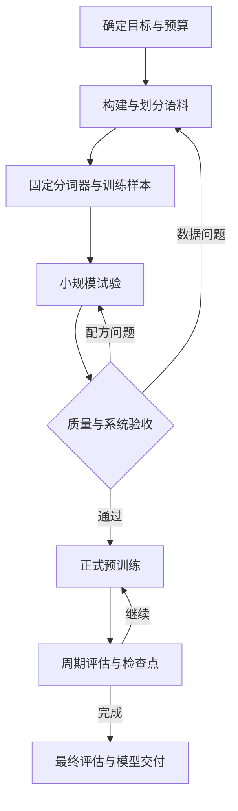

# 大语言模型预训练全流程：从原始语料到可复现的基础模型

> 阅读对象：已经理解 Transformer、交叉熵和反向传播，希望从统计建模走向完整预训练实践的学习者。
>
> 本文将网络主体视为给出条件概率的可微函数，不展开 Transformer 内部架构。叙述顺序为“问题 → 数学表达 → 工程实现 → 验收标准”，以文本自回归基础模型的从零预训练为主线。
>
> 文中的小规模配置和阈值是教学实验设计，不是某个大模型的官方配方，也不保证特定硬件上的运行时间或最终能力。论文与工具资料核对日期：2026-09-06。

## 阅读导航

| 章节 | 核心问题 | 完成后应获得什么 |
|---|---|---|
| 一—二 | 预训练在做什么、优化什么？ | 全流程地图与概率目标 |
| 三 | 多大模型、多少数据、需要多少计算？ | 可计算的预算方案 |
| 四—五 | 从哪里获得数据、怎样形成可信语料？ | 可追溯的清洗和划分流水线 |
| 六—七 | 文本怎样成为模型真正读取的训练样本？ | 固定 tokenizer、Token 文件、样本与掩码 |
| 八—九 | 怎样配数据、怎样更新参数？ | 混合策略和优化配方 |
| 十—十一 | 多张卡如何完成同一个优化步骤？ | 分布式数学与完整训练循环 |
| 十二—十三 | 如何启动、监控、排错和恢复？ | 试运行结果、可恢复检查点 |
| 十四—十五 | 怎样评估、怎样安排后续训练阶段？ | 独立评估与阶段切换方案 |
| 十六—十七 | 怎样交付、怎样亲手完成一次实验？ | 完整模型包与小规模实践闭环 |

---

## 一、先建立全流程：预训练最终交付的是什么

### 1.1 从文本中自动构造监督

给定一句话：

> 统计学习研究如何从数据中提取规律。

将它转换为 Token 序列后，每个后继 Token 都可作为前面 Token 的监督标签。因此“没有人工标注的海量文本”仍然可以构成监督学习问题。

预训练通常同时学习语言形式、事实关联、领域规律以及数据中体现的某些推理模式。但训练目标直接要求的是提高真实文本的概率，不能将它等同于事实真伪验证器或完整推理能力的保证。

完整预训练项目的产物包括：

- 基础模型权重与对应配置。
- 完全匹配的 tokenizer、特殊 Token 定义和输入约定。
- 数据版本、处理规则、训练配方和日志。
- 支持恢复训练的状态，以及独立的评估结果。

**仅有一个权重文件，还不足以复现整个预训练过程。** OLMo 系列是研究这种完整开放流程的例子；其公开范围覆盖权重之外的数据、训练代码等工件。参见 [OLMo](https://arxiv.org/abs/2402.00838) 与 [Olmo 3](https://arxiv.org/abs/2512.13961)。

### 1.2 区分从零预训练、继续预训练和后训练

| 阶段 | 初始参数 | 数据及目标 | 通常得到什么 |
|---|---|---|---|
| 从零预训练 | 随机初始化 $\theta_0$ | 大规模文本的语言建模 | Base Model |
| 继续预训练（CPT） | 已有基础模型参数 | 新文本，通常仍用语言建模 | 适配新领域、语言或时期的基础模型 |
| 监督微调（SFT） | 基础模型或已有微调模型 | 指令—回答、示范轨迹等 | 更会按指定格式完成任务的模型 |
| 偏好优化或强化学习 | 已有模型 | 偏好对、奖励或可验证反馈 | 按相应目标调整行为的模型 |

SFT 和偏好优化常统称为后训练的一部分。它们与预训练衔接，但不是本笔记展开的主体。实践中某些训练阶段会使用多种数据格式，分类应看初始状态、数据构造和损失，而不是只看文件是否叫 `pretrain`。

### 1.3 流程不是单向运行一次



例如，分词后发现某种语言的 Token 数极高，会反过来影响词表和数据配比；吞吐测试不达标，会影响模型规模与预算；分领域验证恶化，可能要求重新检查数据质量和采样权重。

### 1.4 统一符号

| 符号 | 含义 | 必须区分的概念 |
|---|---|---|
| $\theta$ | 全部可训练参数 | 不代表优化器状态 |
| $P$ | 模型参数个数 | 下文计算预算主要考虑稠密模型 |
| $V$ | 词表大小 | 是 Token 类别数 |
| $L$ | 一个训练样本的最大输入长度 | 不表示模型层数 |
| $D_{\mathrm{unique}}$ | 语料库存的非重复 Token 量 | 相对于具体去重和计数规则 |
| $D_{\mathrm{proc}}$ | 累计实际处理的输入 Token 槽位数 | 可包含重复与 PAD |
| $D_{\mathrm{loss}}$ | 累计参与目标损失的 Token 数 | 由损失掩码定义 |
| $b$ | 每个数据并行副本的 micro-batch 序列数 | 不是全局 Batch |
| $a$ | 一次更新累积的 micro-batch 数 | 梯度累积次数 |
| $n_{\mathrm{dp}}$ | 数据并行副本数 | 不一定等于总 GPU 数 |
| $B_{\mathrm{global}}$ | 每次更新的全局序列数 | $b a n_{\mathrm{dp}}$ |
| $K$ | 优化器实际更新次数 | 区别于 forward 次数和 epoch |
| $\eta_k$ | 第 $k$ 次参数更新的学习率 | 明确按 step 或 Token 进度调度 |
| $C$ | 计算量，单位 FLOPs | FLOPs 是总量，FLOP/s 是速度 |

---

## 二、概率模型：预训练究竟在最小化什么

### 2.1 从一个文档到自回归似然

设一个文档经固定 tokenizer 变成 $x=(x_1,\ldots,x_T)$，其中包含约定的文档结束标记。引入起始上下文 $x_0=\texttt{<bos>}$：

$$
p_\theta(x)=\prod_{t=1}^{T}p_\theta(x_t\mid x_0,x_1,\ldots,x_{t-1}).
$$

模型主体只作为函数使用：

$$
f_\theta(x_{<t})=g_t\in\mathbb R^V,
\qquad
p_\theta(x_t=v\mid x_{<t})
=\frac{e^{g_{t,v}}}{\sum_{u=0}^{V-1}e^{g_{t,u}}}.
$$

正文后续省略固定的起始 Token 条件。预训练损失为真实后继 Token 的负对数概率：

$$
\ell_t(\theta)=-\log p_\theta(x_t\mid x_{<t}).
$$

不同实现未必显式使用 BOS，也可能将多个文档构成连续流；必须先定义所拟合的条件分布，再决定如何做序列切分。

### 2.2 有限上下文意味着目标发生了什么变化

实际输入长度最多为 $L$。对连续文档的一种理想化窗口目标是：

$$
p_\theta(x_t\mid x_{\max(1,t-L):t-1}).
$$

但若把文档切成互不重叠的块，块开头实际看到的上下文可能远少于 $L$。因此实际训练风险更精确地应写为：

$$
R(\theta)
=\mathbb E_{(c,y)\sim\mathcal Q_{\mathrm{pipeline}}}
[-\log p_\theta(y\mid c)].
$$

$\mathcal Q_{\mathrm{pipeline}}$ 由原始语料、过滤、去重、采样、分词、切块、边界掩码共同决定。数据流水线不仅提供输入，也在定义模型学习的统计问题。

### 2.3 Token 平均交叉熵

一个 Batch 的目标 Token 为 $Y_{i,t}$，损失掩码为 $m_{i,t}\in\{0,1\}$：

$$
N_{\mathrm{valid}}=\sum_{i,t}m_{i,t}>0,
$$

$$
\boxed{
\mathcal L(\theta)
=-\frac1{N_{\mathrm{valid}}}
\sum_{i,t}m_{i,t}
\log p_\theta(Y_{i,t}\mid C_{i,t}).
}
$$

其中 $C_{i,t}$ 是该位置真正可见的上下文。PAD 等不作为预测目标的位置取 $m_{i,t}=0$；文档结束通常需要被预测，应计入损失。

若单位置目标是 one-hot 分布 $q_v=\mathbf1\{v=y\}$：

$$
-\sum_vq_v\log p_v=-\log p_y.
$$

因此语言建模可以视为大量共享参数的条件多分类问题。

### 2.4 统计学解释：条件 KL 投影

设数据流水线产生的真实条件分布为 $q(y\mid c)$：

$$
\begin{aligned}
R(\theta)
&=\mathbb E_c\left[-\sum_yq(y\mid c)\log p_\theta(y\mid c)\right]\\
&=\mathbb E_c\left[
H(q(\cdot\mid c))+
D_{\mathrm{KL}}(q(\cdot\mid c)\Vert p_\theta(\cdot\mid c))
\right].
\end{aligned}
$$

第一项不依赖参数，第二项衡量模型与训练分布的差异。改变数据过滤和混合策略，会改变 $q$；即使优化器完全一样，最后拟合的分布也不一样。

Token 平均还隐含一个权重约定。对长度 $T_j$、平均损失 $\bar\ell_j$ 的文档：

$$
\mathcal L_{\mathrm{token}}
=\frac{\sum_jT_j\bar\ell_j}{\sum_jT_j},
\qquad
\mathcal L_{\mathrm{doc}}=\frac1N\sum_j\bar\ell_j.
$$

前者按 Token 加权，后者每篇文档等权，通常不是同一个目标。

### 2.5 预训练能获得什么，不能从目标直接推出什么

损失下降表示模型更擅长预测评估协议下的文本。它可能伴随知识、代码和推理任务提升，但不保证所有能力同向提升，也不保证能遵循聊天指令。

对 Base Model，输入一段文本后继续写同类文本，往往比“必须像助手一样回答用户”更贴近它的训练目标。评价时应采用与模型阶段相匹配的方式。

---

## 三、实验设计与预算：先决定要完成什么规模的训练

### 3.1 先写一页训练规格

| 决策 | 应写清的内容 | 为什么影响后续 |
|---|---|---|
| 语言和领域 | 中文、英文、代码、数学等的目标覆盖 | 决定语料、tokenizer 和评估 |
| 模型类型 | 本文主线为稠密自回归文本模型 | 决定 FLOPs 和分布式估计口径 |
| 训练起点 | 随机初始化或某个确定检查点 | 决定是否属于从零训练 |
| 上下文长度 | 初始 $L$，是否后续扩展 | 影响样本、显存和吞吐 |
| 总预算 | GPU 数、可用时长、可承受实验次数 | 决定 $P,D,K$ 的可行组合 |
| 主要指标 | 固定分域 NLL、目标任务指标 | 决定如何选择配方与检查点 |
| 停止条件 | 达到 Token 预算或预设决策条件 | 避免无目标地“再多跑一会” |

### 3.2 粗略训练 FLOPs：$C\approx6PD$

对稠密语言模型，常用参数主导的训练算量近似：

$$
\boxed{C\approx6P D_{\mathrm{proc}}.}
$$

直觉是每 Token 前向约 $2P$ FLOPs，反向约为前向的两倍，合计约 $6P$。这里一次乘加按两个 FLOPs 计。

这是规划用近似，不是完整硬件执行计数：长上下文注意力、词表计算的计数方式、激活重计算、辅助损失和其他算子都可能使误差增大。MoE 模型不能简单把总参数或激活参数之一无条件代入并认为得到精确总量。

若采用文献中的 $C\approx6PD$，应核对其参数和 Token 口径。预算思想可参见 [Training Compute-Optimal Large Language Models](https://arxiv.org/abs/2203.15556)。

**例子：** 假设 $P=10^8$，计划处理 $D_{\mathrm{proc}}=2\times10^8$ 个输入 Token：

$$
C\approx6\times10^8\times2\times10^8=1.2\times10^{17}\ \mathrm{FLOPs}.
$$

这能用于数量级估算，不能直接推出某张 GPU 的实际训练小时数。

### 3.3 从 FLOPs 或吞吐估算时间

设 $n_{\mathrm{gpu}}$ 张 GPU，所用精度下单卡理论峰值为 $F_{\mathrm{peak}}$ FLOP/s，有效利用率近似为 $u$：

$$
t_{\mathrm{train}}\approx
\frac{C}{n_{\mathrm{gpu}}F_{\mathrm{peak}}u}.
$$

但实际规划更适合使用短试跑测得的全局吞吐 $r_{\mathrm{tok}}$：

$$
t_{\mathrm{train}}\approx\frac{D_{\mathrm{proc}}}{r_{\mathrm{tok}}}.
$$

总墙钟时间还包括评估、检查点、数据准备、故障恢复等。若吞吐只统计稳定训练区间，应单独给这些阶段留预算。

同一张卡在不同序列长度、micro-batch、精度和并行方案下的吞吐可能差异明显，因此不要把公开峰值直接当成训练速度。

### 3.4 从 Scaling Law 推导模型与数据的取舍

考虑一个用于局部拟合的经验损失模型：

$$
\mathcal L(P,D)=E+A P^{-\alpha}+B D^{-\beta},
\qquad A,B,\alpha,\beta>0.
$$

在固定计算预算 $C=\kappa PD$ 下：

$$
D=\frac{C}{\kappa P},
$$

$$
\mathcal L(P)=E+AP^{-\alpha}
+B\left(\frac{\kappa P}{C}\right)^\beta.
$$

求导并令其为 0：

$$
-\alpha AP^{-\alpha-1}
+\beta B\left(\frac\kappa C\right)^\beta P^{\beta-1}=0.
$$

因此：

$$
P^*=\left(\frac{\alpha A}{\beta B}\right)^{1/(\alpha+\beta)}
\left(\frac C\kappa\right)^{\beta/(\alpha+\beta)},
$$

$$
D^*=\left(\frac{\beta B}{\alpha A}\right)^{1/(\alpha+\beta)}
\left(\frac C\kappa\right)^{\alpha/(\alpha+\beta)}.
$$

若 $\alpha$ 与 $\beta$ 接近，则最优模型大小与数据量都大致按预算的平方根增长。经验参数必须从适当实验区间拟合，不能视为不依赖数据与配方的物理定律。

这个经验式中的数据收益还受信息含量与重复程度影响，不能把反复读取同一份语料与增加同量新数据一律等同。

常听到的“训练 Token 数约为参数量的 20 倍”只是特定研究与配置附近的经验参照，不是所有预训练项目的固定要求。若考虑部署成本，可能愿意用更多训练 Token 换取更小、推理更便宜的模型。

### 3.5 Token 预算如何变成更新步数

固定 micro-batch、累积次数与数据并行度时：

$$
B_{\mathrm{global}}=b a n_{\mathrm{dp}},
\qquad
N_{\mathrm{slot/step}}=b a n_{\mathrm{dp}}L.
$$

若所有输入槽位都实际计算：

$$
K\approx\left\lceil
\frac{D_{\mathrm{proc}}}{b a n_{\mathrm{dp}}L}
\right\rceil.
$$

若平均有效监督比例为 $\rho$：

$$
N_{\mathrm{loss/step}}\approx\rho b a n_{\mathrm{dp}}L.
$$

所以，按 $D_{\mathrm{loss}}$ 定预算时还要除以 $\rho$。变长训练、丢弃尾批、跳过异常步骤都会造成偏差，正式训练应累计实际计数。

**从此处开始同时记录三条量：** 原始数据库存、已处理输入 Token、有效监督 Token。它们不必相等。

---

## 四、原始语料与数据组织：先做到可追溯

### 4.1 数据源与能力目标的对应

| 数据类型 | 可能提供的训练信号 | 主要质量问题 |
|---|---|---|
| 网页正文 | 广泛语言与主题覆盖 | 导航、广告、模板、SEO 与重复转载 |
| 长文、书籍、教程 | 连贯长文本与系统知识 | 版本重复、抽取质量、来源条件 |
| 代码与技术文档 | 程序语法、接口与技术表达 | 自动生成文件、仓库镜像、依赖文件 |
| 数学与学术文本 | 符号、证明、专业叙述 | 公式损坏、引用噪声、PDF 阅读顺序 |
| 多语言文本 | 不同语言的覆盖与迁移 | 识别误差、低资源语言被过度过滤 |
| 合成文本 | 可控制的题型或领域补充 | 错误复制、模式单一、来源难追踪 |

这里的对应是数据设计假设，是否有效应由小规模消融和分域评估验证。

### 4.2 一篇文档应保存哪些字段

示意记录：

```json
{
  "doc_id": "stable_document_id",
  "source_id": "source_snapshot_id",
  "source_uri": "source_reference",
  "retrieved_at": "snapshot_time",
  "language": "zh",
  "domain": "educational_text",
  "text": "清洗后的正文",
  "content_hash": "normalized_content_hash",
  "duplicate_cluster_id": "cluster_id",
  "processing_version": "pipeline_v1",
  "quality_scores": {"rule_score": 0.9},
  "usage_metadata": "来源与适用使用条件记录"
}
```

分数 0.9 只是字段示意。保留来源、处理版本和重复簇标识，才能追查某个异常样本、重新运行过滤并重建训练集。

涉及来源使用条件、个人信息和敏感字段，应在语料接入与处理阶段按项目规则处理，保留实际处理记录；网页能访问不等于已经满足项目的数据使用条件。

### 4.3 为何要分层保存数据

| 层次 | 内容 | 主要用途 |
|---|---|---|
| 原始层 | 原始网页、文档或原始文本记录 | 重新抽取与追溯 |
| 规范化文本层 | 正文、元信息与处理标记 | 过滤和去重 |
| 冻结语料层 | 最终保留文档与 train/val/test 分配 | 版本固定与复现实验 |
| Token 层 | Token IDs、文档偏移、索引 | 高吞吐训练 |
| 样本与混合索引 | 切块、抽样与读取顺序 | 定义实际训练分布 |

不应只保留最终打乱后的 Token 大文件，否则很难回答某段训练样本来自哪里、为什么被保留、经过何种清洗。

### 4.4 每个阶段记录保留率

对处理阶段 $j$：

$$
r_j^{\mathrm{doc}}=
\frac{N_{j,\mathrm{out}}}{N_{j,\mathrm{in}}},
\qquad
r_j^{\mathrm{token}}=
\frac{D_{j,\mathrm{out}}}{D_{j,\mathrm{in}}}.
$$

还应按语言、域和来源分别统计。整体只删除 5% 并不能说明没有伤害某个小语种；它可能删掉了该语言一半的数据。

冻结 tokenizer 前，Token 数只是临时口径，可先用字节、字符和文档长度统计；最终预算应使用冻结版本重新计算。

---

## 五、清洗、去重和防止评估污染

### 5.1 文本抽取与规范化

一个实用顺序是：正文抽取 → 编码修复 → 语言识别 → 规则过滤 → 质量判别 → 去重与划分 → 基准污染检查 → 最终审计。

实际顺序可以根据代价调整，例如先用廉价哈希去除完全重复，减少后续计算。关键是固定版本，并记录各阶段输入输出。

规范化应服务于文本语义：合并无意义空白、删除重复导航通常合理；但盲目删除缩进、数学符号、Unicode 字符或全部标点会破坏代码和公式。

### 5.2 质量过滤可以写成选择概率

设原始文档分布为 $p_{\mathrm{raw}}(d)$，保留概率为 $s(d)\in[0,1]$：

$$
p_{\mathrm{kept}}(d)
=\frac{s(d)p_{\mathrm{raw}}(d)}{
\mathbb E_{d\sim p_{\mathrm{raw}}}[s(d)]}.
$$

确定性规则对应 $s(d)\in\{0,1\}$。因此过滤必然改变分布：过滤器更偏好的文体会被放大。

可检查文档长度、可见字符比例、重复行比例、异常符号比例、语言置信度等；模型打分也可以辅助判断，但不应把其输出当成绝对正确的质量标签。

FineWeb 系统研究了网页过滤和去重，DCLM 用受控训练比较数据处理策略；它们说明数据设计应结合下游训练效果评估。参见 [FineWeb](https://arxiv.org/abs/2406.17557) 与 [DCLM](https://arxiv.org/abs/2406.11794)。

### 5.3 完全重复与近似重复

**完全重复：** 对规定的规范化文本计算哈希：

$$
h_i=\operatorname{Hash}(\operatorname{Normalize}(d_i)).
$$

哈希相同的文档可作为候选重复组，必要时再核对内容。哈希规则应独立记录，不能随意改变规范化方式后沿用旧索引。

**近似重复：** 令 $S(d)$ 为文档的词或字符 $n$-gram 集合，可用 Jaccard 相似度：

$$
J(d_i,d_j)=\frac{|S(d_i)\cap S(d_j)|}{|S(d_i)\cup S(d_j)|}.
$$

实际大规模语料不能穷举 $O(N^2)$ 对比，常用签名和候选检索缩小范围，例如 MinHash/LSH，然后依据规则聚类和保留代表文档。

去重粒度可以是文档、段落或子串。代码仓库、网页模板和长文转载需要不同处理；删除所有重复句子还可能误删合法的固定表达。

### 5.4 重复为什么改变优化目标

若文档 $d_j$ 重复出现 $c_j$ 次，训练相当于增加其权重：

$$
\mathcal L(\theta)\propto
\sum_j c_j\sum_{t=1}^{T_j}\ell_{j,t}(\theta).
$$

所以重复既消耗计算，也改变训练分布，可能加剧记忆和评估泄漏。另一方面，有意重复少量高价值数据是采样策略，应该与意外重复区分，并统计暴露次数。

### 5.5 训练、验证和测试必须在合适的粒度隔离

不能把同一篇长文随机切块后，把相邻块分别放到训练和测试；也不能把同一篇文章的转载版本分到不同集合。

一种做法是先把近重复文档组成簇，再按簇分配：

$$
\operatorname{split}(d)
=f\big(\operatorname{Hash}(\operatorname{cluster\_id}(d)),\mathrm{seed}\big).
$$

项目还可能需要按整本书、整个仓库、网站、作者或时间分组，取决于希望检验哪种泛化。

验证集用于调配方和选检查点；最终测试集应在这些选择后才用于正式报告。反复依据测试分数调整配方，会逐渐把测试集变成开发集。

### 5.6 基准去污染

即使预训练语料与内部验证文档不重合，训练集仍可能包含公开评测题、答案或解析。

应对选定基准进行规范化匹配、长 $n$-gram 检查及必要的近似检索，区分短常见短语与真正的题目重合。冻结检查规则，并记录命中、移除和人工复核结果。

未命中字符串重复不等于完全没有语义污染；最终报告应写清检查范围和局限，而不是宣称绝对无污染。

**本阶段验收：** 能随机抽到保留/删除样本解释原因，能重建各域保留率，能确认同一重复簇没有跨分割，并有固定评估语料版本。

---

## 六、Tokenizer：冻结文本与 Token 之间的接口

### 6.1 Tokenizer 是数据定义的一部分

将编码和解码记为：

$$
\operatorname{Enc}_\tau:\text{Text}\to\{0,\ldots,V-1\}^*,
\qquad
\operatorname{Dec}_\tau:\{0,\ldots,V-1\}^*\to\text{Text}.
$$

$\tau$ 包括规范化、预分词、词表、合并规则及特殊 Token 规则。词表相同不意味着完整 tokenizer 行为相同。

原始文本 $s$ 经过规范化 $N_\tau$ 后，理想往返性质是：

$$
\operatorname{Dec}_\tau(\operatorname{Enc}_\tau(s))=N_\tau(s).
$$

若要精确保留原文，则还需 $N_\tau(s)=s$；应特别检查空格、换行、代码缩进、中文标点和数学字符。

### 6.2 从零训练与继续预训练的选择不同

从零预训练可以重新训练 tokenizer，也可以复用合适的 tokenizer。继续预训练通常需要保持原 Token ID 语义一致，因为模型参数已经与这些 ID 对应。

即使新旧词表大小相同，若把 ID 100 从“统计”换成“天气”，已有权重对应关系也会被破坏。增加词表还涉及新增输入/输出参数的初始化与重新适配，不能只改 tokenizer 文件。

### 6.3 BPE 的基本训练过程

以初始字符或字节符号为单位，在训练文本中统计相邻符号对：

$$
c(u,v)=\sum_{d}\#\{\text{符号对 }(u,v)\text{ 在当前分词中的出现次数}\}.
$$

选择频次最高的候选对：

$$
(u^*,v^*)\in\arg\max_{u,v}c(u,v),
$$

将其合并为新符号，并更新语料表示，直到达到目标词表规模或停止条件。实际实现还受预分词边界、特殊 Token、并列处理及算法细节约束。

Tokenizer 训练和神经网络的梯度训练通常是两个阶段：先确定 Token 表达，再训练语言模型参数。可参考 [Hugging Face Tokenizers 官方实现](https://github.com/huggingface/tokenizers)。

### 6.4 如何选择训练 tokenizer 的语料

从训练分割中抽取有代表性的样本，覆盖目标语言、代码、数字、数学表达和罕见字符。不要只从占比最大的单一来源抽样，再假设所有语言都能良好编码。

Tokenizer 的语料抽样配比与语言模型预训练配比可以不同，前者关注编码覆盖与效率，后者直接决定优化分布；两份配比都应记录。

### 6.5 词表大小如何影响预算

更大的词表可能缩短编码长度，但通常增加输入/输出相关参数与分类计算。小词表通常导致序列更长，在固定 $L$ 下能容纳的原始文本更少。

对同一评测文本集合 $\mathcal S$，可统计：

$$
R_{\mathrm{byte/token}}=
\frac{\sum_{s\in\mathcal S}|s|_{\mathrm{UTF8\ bytes}}}
{\sum_{s\in\mathcal S}|\operatorname{Enc}_\tau(s)|}.
$$

还应按语言和域报告 Token 数/字符数、编码吞吐、往返误差以及特殊字符处理。不能只以平均压缩率决定质量。

### 6.6 固定版本与验收

保存词表、规则、特殊 ID、规范化配置及整个文件包的哈希。训练、验证、导出和生成都使用同一个版本。

**验收样例应包含：** 普通中文、英文、混合语言、连续数字、空白、代码缩进、LaTeX、长文本和特殊 Token 的字面字符串。原始网页中看起来像 `<eos>` 的普通字符，不应未经约定就自动变成控制标记。

---

## 七、从 Token 文件到训练样本：预训练最容易悄悄出错的一步

### 7.1 离线分词与二进制分片

将文档 Token 序列存成二进制数据，并保存文档边界、偏移与元信息索引。训练时读取整数，避免每一轮重复进行正文抽取和分词。

若每 Token 存储 $s$ 字节：

$$
\operatorname{Storage}_{\mathrm{tokens}}\approx sD_{\mathrm{unique}}.
$$

例如 $10^9$ 个 Token 使用 32 位无符号整数，Token 数组约需 $4\times10^9$ 字节，即 4 GB，未含索引和副本。

当所有 ID 小于 $2^{16}$ 时，16 位无符号存储才足够；不能只看“常用词表”就擅自选类型。文档偏移还可能需要 64 位整数。

每个 shard 保存 Token 数、文档数、dtype、内容校验和和 tokenizer 版本。分片应兼顾顺序读取与任务分配，避免极多微小文件或单个巨大不可恢复文件。

### 7.2 一个样本为什么常读取 $L+1$ 个 Token

从数据中读取：

$$
s=(s_0,s_1,\ldots,s_L).
$$

构造：

$$
X=(s_0,\ldots,s_{L-1}),\qquad
Y=(s_1,\ldots,s_L).
$$

于是输入和标签都是长度 $L$，第 $t$ 个输入槽位预测下一个 Token。标签在数据构造或模型损失内部移位一次即可；重复移位会让模型变成预测下下个 Token。

若输入长度为 $L$，然后在内部用前 $L-1$ 个 logits 对后 $L-1$ 个输入 Token 计算损失，那么每样本只有 $L-1$ 个目标。两种接口都能成立，但预算与掩码必须使用实际数量。

### 7.3 三种切块策略

| 方法 | 如何构造 | 主要取舍 |
|---|---|---|
| 文档内切块并补齐 | 每块来自同一文档，不足长度用 PAD | 边界清楚，短文可能浪费算力 |
| 连续流切块 | 文档加结束标记后串联，再取固定长度块 | 填充率高，可能建立跨文档依赖 |
| 多文档 Packing | 将多篇短文装入同一计算块 | 填充率高，但需显式处理文档边界 |

长文还可以使用重叠窗口。若重叠区域都计算损失，同一 Token 会被重复加权；若重叠仅用于提供上下文，应将这些上下文位置的重复监督屏蔽。

### 7.4 Packing 不是自动的文档隔离

设两个文档为 A/B 和 C，打包为：

$$
s=(\texttt{BOS}_1,A,B,\texttt{EOS}_1,
\texttt{BOS}_2,C,\texttt{EOS}_2).
$$

取 $L=6$，构造：

| 输入槽位 | 1 | 2 | 3 | 4 | 5 | 6 |
|---|---|---|---|---|---|---|
| 输入 $X$ | BOS$_1$ | A | B | EOS$_1$ | BOS$_2$ | C |
| 标签 $Y$ | A | B | EOS$_1$ | BOS$_2$ | C | EOS$_2$ |
| 输入文档 ID | 1 | 1 | 1 | 1 | 2 | 2 |
| 独立文档目标的 Loss Mask | 1 | 1 | 1 | 0 | 1 | 1 |

如果要拟合独立文档的目标，第四个槽位“用文档 1 预测文档 2 的 BOS”不作为监督。文档 2 的 BOS 槽位则用于预测 C。

对输入槽位 $i,j$，用 $d_i$ 表示文档 ID，文档内因果加性掩码为：

$$
M_{ij}=
\begin{cases}
0,&j\le i\text{ 且 }d_i=d_j\text{ 且 Key 有效},\\
-\infty,&\text{其他情况}.
\end{cases}
$$

因此两个文档之间不能互相读取。只有插入 EOS 而不设置隔离掩码，模型仍可能读取前一篇文档；EOS 不是自动切断注意力的操作。

连续流训练也可以有意允许跨文档上下文，这时学习的是相应流式目标。关键是记录选择，而不是把两种做法误认为完全相同。

### 7.5 三份信息必须分别定义

| 信息 | 数学职责 | 不能代替什么 |
|---|---|---|
| Attention Mask | 决定上下文 $C_{i,t}$ 的可见位置 | 不能自动删除该槽位的损失 |
| Loss Mask | 决定 $m_{i,t}$ 是否为 1 | 不能阻止其他位置读取它 |
| Position IDs | 决定位置编号 | 重置编号不能自动隔离文档 |

文档内位置重置或连续位置编号都应与训练设计一致。评估、长文训练和模型导出时也必须保持兼容约定。

若 PAD 与 EOS 使用相同 ID，不能简单按 `token_id == pad_id` 删除所有损失，否则会连真正的 EOS 监督一起删除。应由真实长度、边界或有效性元信息构造掩码。

### 7.6 Padding 和完全被屏蔽的行

无效目标槽位的损失置零；有效 Query 不应读取 PAD Key。对无效 Query，可以不使用其输出，但应避免把整行 Softmax 变成对全 $-\infty$ 归一化而产生 NaN。

不同高效变长算子可能使用边界索引而非显式二维掩码，验收标准仍然相同：有效位置的条件信息符合数学定义。

### 7.7 DataLoader 如何保证多副本不重复

在纯数据并行中，不同副本应读取互补或按规定独立抽样的数据，而不是各自从同一文件开头读同一批。

例如全局样本索引序列为 $i_0,i_1,\ldots$，可用确定性分配：

$$
\text{rank }r\text{ 读取 }i_r,i_{r+n_{\mathrm{dp}}},i_{r+2n_{\mathrm{dp}}},\ldots.
$$

还要在每个副本内部区分 DataLoader worker。使用 TP/PP 的多个 GPU 可能共同处理同一批数据，不能错误地按所有 GPU 全部切成独立数据流。

Streaming 数据集需要记录分片位置、文档偏移、shuffle buffer 状态等；有放回采样中的重复可能符合设计，意外重复则是实现问题。

### 7.8 本阶段的数学验收

1. 手工打印一个很短的样本，逐 Token 核对输入、标签与掩码。
2. 修改未来输入，确认更早有效位置的 logits 不变。
3. 在独立文档模式下修改文档 1，确认文档 2 的 logits 不变。
4. 右侧增加 PAD，确认原有效位置输出与 Token 平均损失不变。
5. 检查跨 worker、rank 的样本 ID 与预期抽样规则一致。

这些检查应在关闭 Dropout、保持其他输入一致时进行。

---

## 八、数据混合：模型到底以多大概率看到各类文本

### 8.1 数据混合是一个目标函数

设有 $J$ 个域，域 $j$ 的训练分布为 $q_j$，混合权重为 $\pi_j$：

$$
\pi_j\ge0,\qquad\sum_{j=1}^{J}\pi_j=1,
\qquad q_\pi=\sum_j\pi_jq_j.
$$

相应风险为：

$$
R(\theta;\pi)=\sum_{j=1}^{J}\pi_j
\mathbb E_{(c,y)\sim q_j}[-\log p_\theta(y\mid c)].
$$

如果这里的 $q_j$ 定义为“域内随机有效 Token 的上下文—标签分布”，$\pi_j$ 就是有效 Token 权重，不能直接拿文档数占比代替。

### 8.2 文档采样概率不等于 Token 占比

假设以概率 $p_j$ 选域，再完整读取该域一篇平均长度为 $\mu_j$ 的文档。在稳定的大量抽样下，输入 Token 占比约为：

$$
\pi_j^{\mathrm{token}}
\approx\frac{p_j\mu_j}{\sum_rp_r\mu_r}.
$$

若希望得到指定 Token 比例 $\pi_j$，则可考虑：

$$
p_j\propto\frac{\pi_j}{\mu_j}.
$$

实际切块、截断、Packing 和 Loss Mask 会改变关系。按等长度块选择域更容易控制输入 Token 占比，但若各域有效监督率不同，还应记录实际 Loss Token 比例。

### 8.3 温度平滑采样

设各域可用 Token 库存为 $n_j$，一种平滑配比是：

$$
\pi_j(\alpha)=\frac{n_j^\alpha}{\sum_r n_r^\alpha},
\qquad0\le\alpha\le1.
$$

$\alpha=1$ 接近库存比例，$\alpha=0$ 域间等权。较小 $\alpha$ 会提高小域相对暴露，但可能造成大量重复。

这是一种可供实验的设计，不是保证最优配比的公式。多语言语料还需要针对各语言调整过滤和评价，不能将英语处理阈值机械套用。可参考 [FineWeb2 的多语言数据流程研究](https://arxiv.org/abs/2506.20920)。

### 8.4 计算各域暴露次数

假设总训练有效 Token 预算为 $D$，域 $j$ 的目标占比为 $\pi_j$，可用有效 Token 库存为 $D_j$，则平均暴露倍数约为：

$$
e_j=\frac{\pi_jD}{D_j}.
$$

比如某域只有 1000 万个 Token，却在 10 亿 Token 训练中占 20%，则平均暴露倍数为 20。把它称为“20% 数据”会掩盖反复训练同一批文本的事实。

重复不必一律禁止，但应在验证集上检查记忆、过拟合与域外能力变化。

### 8.5 配比怎么选：受控消融

在相同模型、tokenizer、上下文长度和训练 Token 预算下，比较少量候选配比。固定验证域权重 $w_j$：

$$
\mathcal L_{\mathrm{dev}}(\theta)
=\sum_jw_j\mathcal L_j^{\mathrm{dev}}(\theta),
\qquad\sum_jw_j=1.
$$

$w_j$ 描述评价需求，不必等于训练比例 $\pi_j$。例如训练中某大域占比较高，但应用需要关注小域，其评估权重可以独立设置。

若同时换配比、模型规模和训练步数，分数提升很难归因。小规模最佳配比也未必在大模型上保持最优，放大前应做有限验证。

---

## 九、模型初始化与优化配方：定义可复现的参数更新

### 9.1 网络主体在本笔记中只需要一个接口

给定输入、注意力可见范围及位置编号：

$$
f_\theta(X,M,\mathrm{pos})=G\in\mathbb R^{B\times L\times V}.
$$

这已经足以定义预训练。具体内部架构放在独立的 Transformer 笔记中。

从零训练要从配置创建随机参数，不能不知不觉调用加载预训练权重的路径。保存初始化种子、模型配置、实际参数量、参数共享与可训练参数列表。

各层初始化尺度应沿用所选模型实现的明确方案，不要把所有张量一律用同一个任意方差初始化。初始化后先检查权重有限、前向输出有限以及参数确实进入优化器。

### 9.2 初始损失的数量级检查

若初始词表分布恰好均匀：

$$
p_v=\frac1V\quad\Longrightarrow\quad\ell=\log V.
$$

例如 $V=32000$，$\log V\approx10.3735$。随机网络的 logits 并不一定均匀，因此这只是参照，不能要求初始损失精确等于它。

若从随机初始化开始，损失突然接近零，应优先排查标签泄漏、损失屏蔽错误、错误加载权重或只计算了极少有效位置。

### 9.3 AdamW 的完整更新

第 $k$ 步梯度为：

$$
g_k=\nabla_\theta\mathcal L_k(\theta_{k-1}).
$$

采用一阶、二阶矩状态 $u_k,v_k$，初始值为 0：

$$
\begin{aligned}
u_k&=\beta_1u_{k-1}+(1-\beta_1)g_k,\\
v_k&=\beta_2v_{k-1}+(1-\beta_2)g_k\odot g_k,\\
\hat u_k&=u_k/(1-\beta_1^k),\qquad
\hat v_k=v_k/(1-\beta_2^k),\\
\theta_k&=(1-\eta_k\lambda)\theta_{k-1}
-\eta_k\frac{\hat u_k}{\sqrt{\hat v_k}+\epsilon}.
\end{aligned}
$$

参数可以分组使用不同 $\lambda$；例如是否对偏置、归一化参数应用衰减应在配置中明确。

将 $\lambda\theta$ 加入梯度后再进入 Adam，会受到自适应分母影响，与这里的解耦权重衰减通常不等价。

### 9.4 学习率：Warmup 与衰减

总更新数为 $K$，warmup 更新数 $K_w$，峰值学习率 $\eta_{\max}$，末端 $\eta_{\min}$：

$$
\eta_k=
\begin{cases}
\eta_{\max}\dfrac{k}{K_w},&1\le k\le K_w,\\[6pt]
\eta_{\min}+\dfrac{\eta_{\max}-\eta_{\min}}2
\left[1+\cos\left(\pi\dfrac{k-K_w}{K-K_w}\right)\right],
&K_w<k\le K.
\end{cases}
$$

这是 warmup 后余弦衰减的一种明确公式。Warmup 控制早期更新尺度，但不意味着任意配置都稳定。

如果每步处理的 Token 数改变，应考虑用累计 Token 进度：

$$
r_k=\frac{D_{\mathrm{seen},k}}{D_{\mathrm{budget}}},
\qquad\eta_k=\eta(r_k).
$$

固定 Batch 时按步和按 Token 可以换算；变长训练、Batch ramp-up 或多阶段训练时，两者可能不同。

学习率、Batch 与模型规模的关系需要试验，不应把小模型配方直接按 GPU 数线性放大后当成普遍规律。

### 9.5 梯度裁剪

全局范数裁剪为：

$$
\tilde g=g\min\left(1,\frac{c}{\lVert g\rVert_2}\right),
$$

$g=0$ 时令 $\tilde g=0$。应在正确的梯度累积、分布式归约以及 loss scaling 反缩放之后执行。

分片训练中每卡只持有部分梯度时，全局范数需对分片平方范数正确归约。仅裁剪某卡局部范数通常不等于裁剪完整梯度。

### 9.6 混合精度

| 精度 | 常见用途 | 主要注意点 |
|---|---|---|
| FP32 | 参数主副本、优化器状态、部分归约 | 内存和带宽代价较大 |
| BF16 | 适配硬件上的矩阵运算与部分存储 | 动态范围较大，但有效精度有限 |
| FP16 | 部分混合精度训练 | 较窄动态范围，常需 loss scaling |
| 更低精度格式 | 专门优化训练流程 | 依赖硬件、缩放与算子支持，需要额外验证 |

“BF16 训练”不表示每个张量都使用 BF16。矩阵输入、累加、损失归约、梯度与优化器状态可以采用不同精度。

若以尺度 $s>0$ 放大损失：

$$
\mathcal L'=s\mathcal L,\qquad
\nabla\mathcal L'=s\nabla\mathcal L.
$$

更新前要除以 $s$ 恢复原梯度，并处理非有限值。若因溢出跳过更新，应明确计数和调度器是否推进，不能把“执行了一个 Batch”混同于“完成一次参数更新”。

### 9.7 激活重计算与优化器状态不同

激活检查点在前向时少保存中间激活，反向时重新计算，用额外算力降低峰值显存。它与保存训练恢复文件的 Checkpoint 是两件不同的事。

优化器分片减少的是参数相关状态冗余；激活重计算减少的是中间结果存储。两者可以组合使用，但不能期待任意一种单独解决所有显存问题。

### 9.8 基础配方必须记录的字段

保存模型与 tokenizer 哈希、上下文长度、全局 Token Batch、精度策略、优化器及参数分组、学习率公式、warmup、裁剪阈值、数据混合、掩码策略、随机种子和所有代码版本。

语言建模常直接使用硬标签 NLL；标签平滑、辅助损失等若被加入，应单独注明。记录训练总损失的同时，也应保留可比较的原始 NLL。

---

## 十、分布式训练：多张卡怎样实现同一个统计目标

### 10.1 先区分三个问题

- 一张卡能放下模型和训练状态，但想处理更多数据：考虑数据并行。
- 参数、梯度或优化器状态放不下：考虑状态分片或模型并行。
- 长序列的激活与注意力占用过大：考虑激活重计算、合适算子和上下文并行。

并行度越多，通信与调度也越复杂。选择方案应基于真实内存和吞吐瓶颈。

### 10.2 数据并行：每份模型计算不同样本

设 $n=n_{\mathrm{dp}}$ 个副本，从相同参数开始，各自得到梯度 $g_r$。若每个副本使用相同数量的有效 Token，局部平均梯度的平均就是全局 Token 平均梯度：

$$
g=\frac1n\sum_{r=1}^{n}g_r.
$$

各卡使用同一个 $g$ 和相同优化器状态更新，参数即可保持同步。PyTorch DDP 的常规梯度归约采用副本间平均；特殊通信 hook 或不均匀输入模式可能改变细节，应以所用配置为准。参见 [PyTorch DDP 说明](https://docs.pytorch.org/docs/stable/notes/ddp.html)。

### 10.3 有效 Token 数不同时，不能简单平均局部均值

设副本 $r$ 有 $N_r$ 个有效 Token，NLL 总和为 $S_r(\theta)$：

$$
\mathcal L_r=\frac{S_r}{N_r},\qquad
N_{\mathrm{all}}=\sum_rN_r.
$$

正确的全局目标是：

$$
\mathcal L_{\mathrm{global}}
=\frac{\sum_r S_r}{N_{\mathrm{all}}}
=\sum_r\frac{N_r}{N_{\mathrm{all}}}\mathcal L_r.
$$

因此：

$$
\nabla\mathcal L_{\mathrm{global}}
=\sum_r\frac{N_r}{N_{\mathrm{all}}}\nabla\mathcal L_r.
$$

如果归约默认做 $1/n$ 平均，就让每卡反传：

$$
\boxed{
\tilde{\mathcal L}_r
=\frac{nS_r}{N_{\mathrm{all}}}.
}
$$

于是：

$$
\frac1n\sum_r\nabla\tilde{\mathcal L}_r
=\frac1{N_{\mathrm{all}}}\sum_r\nabla S_r.
$$

**例子：** 两卡分别有 2、6 个有效 Token，局部平均 NLL 为 1、3。直接平均得到 2；真正全局平均为：

$$
\frac{2\times1+6\times3}{8}=2.5.
$$

### 10.4 再加上梯度累积

第 $r$ 个副本的第 $j$ 个 micro-batch 有有效数 $N_{r,j}$、损失和 $S_{r,j}$，$j=1,\ldots,a$：

$$
N_{\mathrm{all}}=\sum_{r=1}^{n}\sum_{j=1}^{a}N_{r,j}.
$$

每个 micro-batch 反传：

$$
\tilde{\mathcal L}_{r,j}=\frac{nS_{r,j}}{N_{\mathrm{all}}}.
$$

先在本地累积，再只做一次副本间平均，就得到完整更新目标的梯度。此时已经按整组有效 Token 总数归一化，**不能再额外除一次累积次数 $a$**。

只有各 micro-batch 有效数相等时，“每个局部平均损失除以 $a$”才自然等价。

如果整组样本的有效数可在前向前确定，可先归约计数；若采用先累积损失和梯度再统一缩放的实现，也要与混合精度、通信和裁剪顺序保持一致。

### 10.5 All-Reduce 为什么会成为瓶颈

如果梯度通信量为 $S_g$ 字节，采用理想 ring all-reduce，单卡发送量约为：

$$
V_{\mathrm{send}}\approx2\frac{n-1}{n}S_g.
$$

接收量也为同样量级；这里未把发送与接收再相加。一种简化的通信时间模型是：

$$
t_{\mathrm{comm}}\approx2(n-1)\alpha_{\mathrm{latency}}
+2\frac{n-1}{n}\frac{S_g}{\beta_{\mathrm{bandwidth}}}.
$$

实际集合通信可能采用其他算法，也可能与反向计算重叠。小 micro-batch 计算时间太短时，通信更难隐藏；增大梯度累积可减少每处理 Token 的同步次数，但同时改变全局 Batch 和更新频率。

### 10.6 ZeRO/FSDP：减少模型状态冗余

令完整模型的参数、梯度、优化器状态内存分别为 $M_W,M_G,M_O$。理想化常驻状态如下：

| 方式 | 每卡常驻状态近似 | 分片对象 |
|---|---|---|
| 普通数据并行 | $M_W+M_G+M_O$ | 无 |
| ZeRO-1 | $M_W+M_G+M_O/n$ | 优化器状态 |
| ZeRO-2 | $M_W+(M_G+M_O)/n$ | 梯度和优化器状态 |
| ZeRO-3 | $(M_W+M_G+M_O)/n$ | 参数、梯度和优化器状态 |

ZeRO 通过分片消除副本冗余；FSDP 也可使用完全分片等方案，但具体参数驻留与通信时机依赖实现。参见 [ZeRO 原论文](https://arxiv.org/abs/1910.02054)。

上表不是峰值显存：计算当前模块时可能临时聚合参数，还需要激活、通信缓冲和工作区。

若只按 FP32 参数、FP32 梯度、Adam 两份 FP32 矩估计计数：

$$
M_{\mathrm{state}}\approx(4+4+4+4)P=16P\ \mathrm{bytes}.
$$

十亿参数约为 16 GB 状态内存，尚未包含激活。混合精度是否保存额外主副本、梯度 dtype 等会改变此数值。

### 10.7 张量并行、流水线并行和上下文并行

| 方式 | 切分对象 | 主要通信 | 适用瓶颈 |
|---|---|---|---|
| TP | 单层张量计算与参数 | 层内聚合或分发 | 单层过大或模型计算需切分 |
| PP | 模型的不同层段 | 相邻阶段传激活与梯度 | 模型深度和状态过大 |
| CP | 单条序列的不同位置 | 上下文相关计算通信 | 长序列激活和计算 |
| EP | MoE 专家 | Token 到专家的路由通信 | 专家模型训练 |

例如一般矩阵乘法 $Y=XW$，按输出列分割 $W=[W_1,\ldots,W_m]$，各卡得到 $Y_j=XW_j$；若下游需要完整 $Y$，则需拼接通信。TP 的本质是把一个计算图的张量算子分给多卡，而非让每卡独立训练另一个模型。

PP 用多个 micro-batch 交错经过各阶段。假设阶段耗时一致、使用简单填充/排空调度，阶段数为 $p$、micro-batch 数为 $m$，一个粗略效率参照为：

$$
\operatorname{Efficiency}_{\mathrm{pipe}}\approx\frac{m}{m+p-1}.
$$

不同调度、前后向不对称和阶段不平衡会改变该式；不能把它当成所有流水线实现的精确性能模型。

CP 与某些框架里的 Sequence Parallelism 名称并不完全等价，应看其实际切分哪些张量。并行方案说明可参考 [Megatron Core 官方指南](https://docs.nvidia.com/megatron-core/developer-guide/latest/user-guide/parallelism-guide.html)。

### 10.8 总 GPU 数不等于数据并行副本数

在不含 EP 且各维正交组合的一种简化配置中：

$$
n_{\mathrm{gpu}}=n_{\mathrm{dp}}n_{\mathrm{tp}}n_{\mathrm{pp}}n_{\mathrm{cp}}.
$$

但全局序列 Batch 仍是：

$$
B_{\mathrm{global}}=b a n_{\mathrm{dp}}.
$$

例如 64 张卡分成 DP=8、TP=4、PP=2、CP=1，每个副本 micro-batch=2、累积=8：

$$
B_{\mathrm{global}}=2\times8\times8=128.
$$

如果 $L=4096$，每次更新处理 $128\times4096=524{,}288$ 个输入槽位。TP、PP 中的 GPU 共同计算这些样本，不能再次乘入样本数量。

### 10.9 选型顺序

先测单卡模型状态与峰值激活，再决定是否采用数据并行、状态分片或模型并行。已能放下并稳定运行的模型，不必为了“像大模型训练”就同时开启所有并行形式。

多机配置还需考虑网络拓扑。频繁同步的并行组通常更依赖高带宽连接；存储读取、网络通信和 GPU 计算应一起测量。

---

## 十一、一次优化步骤的完整流程

### 11.1 从样本到更新的数学链条

设一次更新的全局有效位置集合为 $\mathcal I_k$：

$$
\mathcal L_k(\theta)
=-\frac1{|\mathcal I_k|}
\sum_{(i,t)\in\mathcal I_k}\log p_\theta(Y_{i,t}\mid C_{i,t}).
$$

依次执行：

$$
(X,Y,M,m)\longrightarrow G=f_\theta(X,M,\mathrm{pos})
\longrightarrow\mathcal L_k
\longrightarrow g_k
\longrightarrow\theta_k.
$$

单位置的 Softmax 交叉熵对 logits 的梯度为：

$$
\frac{\partial\ell}{\partial g_v}=p_v-\mathbf1\{v=y\}.
$$

训练中不需要先生成文本、取 argmax 或做采样才能计算损失。真实输入与标签已经给出，优化直接作用于 logits。

### 11.2 与框架无关的训练伪代码

下面刻意把梯度通信写为一个明确步骤，便于核对数学。实际 DDP 可在反向时自动执行等价归约，若已自动归约，就不能再手动归约一次。

```text
固定数据版本、tokenizer、模型配置、优化器、调度器和随机状态
从随机初始化开始，或完整恢复指定检查点

while 尚未达到预设训练预算:
    读取本次更新的 a 个 micro-batch
    计算每个 micro-batch 的有效目标数量
    在数据并行组内求和，得到 N_all
    若 N_all == 0，按所有副本一致的规则处理该更新

    清空梯度
    根据本次更新编号或 Token 进度设置学习率

    for 每个 micro-batch:
        在规定精度下前向计算 logits
        计算有效位置的 NLL 总和 S_local
        loss_backward = n_dp * S_local / N_all
        可选：乘以统一 loss scale
        反向传播并累积局部梯度

    对累积梯度做一次数据并行平均
    若使用 loss scaling，反缩放梯度
    所有相关副本一致地检查梯度是否有限
    计算全局梯度范数并裁剪
    若本次允许更新，执行 optimizer.step()
    按约定推进 scheduler、update_step 和各类 Token 计数

    记录原始 NLL 总和、有效数、吞吐及异常信息
    达到评估间隔时进行独立验证
    达到保存间隔时提交完整检查点
```

通信 hook、分片优化器、TP/PP 会改变执行位置，但数学上仍应得到约定目标的梯度。各 rank 的通信调用顺序必须一致，否则可能死锁。

### 11.3 日志损失和反传损失可能数值不同

上面反传的局部损失乘了 $n_{\mathrm{dp}}/N_{\mathrm{all}}$，目的是配合梯度平均。日志应另行归约真实统计量：

$$
\mathcal L_{\mathrm{log}}
=\frac{\sum_{r,j}S_{r,j}}{\sum_{r,j}N_{r,j}}.
$$

不能直接把某个 rank 的反传标量当成整组真实 NLL。全局记录和 TensorBoard/W&B 展示都应使用明确的归约口径。

### 11.4 哪些状态随一步更新改变

| 状态 | 何时改变 |
|---|---|
| 模型参数 | 成功执行参数更新时 |
| Adam 矩状态及步数 | 对应优化器实际执行时 |
| 调度器状态 | 按明确的 step/Token 约定推进 |
| 数据游标 | 数据被消费时 |
| 已处理 Token 数 | 前向处理了样本时 |
| 有效训练更新计数 | 成功提交一次更新时 |
| 随机数状态 | 抽样、Dropout 等操作消耗随机数时 |

如果某步因非有限值被跳过，数据可能已经读过，参数却没变。因此检查点必须同时保存这些状态，不能只存一个模糊的 `step`。

---

## 十二、正式预训练前：按代价递增做试运行

### 12.1 第一关：单 Batch 正确性

使用极少量人工可读文本，核对标签移位、掩码、特殊 Token 和有效数。完成前文的因果性、跨文档隔离和 Padding 检查。

这里应优先发现统计目标是否正确，而不是追求最快吞吐。

### 12.2 第二关：极小训练集拟合

在少量固定样本上重复训练，观察是否能够显著降低损失。若不行，检查学习率、可训练参数、优化器、标签和梯度路径。

这是优化链路检查，不是泛化评估；即使损失接近零也不能作为预训练成功的证据。

### 12.3 第三关：短稳定性和吞吐试跑

在真实 DataLoader 与目标精度上运行足够多步骤，跨过初始化与 warmup 的早期阶段，记录稳定区间：

$$
r_{\mathrm{proc}}=
\frac{\Delta D_{\mathrm{proc}}}{\Delta t},\qquad
r_{\mathrm{loss}}=
\frac{\Delta D_{\mathrm{loss}}}{\Delta t}.
$$

固定长度 Packing 的输入填充率和有效监督率可分别记录：

$$
\rho_{\mathrm{nonpad}}=
\frac{\text{非 PAD 输入槽位}}{\text{全部计算输入槽位}},\qquad
\rho_{\mathrm{loss}}=
\frac{\text{有效预测标签}}{\text{全部计算输入槽位}}.
$$

两者不同，边界被屏蔽的预测可能有真实输入但不计损失。

### 12.4 第四关：分布式等价性

使用相同全局样本、相同初始参数，在关闭随机性的条件下比较：单卡大 Batch、单卡梯度累积、多卡梯度累积。

检查真实 NLL、梯度和一次参数更新是否在浮点容差内一致；特意设置不同 micro-batch/卡的有效 Token 数，验证第十章的归一化。

浮点归约顺序不同可能造成微小差异，但成比例放大或缩小的梯度通常提示归一化错误。

### 12.5 第五关：恢复演练

方案 A 连续运行若干更新；方案 B 在中间保存、退出、恢复后继续。比较数据样本索引、学习率、优化器步数、损失和参数。

严格逐位一致需要同硬件、算子和确定性配置；即使无法保证逐位一致，也必须确认恢复的是同一预定训练状态，而不是只加载权重重新开始。

### 12.6 第六关：放大决策

| 结果 | 决策 |
|---|---|
| 数据与损失检查通过，短跑稳定，吞吐可行，恢复成功 | 固定配方进入正式训练 |
| 能训练但吞吐差 | 排查 DataLoader、通信、微批大小和算子 |
| 单卡正常、多卡异常 | 核对采样、归约、组划分和同步顺序 |
| Loss 下降但分域验证异常 | 检查数据配比、污染与目标分布 |
| 需要改变 tokenizer 或掩码定义 | 更新实验版本，重新经过对应验收 |

不要在一次主实验中持续无记录地修改配方。每次实质改变都应有原因、边界检查点和可比较的验证结果。

---

## 十三、运行监控、异常定位与断点恢复

### 13.1 监控的不只是 Loss

| 指标 | 观察什么 | 可能揭示什么 |
|---|---|---|
| 总 NLL 与分域 NLL | 平滑趋势与局部突变 | 数据组成和拟合效果 |
| 学习率、实际更新次数 | 是否符合调度公式 | 调度或恢复错误 |
| 梯度范数、裁剪比例 | 是否经常被强烈裁剪 | 更新尺度不合适或异常样本 |
| 参数及更新范数 | 参数是否停滞、是否突变 | 未训练或过大更新 |
| 有效 Token 数与 PAD 比例 | 每步监督量变化 | Packing 或 Batch 问题 |
| Token/s、step 时间 | 稳态与长尾 | IO、通信或计算瓶颈 |
| GPU 峰值内存 | 是否接近运行边界 | 碎片、长度变化或临时张量 |
| DataLoader 等待与通信时间 | GPU 等待原因 | 数据与网络瓶颈 |
| 非有限值与跳过步数 | 频率与位置 | 数值不稳定 |

可按参数组监控相对更新量：

$$
r_k^{\mathrm{update}}
=\frac{\lVert\theta_k-\theta_{k-1}\rVert_2}
{\lVert\theta_{k-1}\rVert_2+\epsilon}.
$$

全模型一个数可能掩盖某个小模块的异常，因此必要时按组统计。

### 13.2 Loss 曲线的平滑与对齐

指数滑动平均可写为：

$$
\bar\ell_k=\gamma\bar\ell_{k-1}+(1-\gamma)\ell_k.
$$

平滑曲线方便观察趋势，但应保留原始值以定位异常。比较不同 Batch 或 GPU 配置时，横轴应优先使用累计 Token 或累计计算量，不能只比较相同步数。

训练期间如果改变数据比例，总 Loss 变高可能只是更多难域进入 Batch；应查看固定验证集及各域 NLL。

### 13.3 MFU 与吞吐

采用 $6P$ 每 Token 的简化模型 FLOPs 口径：

$$
\operatorname{MFU}_{\mathrm{approx}}
=\frac{6P\,r_{\mathrm{proc}}}
{n_{\mathrm{gpu}}F_{\mathrm{peak}}}.
$$

若包含长上下文注意力等，应使用更完整模型 FLOPs 估计。分母应匹配实际精度和硬件，不应混用不同稀疏/稠密峰值。

MFU 描述模型有效计算相对理论峰值的比例。激活重计算增加硬件执行量，不必提高模型有效 FLOPs；不能单靠 GPU utilization 接近 100% 就断言训练高效。

### 13.4 常见异常按证据定位

| 现象 | 先检查 | 可能的处理 |
|---|---|---|
| Loss 突然升高 | 对应样本、域比例、学习率和梯度 | 重现该 Batch，判断数据还是数值问题 |
| NaN/Inf | logits、损失、全屏蔽行、梯度 | 找首个非有限张量，再处理精度或配方 |
| Loss 几乎不动 | 参数是否更新、有效标签数、学习率 | 核对训练链路和学习率数量级 |
| 训练很好、验证变差 | 重复暴露、数据泄漏与域差异 | 检查过拟合和分域表现 |
| 吞吐周期性骤降 | 评估、保存、分片切换 | 将维护开销与纯训练时间分开记录 |
| 多卡卡死 | 各 rank 日志和通信顺序 | 检查某卡异常退出、不同步或空批处理 |
| 恢复后 Loss/学习率跳变 | tokenizer、数据游标、优化器和调度 | 恢复完整状态或记录为新阶段 |

不应把所有 Loss spike 都简单归结为“脏数据”。删样本、改学习率和回滚都应记录证据，并保留异常样本 ID 供复现。

### 13.5 Checkpoint 必须包含什么

恢复状态可抽象为：

$$
\mathcal S_k=(\theta_k,u_k,v_k,
\mathrm{scheduler}_k,\mathrm{RNG}_k,
\mathrm{loader}_k,\mathrm{counters}_k,\mathrm{versions}).
$$

| 状态 | 原因 |
|---|---|
| 权重与模型配置 | 重建同一模型 |
| 优化器状态与参数组 | 接续 Adam 动量及衰减规则 |
| 调度状态与成功更新次数 | 接续原学习率轨迹 |
| 已处理/有效 Token 计数 | 对齐预算和 Token 调度 |
| CPU/GPU/采样器随机状态 | 接续随机过程 |
| 分片、样本偏移、shuffle 状态 | 防止无意重读或跳过语料 |
| 混合精度缩放状态 | 接续对应数值控制 |
| tokenizer、数据、代码与环境版本 | 确认恢复条件一致 |
| 分布式分片元数据 | 正确装载各部分训练状态 |

最好在一次完整优化更新后的清晰边界保存。若在梯度累积中途保存，还需要恢复部分梯度和 micro-batch 游标，复杂得多。

### 13.6 保存过程也需要原子性

先写入临时版本，所有预期分片写完并校验后，再提交完成标记或更新“最近完整检查点”的索引。恢复时只选择已完成版本。

异步保存需要保证读到的是一致的参数快照，否则可能混入不同更新时刻的分片；减少停顿不能以失去状态一致性为代价。

### 13.7 保存多频繁：一个简单的代价模型

设一次保存耗时为 $c$，相邻保存间隔为 $\tau$，作业平均故障间隔为 $\mu$。在故障稀少、发生时刻近似均匀且忽略恢复固定开销的简化假设下，时间损失比例约为：

$$
J(\tau)\approx\frac c\tau+\frac\tau{2\mu}.
$$

第一项是频繁保存开销，第二项是平均回滚损失。令导数为 0：

$$
-\frac c{\tau^2}+\frac1{2\mu}=0
\quad\Longrightarrow\quad
\tau^*\approx\sqrt{2c\mu}.
$$

这是理解权衡的模型，实际还需考虑存储带宽、抢占、故障相关性和恢复时间。最重要的验收是确实做过恢复演练。

---

## 十四、评估：怎样判断预训练真的有进展

### 14.1 分成三个层次

| 层次 | 评估对象 | 回答的问题 |
|---|---|---|
| 语言建模 | 独立文本的 NLL、PPL | 是否更好预测未训练过的同类文本 |
| 能力评估 | 知识、阅读、代码、数学、目标领域任务 | 下游能力是否改善 |
| 质量与行为检查 | 固定文本续写、重复、异常输出、记忆样例 | 是否存在指标未覆盖的退化 |

自动指标与人工阅读互相补充。几条漂亮续写不能代替系统评估；一个综合分数也不应掩盖某个重要领域明显变差。

### 14.2 验证 NLL 与 PPL

固定模型权重、关闭 Dropout，用真实上下文计算：

$$
\mathcal L_{\mathrm{val}}
=\frac{\sum_{j,t}m_{j,t}\ell_{j,t}}{\sum_{j,t}m_{j,t}}.
$$

使用自然对数时：

$$
\operatorname{PPL}=\exp(\mathcal L_{\mathrm{val}}).
$$

如果每个有效 Token 的真实条件概率都为 $1/4$，则 NLL 为 $\log4$，PPL 为 4。它可理解为真实 Token 概率倒数的几何平均，不是模型“总在四个词里选一个”的字面描述。

评估应固定 tokenizer、上下文长度、切窗方式、边界策略与 EOS 计数。若用重叠上下文，确保同一个目标 Token 按协议只计算一次，避免改变权重。

### 14.3 不同 tokenizer 的 PPL 为什么不能直接比

同一文本被切成不同长度的 Token 序列，Token 平均 NLL 的分母发生变化。更细的分词不代表更差或更好的文本概率模型。

在固定文本、规范化及评分协议下，可以补充每字节比特数：

$$
\operatorname{BPB}
=\frac{\text{评测文本的总 NLL}}
{\ln2\times\text{评测文本的 UTF-8 字节总数}}.
$$

它使用共同的原始文本单位，通常比直接跨 tokenizer 比较 PPL 更有解释力。仍应明确特殊 Token、规范化和上下文截断，因为这些会改变分子或分母。

### 14.4 分域评估与固定权重

设域 $j$ 的验证损失为 $\mathcal L_j$，使用固定需求权重 $w_j$：

$$
\mathcal L_{\mathrm{weighted}}=\sum_jw_j\mathcal L_j.
$$

除了报告该加权值，也保留每个 $\mathcal L_j$。如果每次评估都按当前训练 Batch 的混合比例加权，数据比例变化本身就会影响综合指标，不利于横向比较。

### 14.5 选择题与生成任务的评估方式不同

对题干 $q$ 和候选答案文本 $a^{(j)}=(a_1^{(j)},\ldots,a_{T_j}^{(j)})$，一种计分方式是：

$$
s_j=\sum_{t=1}^{T_j}
\log p_\theta(a_t^{(j)}\mid q,a_{<t}^{(j)}),
\qquad\hat j=\arg\max_j s_j.
$$

有的协议用长度归一化 $s_j/T_j$，有的只评分选项字母；这些不是相同指标，必须采用任务规定的格式和评分方式。题干与答案连接处的空格和分词也会改变结果。

生成式任务应固定提示、few-shot 样例、解码参数、最大生成长度、答案抽取及判分规则。代码执行应使用隔离的评测环境，运行输出只是评估的一部分。

可使用 [EleutherAI lm-evaluation-harness](https://github.com/eleutherai/lm-evaluation-harness) 组织一致的评估协议，但还应固定任务版本和完整配置。

### 14.6 指标差异有没有统计意义

若 $n$ 道独立题的正确率为 $\hat p$，简单标准误近似为：

$$
\operatorname{SE}(\hat p)\approx
\sqrt{\frac{\hat p(1-\hat p)}n}.
$$

实际题目可能相关，代码与数学评估还可能含采样随机性。比较两个模型时，更适合在同一批样例上做成对比较或 bootstrap，并报告随机种子、样本量和波动范围。

文本 Token 不独立，因此不能把几亿个 Token 当成几亿个独立样本来得到极窄置信区间；需要时可按文档或更高层级抽样。

### 14.7 何时评价、怎样选检查点

轻量验证可更频繁，耗时能力评估可更稀疏，最终完整测试在配方确定后进行。评估间隔最好同时用更新步或累计 Token 明确表示。

检查点选择规则可写为：

$$
k^*\in\arg\min_{k\in\mathcal K_{\mathrm{candidate}}}
\mathcal L_{\mathrm{dev}}(\theta_k),
$$

或使用预先定义的能力组合指标。若存在多个冲突目标，应报告权衡，不要事后随意改变综合权重以选择最漂亮的结果。

---

## 十五、多阶段预训练：主训练结束后还有哪些选择

### 15.1 预训练不一定只有一段固定配方

一种可解释的阶段划分是：

| 阶段 | 主要目的 | 可能改变的设置 |
|---|---|---|
| 初期稳定阶段 | 使参数更新进入稳定区间 | 学习率 warmup、Batch ramp-up |
| 主预训练 | 消化主要语料预算 | 相对稳定的数据混合与上下文长度 |
| 末期退火阶段 | 在剩余预算中细化拟合 | 降学习率、调整高价值语料比例 |
| 长上下文阶段 | 提升长输入处理能力 | 上下文长度、长文比例及位置方案 |
| 领域继续预训练 | 适配新领域或时期 | 目标域与通用数据混合 |

这些并非每个模型都必须采用。OLMo 2 的训练报告和公开脚本提供了研究阶段化训练、稳定性与退火的具体案例。参见 [2 OLMo 2 Furious](https://arxiv.org/abs/2501.00656) 与 [OLMo-core](https://github.com/allenai/OLMo-core)。

### 15.2 Warmup–Stable–Decay 的一个明确写法

设 warmup 到 $K_w$，稳定段到 $K_s$，最终更新为 $K$：

$$
\eta_k=
\begin{cases}
\eta_{\max}k/K_w,&1\le k\le K_w,\\
\eta_{\max},&K_w<k\le K_s,\\
\eta_{\min}+(\eta_{\max}-\eta_{\min})
\dfrac{1+\cos(\pi(k-K_s)/(K-K_s))}{2},&K_s<k\le K.
\end{cases}
$$

稳定段便于从某个检查点分出不同末期训练分支，但不能保证它比所有其他调度更好。比较时应包含分支消耗的额外算力。

如果同时改变数据配比和学习率，效果归因需要对照实验；“末期质量提高”并不能自动证明究竟是哪一项起作用。

### 15.3 继续预训练与灾难性遗忘

从已有参数 $\theta_0$ 出发，在目标域训练：

$$
R_{\mathrm{domain}}(\theta)
=\mathbb E_{(c,y)\sim q_{\mathrm{domain}}}
[-\log p_\theta(y\mid c)].
$$

只优化目标域可能损害通用域表现。一种直接方法是混合回放：

$$
R_{\mathrm{mix}}(\theta)
=\lambda R_{\mathrm{domain}}(\theta)
+(1-\lambda)R_{\mathrm{general}}(\theta),
\qquad0\le\lambda\le1.
$$

$\lambda$ 越大，目标域权重越高，但是否遗忘仍需双域验证。

另一个可选思路是在固定通用上下文集上约束与初始模型的偏离：

$$
R(\theta)=R_{\mathrm{domain}}(\theta)
+\mu\,\mathbb E_{c\sim q_{\mathrm{anchor}}}
D_{\mathrm{KL}}
\big(p_{\theta_0}(\cdot\mid c)\Vert p_\theta(\cdot\mid c)\big).
$$

这里教师模型 $\theta_0$ 固定，计算词表分布约束会增加成本。这是可研究的正则化设计，不是所有 CPT 都默认采用的配方。

### 15.4 CPT 和“断点续训”为什么不同

断点续训通常要接续同一优化过程；CPT 则可能有意更换数据、学习率和优化器状态，形成一个新阶段。

从同一权重出发，可以选择继承 Adam 状态，也可以明确重置；关键是记录选择并重新调试稳定性，不能将重置后得到的轨迹称为原训练的无缝恢复。

### 15.5 长上下文训练需要同时改变什么

将上下文上限从 $L_1$ 改为 $L_2$ 不仅是配置文件中的一个数字：

- 训练样本需要含有足够长且连贯的文本。
- 数据切块和 Packing 要保留真正的长距离依赖。
- 位置方案必须支持该范围，并按所选模型的具体方法处理。
- 更长序列改变计算与显存，应重新测量吞吐、Batch 和梯度归一化。
- 评估既要检查长文任务，也要检查短文能力是否退化。

在标准全连接注意力的计算项中，序列长度翻倍可使对应成对交互项约增为四倍；但完整训练步的增长还取决于线性计算、Batch 和实现。此处不展开位置编码与注意力内部结构。

仅通过一个简单检索测试不足以证明所有长文能力，还需检查长文 NLL、跨段信息整合和目标应用任务。

### 15.6 预训练结束之后如何交给后训练

基础模型与 tokenizer 完整固定后，再设计指令模板、回答损失掩码以及 SFT/偏好训练。聊天模板不是每个预训练模型都天然具有的接口，不应导出时随意加入不兼容的特殊 Token。

若仅进行领域文本语言建模，它仍然主要是继续预训练；若训练目标明确使用指令—回答示范，则属于另一个训练阶段。参数是否全量更新与训练阶段分类也不是同一维度。

---

## 十六、最终交付：把训练结果变成可使用、可追溯的模型包

### 16.1 区分推理模型包和恢复检查点

| 工件 | 用途 | 主要内容 |
|---|---|---|
| 推理模型包 | 加载并计算概率或生成文本 | 权重、模型配置、tokenizer、输入约定 |
| 恢复检查点 | 接续训练 | 模型包加优化器、调度、数据游标、RNG 等 |
| 实验记录 | 解释和复现结果 | 配方、数据版本、代码环境、日志、评估 |

不能要求只有推理模型包的用户精确恢复原训练轨迹，也不能把所有庞大训练状态都当成推理必需品。

### 16.2 导出后的验收

1. 在全新进程中加载导出模型与 tokenizer。
2. 用固定输入比较导出前后的 logits 和 NLL。
3. 核对特殊 Token ID、上下文上限、权重共享与精度。
4. 运行固定的文本续写与 EOS 停止样例。
5. 对分片合并或精度转换后的文件重新检查完整性。

若转换精度，应使用合理浮点容差并记录变化。一个能加载的文件不必然意味着语义完全兼容。

### 16.3 模型与实验说明应包含什么

简明说明模型训练目标、参数规模、tokenizer、上下文范围、语言/领域覆盖、数据来源类别和处理方法、实际 Token 暴露、训练配方、评估协议及已知限制。

对能力描述应区分实测结果和推断。没有经过指令训练的基础模型，不应仅因可以续写几段文本就被描述为成熟聊天助手。

### 16.4 可复现闭环的判定

另一个人应当能依据记录回答：

- 用的是哪版文本、哪版 tokenizer 和哪版代码？
- 每一步对应多少有效 Token，数据以何种比例被读取？
- 模型从什么状态开始，优化器如何更新？
- 训练在什么位置停止，哪个检查点被选中？
- 评估使用了哪些样本、输入模板和评分规则？
- 能否重新加载模型，并从某个完整检查点继续？

这比“主训练运行结束且文件没有损坏”更完整地定义了项目完成。

---

## 十七、贯穿实践：做一次约一亿参数的完整预训练实验

### 17.1 项目目标与边界

目标是亲手完成全部关键环节，理解数据、统计目标、训练系统和评估如何协同。采用已有、定义清楚的自回归网络实现，从随机初始化开始；本项目不要求重新实现 Transformer。

设置约 $10^8$ 参数、处理约 $2\times10^8$ 输入 Token 的教学预算。它不足以据此宣称获得通用高能力大模型；它用于验证完整流程，并为后续放大提供吞吐和损失证据。

不预设你的 GPU 型号。micro-batch 能否运行必须由峰值显存测试确认，先做短跑再决定实际预算。

### 17.2 一份自定义实验规格

下面 YAML 是本笔记的说明性规格，**不是可以直接传给任意训练框架的通用配置**：

```yaml
experiment:
  name: text_pretraining_pilot_v1
  initialization: random
  seed: 42

model:
  parameter_budget_approx: 100000000
  context_length: 1024
  tokenizer_policy: freeze_before_main_training

data:
  split_unit: duplicate_cluster_or_source_group
  packing: document_isolated
  loss: valid_next_token_nll
  processed_input_token_budget: 200000000
  mix_measure: equal_length_block_sampling
  illustrative_domain_mix:
    general_text: 0.70
    technical_text: 0.20
    code_or_math_text: 0.10

training:
  data_parallel_size: 1
  micro_batch_sequences: 2
  accumulation_steps: 8
  precision: bf16_if_supported_and_validated
  optimizer: adamw
  peak_lr: 0.0003
  beta1: 0.9
  beta2: 0.95
  optimizer_epsilon: 0.00000001
  weight_decay_for_selected_groups: 0.1
  max_grad_norm: 1.0
  schedule: warmup_then_cosine
  warmup_update_steps: 200
  final_lr_ratio: 0.1

evaluation:
  lightweight_eval_every_updates: 250
  fixed_domain_weights: true
  report_raw_nll_separately: true

checkpoint:
  save_every_updates: 1000
  save_at_stage_boundaries: true
  verify_resume_before_main_run: true
```

学习率、混合比例、裁剪与保存频率只是试跑起点，应根据数据和测量修订后冻结。代码/数学域是否合并也只是教学简化，正式分析时可以分别记录。

### 17.3 计算 Batch、步数和有效监督量

按上面单数据副本配置：

$$
B_{\mathrm{global}}=2\times8\times1=16,
$$

$$
N_{\mathrm{proc/step}}=16\times1024=16{,}384.
$$

达到约两亿输入 Token 需要：

$$
K=\left\lceil\frac{200{,}000{,}000}{16{,}384}\right\rceil
=12{,}208.
$$

若每步完整执行，则实际处理：

$$
D_{\mathrm{proc}}=12{,}208\times16{,}384=200{,}015{,}872.
$$

由于文档边界和 PAD 可能被屏蔽，$D_{\mathrm{loss}}$ 需实际统计。若实测有效率为 0.95，则有效目标约为 $1.90\times10^8$，不能仍报告成精确两亿有效目标。

按约一亿参数粗估：

$$
C\approx6\times10^8\times200{,}015{,}872
=1.200095232\times10^{17}\ \mathrm{FLOPs}.
$$

这里忽略的算子和重计算需在实际吞吐中体现。

### 17.4 如果使用四张数据并行卡，怎样保持实验可比

保持 $b=2,L=1024$，把累积次数从 8 改为 2：

$$
B_{\mathrm{global}}=2\times2\times4=16.
$$

全局 Batch 和总更新数不变，有助于比较系统速度，梯度仍需按真实有效 Token 数归一化。

若四卡仍累积 8 次，则 Batch 变成 64，每次更新处理四倍 Token，总更新数约变为四分之一。这同时改变优化过程，不能只称为“同一个实验加了四张卡”。

### 17.5 数据侧需要交付什么

| 工件 | 验收条件 |
|---|---|
| 语料清单与元信息 | 能解释来源、用途和处理版本 |
| 保留/删除样本报告 | 能检查过滤是否误伤目标文本 |
| 重复簇与数据划分 | train/val/test 没有已知簇级交叉 |
| tokenizer 文件 | 通过中文、代码、数学和特殊字符往返检查 |
| Token shards 与索引 | ID 范围、dtype、偏移和校验和正确 |
| 样本检查报告 | 标签、文档边界、Loss Mask 一一对应 |
| 混合统计 | 实际域占比与暴露次数可计算 |

训练两亿次 Token 暴露，不意味着必须拥有恰好两亿唯一 Token。若库存更小，应报告重复次数，并通过独立验证识别过拟合；若库存更大，记录抽样方案即可。

### 17.6 按阶段完成实验

| 阶段 | 做什么 | 进入下一阶段的条件 |
|---|---|---|
| A：样本检查 | 几篇人工可读文档，检查分词与掩码 | 所有数学不变量通过 |
| B：极小拟合 | 对小固定样本重复更新 | 损失能显著下降，梯度路径完整 |
| C：短系统试跑 | 真实 DataLoader、精度和保存流程 | 稳定吞吐、峰值显存和恢复可用 |
| D：小预算对照 | 比较有限配比或学习率候选 | 使用同一开发集选定配方 |
| E：主预训练 | 从明确初始状态运行冻结配方 | 达到预算，日志和检查点完整 |
| F：最终评估与导出 | 独立评估、重新加载、生成检查 | 形成可使用模型与实验报告 |

阶段 D 的试验成本应另计。若主训练从某个试验检查点继续，要写明已经消耗的 Token；若从随机初始化重启，则作为新 run 记录。

### 17.7 项目模块与数学职责

| 模块 | 主要职责 | 对应数学对象 |
|---|---|---|
| `prepare_corpus` | 抽取、清洗、去重、分割 | 原始分布到保留分布 |
| `train_or_load_tokenizer` | 建立并冻结编码规则 | $\operatorname{Enc}_\tau$ |
| `tokenize_shards` | 文本转 Token、保存边界索引 | 文档 Token 库存 |
| `build_samples` | 切块、Packing、标签和掩码 | $\mathcal Q_{\mathrm{pipeline}}$ |
| `mixture_sampler` | 域采样与确定性读取 | $q_\pi$ |
| `trainer` | 前向、NLL、梯度与优化器 | $\mathcal L_k,\nabla\mathcal L_k,\theta_k$ |
| `distributed_runtime` | 分片、同步与梯度归约 | 全局优化目标 |
| `checkpoint_manager` | 一致保存与完整恢复 | $\mathcal S_k$ |
| `evaluator` | 固定验证与能力协议 | 泛化指标 |
| `export_model` | 模型包与重新加载核对 | 可交付基础模型 |

这些是职责划分，不要求恰好使用这些文件名。训练框架可能将多个模块封装在同一个接口中，但学习时应明确它们各自的作用。

### 17.8 最终实验报告的最小内容

写清实际参数量、tokenizer 与数据版本、三类 Token 数、实际域暴露、有效 Batch、优化器配方、运行精度与并行方案、吞吐和总时间。

然后报告训练与固定分域验证曲线、最终测试结果、至少一组受控对照、异常处理记录以及导出/恢复验收。把“本次验证了什么”与“由于预算没有检验什么”区分清楚。

---

## 附录 A：整条流程的统一数学表达

将原始数据处理、分词、混合和样本构造记为带版本的算子 $\mathcal T_\phi$：

$$
\mathcal D_{\mathrm{raw}}
\xrightarrow{\mathcal T_\phi}
\mathcal Q_\phi(c,y,m).
$$

$\phi$ 包含过滤规则、去重、分词、上下文、域权重和掩码，不必都是可微参数。

训练问题可以写成：

$$
\theta^*(\phi)\in\arg\min_\theta
\mathbb E_{(c,y,m)\sim\mathcal Q_\phi}
[m(-\log p_\theta(y\mid c))],
$$

若按所有槽位抽样且要求有效 Token 平均，还需除以 $\mathbb E[m]>0$；对固定 $\phi$，它不改变最优解，但会改变梯度尺度。

项目整体还受到约束：

$$
\begin{aligned}
\min_{\phi,\text{训练配方}}\quad
&\mathcal L_{\mathrm{dev}}(\theta_{\mathrm{trained}})\\
\text{subject to}\quad
&C_{\mathrm{total}}\le C_{\max},\\
&M_{\mathrm{peak}}\le M_{\mathrm{available}},\\
&\text{数据隔离、版本与训练状态满足预定要求}.
\end{aligned}
$$

这解释了为什么“数据工程、统计目标、优化算法、分布式系统”都是预训练问题的一部分：它们共同决定预算内实际得到的参数与泛化表现。

## 附录 B：十个自测问题与答案要点

| 问题 | 答案要点 |
|---|---|
| 为什么无人工标签仍可以预训练？ | 后继 Token 自动提供监督，目标是条件似然 |
| 为什么过滤数据会改变模型行为？ | 过滤将原始分布重新加权，改变风险函数 |
| 20 倍 Token/参数是不是固定要求？ | 不是，依赖经验区间、预算和部署目标 |
| 为什么 Packed 文档加 EOS 还可能互相影响？ | EOS 不等于注意力隔离掩码 |
| 为什么文档 50/50 抽样不一定得到 Token 50/50？ | 域内平均长度不同，贡献量约与长度相乘 |
| 为什么各卡平均 Loss 再平均可能出错？ | 有效 Token 数不同，应按总 NLL/总有效数归一化 |
| 为什么梯度累积不一定等于平均各次 Loss？ | micro-batch 有效数不等时权重不同 |
| 为什么增加 GPU 不必改变全局 Batch？ | 可降低每卡 micro-batch 或累积次数 |
| 为什么加载模型权重不等于恢复训练？ | 优化器、调度、随机和数据状态尚未恢复 |
| 为什么 Base Model 不一定会聊天？ | 语言建模目标与指令遵循训练目标不同 |

## 附录 C：资料与工具阅读顺序

以下入口用于继续核对和实践。建议先用一个训练实现完成闭环，再研究更复杂的并行方式；具体命令和配置应以固定版本的官方文档为准。

| 阅读目标 | 官方论文或项目 | 重点阅读内容 |
|---|---|---|
| 模型—数据—算力预算 | [Chinchilla / Compute-optimal training](https://arxiv.org/abs/2203.15556) | 预算约束与经验 Scaling Law |
| 网页语料处理 | [FineWeb](https://arxiv.org/abs/2406.17557) | 过滤与去重的消融方法 |
| 多语言处理 | [FineWeb2](https://arxiv.org/abs/2506.20920) | 跨语言处理与评价设计 |
| 数据集实验方法 | [DCLM](https://arxiv.org/abs/2406.11794) | 固定训练条件比较数据策略 |
| 数据流水线实现 | [DataTrove](https://github.com/huggingface/datatrove) | 模块化数据处理与任务执行 |
| 分词实现 | [Tokenizers](https://github.com/huggingface/tokenizers) | tokenizer 训练、编码与保存 |
| 完整开放训练 | [OLMo](https://arxiv.org/abs/2402.00838)、[OLMo 2](https://arxiv.org/abs/2501.00656)、[Olmo 3](https://arxiv.org/abs/2512.13961) | 从语料到检查点与评估的对应 |
| 训练实现 | [OLMo-core](https://github.com/allenai/OLMo-core) | 数据、训练配方、检查点及阶段脚本 |
| 数据并行 | [PyTorch DDP](https://docs.pytorch.org/docs/stable/notes/ddp.html) | 副本同步与梯度平均 |
| 状态分片 | [ZeRO](https://arxiv.org/abs/1910.02054) | 参数状态冗余与分片思想 |
| 多维并行 | [Megatron Core 指南](https://docs.nvidia.com/megatron-core/developer-guide/latest/user-guide/parallelism-guide.html)、[Megatron-LM](https://github.com/nvidia/megatron-lm) | TP、PP、CP 与数据并行组合 |
| 下游评价 | [lm-evaluation-harness](https://github.com/eleutherai/lm-evaluation-harness) | 任务协议、提示配置与指标计算 |

