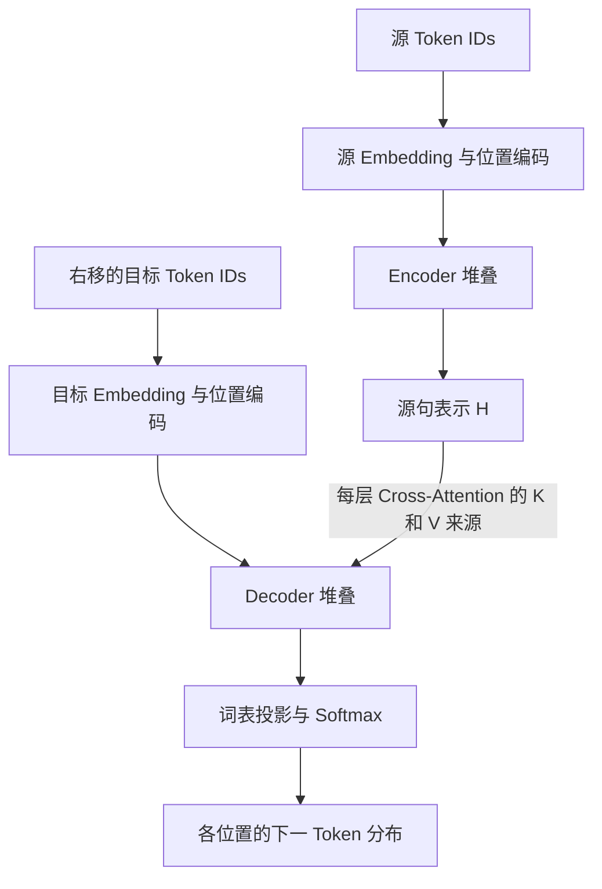

# Transformer 学习笔记：从序列建模到训练与生成

> **阅读主线**：以机器翻译中的原始 Encoder–Decoder Transformer 为核心，依次理解输入表示、注意力、编码器、解码器和训练目标；再学习 RoPE 与其他架构变体。
>
> **版本说明**：根据原笔记修改、重组和补充。保留 RNN/LSTM/GRU、Embedding、正弦位置编码及 RoPE 的内容，修正数学记号与过度概括的结论。原文件中的图片依赖 Windows 本地路径，本版用独立可读的公式、表格和 Mermaid 图替代；未获得那些图片本身。

## 目录

1. 问题与符号：Transformer 究竟学习什么
2. 起源：从 RNN 到注意力
3. 整体架构与信息流
4. 输入表示：Tokenizer、Embedding、位置编码
5. 注意力：从单个位置到矩阵计算
6. 多头注意力与张量维度
7. 残差连接、LayerNorm 与 FFN
8. Encoder：生成上下文表示
9. Decoder：有条件地预测下一个 Token
10. 训练：右移输入、掩码与交叉熵
11. 推理：自回归生成与 KV Cache
12. RoPE：完整推导与适用边界
13. 架构变体、复杂度与实现检查
14. 原笔记关键修正与自测

## 1. 问题与符号：Transformer 究竟学习什么

### 1.1 从条件概率开始理解机器翻译

设源语言 Token 序列为 $x=(x_1,\ldots,x_S)$，目标语言 Token 序列为 $y=(y_1,\ldots,y_T)$。这里约定 $y_T=\texttt{<eos>}$，也就是把“何时结束”纳入预测。

模型要学习条件分布：

$$
p_\theta(y\mid x)
=\prod_{t=1}^{T}p_\theta(y_t\mid y_{<t},x),
\qquad y_{<t}=(y_1,\ldots,y_{t-1}).
$$

这个分解来自概率的链式法则，并不是 Transformer 独有的假设。Transformer 的作用是用一个可训练的神经网络，参数化右边每一步的条件概率。

以教学用的词级切分为例：

- 源序列：`我 / 爱 / 机器 / 翻译`。
- 目标序列：`I / love / machine / translation / <eos>`。
- 预测 `machine` 时，可用条件是完整中文原句和英文前缀 `I love`。

**Encoder 提供源句表示；Decoder 结合源句与目标前缀；输出层给出词表上的概率分布。** Cross-Attention 只是这个计算过程中的一个模块。

### 1.2 统一符号

| 符号 | 含义 | 备注 |
|---|---|---|
| $B$ | Batch 大小 | 一批样本的数量 |
| $S,T$ | 源序列、目标序列长度 | Batch 中通常指补齐后的长度 |
| $V_s,V_t$ | 源语言、目标语言词表大小 | 用 $V_t$ 表示词表大小，避免与 Value 矩阵混淆 |
| $d$ | 模型隐藏维度 | 即 $d_{\mathrm{model}}$ |
| $h$ | 注意力头数 | 标准等宽多头通常要求 $h\mid d$ |
| $d_k,d_v$ | 单头 Query/Key、Value 维度 | 常取 $d_k=d_v=d/h$ |
| $d_{\mathrm{ff}}$ | FFN 中间维度 | 通常大于 $d$ |
| $L_e,L_d$ | Encoder、Decoder 层数 | 每层一般有独立参数 |
| $H,Z$ | Encoder、Decoder 隐藏表示 | 每一行对应一个位置 |
| $Q,K,V$ | Query、Key、Value 矩阵 | 是输入经过投影得到的表示 |
| $A,M$ | 注意力权重、加性掩码 | 不与模型参数混淆 |

除 RoPE 一节明确使用列向量外，序列矩阵均按“**每一行是一个 Token 的表示**”书写。推导一般省略 Batch 维度，形状检查时再加回。

## 2. 起源：从 RNN 到注意力

### 2.1 RNN：通过状态递推携带历史信息

RNN 是经典序列建模架构之一：

$$
h_t=\phi(W_hh_{t-1}+W_xe_t+b),
$$

其中 $e_t$ 是当前位置的输入向量。本节采用列向量记法。

从 $h_{t-k}$ 到 $h_t$ 的梯度包含雅可比矩阵连乘：

$$
\frac{\partial h_t}{\partial h_{t-k}}
=J_tJ_{t-1}\cdots J_{t-k+1},
\qquad J_r=\frac{\partial h_r}{\partial h_{r-1}}.
$$

连乘可能导致梯度变小或变大，因此长距离依赖较难训练。另一个问题是：计算 $h_t$ 前必须先得到 $h_{t-1}$，所以**沿时间轴存在顺序依赖**。

这不表示 RNN 不能使用 GPU：不同样本、矩阵乘法内部仍能并行，只是同一序列的状态递推限制了时间维度上的并行。

### 2.2 LSTM：增加可控制的信息通道

一种常见 LSTM 写法为：

$$
\begin{aligned}
f_t&=\sigma(W_f[h_{t-1};e_t]+b_f),\\
i_t&=\sigma(W_i[h_{t-1};e_t]+b_i),\\
\widetilde c_t&=\tanh(W_c[h_{t-1};e_t]+b_c),\\
c_t&=f_t\odot c_{t-1}+i_t\odot\widetilde c_t,\\
o_t&=\sigma(W_o[h_{t-1};e_t]+b_o),\\
h_t&=o_t\odot\tanh(c_t).
\end{aligned}
$$

$[\cdot;\cdot]$ 表示拼接，$\odot$ 表示逐元素乘法。遗忘门决定保留多少旧状态，输入门决定写入多少新信息，输出门控制显露多少细胞状态。

$c_{t-1}\to c_t$ 的直接加性通道有利于保留梯度。但不能把整个网络的总导数简单写成 $f_t$，因为门值本身也通过隐藏状态依赖历史。

### 2.3 GRU：更紧凑的门控结构

采用“$z_t$ 控制写入新信息比例”的约定：

$$
\begin{aligned}
z_t&=\sigma(W_z[h_{t-1};e_t]+b_z),\\
r_t&=\sigma(W_r[h_{t-1};e_t]+b_r),\\
\widetilde h_t&=\tanh(W_h[r_t\odot h_{t-1};e_t]+b_h),\\
h_t&=(1-z_t)\odot h_{t-1}+z_t\odot\widetilde h_t.
\end{aligned}
$$

有的资料把 $z_t$ 定义为保留旧状态的比例，此时最后一式的两个系数会交换。比较代码时要先核对约定；重置门在候选状态中的具体位置也有实现变体。

GRU 通常比相同隐藏维度的 LSTM 参数更少，但两者孰优取决于任务与配置。它们都保留时间递推。

### 2.4 注意力：从压缩历史到按需读取

如果 Encoder 把整句信息压缩成一个固定向量，Decoder 每一步都依赖这同一份摘要。注意力改为保留多个源位置表示：

$$
H=(h_1^\top,\ldots,h_S^\top)^\top,
\qquad
c_t=\sum_{j=1}^{S}\alpha_{tj}h_j,
\qquad
\sum_j\alpha_{tj}=1.
$$

每一步根据当前解码状态，动态计算一组 $\alpha_{tj}$，读取不同的源句信息。

原始 Transformer 在序列表示计算中去掉了循环与卷积，使用注意力和逐位置网络构建 Encoder–Decoder。它并不是只有 Attention，还包含 FFN、残差连接、归一化和位置表示。参见 [Attention Is All You Need](https://arxiv.org/abs/1706.03762)。

## 3. 整体架构与信息流



| 组件 | 接收什么 | 产生什么 | 核心作用 |
|---|---|---|---|
| 源 Embedding 与位置编码 | 源 Token IDs | $S\times d$ | 表达 Token 内容与位置 |
| Encoder | 源序列表示 | $H\in\mathbb R^{S\times d}$ | 融合源句上下文 |
| 目标 Embedding 与位置编码 | 右移目标 IDs | $T\times d$ | 表达已知目标前缀 |
| Decoder | 目标表示与 $H$ | $Z\in\mathbb R^{T\times d}$ | 结合前缀和源句 |
| 输出投影 | $Z$ | $T\times V_t$ logits | 为每个候选 Token 打分 |
| Softmax | logits | $T\times V_t$ 概率 | 得到条件分布 |

**要区分两种“位置”**：源位置 $j$ 属于原句，目标位置 $t$ 属于译文；二者长度不同，也不要求逐词对应。

## 4. 输入表示：Tokenizer、Embedding、位置编码

### 4.1 Tokenizer：把文本变成离散符号序列

$$
\text{原始文本}\longrightarrow\text{Token 序列}
\longrightarrow\text{Token ID 序列}.
$$

Token 可以是字、词、子词或字节片段。**字符数、词数与 Token 数通常不同**；应把 $S$ 定义为分词后的长度。

BPE、WordPiece 是常见子词分词算法；SentencePiece 是分词工具框架，可使用 Unigram 或 BPE 等方法，不宜把三者完全视为同一层级的算法名称。

Token ID 只是词表索引：ID 20 并不比 ID 10“语义大一倍”，两个 ID 的数值差也不是语义距离。

| 特殊 Token | 常见作用 | 注意 |
|---|---|---|
| `<bos>` / `<sos>` | 序列起始 | 具体是否使用取决于模型 |
| `<eos>` | 序列终止 | 通常也需要被预测 |
| `<pad>` | 批处理补齐 | 需在注意力和损失中正确处理 |
| `<unk>` | 未知片段 | 不是每种 tokenizer 都需要 |
| `[CLS]`、`[SEP]` | BERT 风格的特殊用途 | 并非 Transformer 通用要求 |

Tokenizer 通常在神经网络训练前确定分词规则和词表；它不等同于后续可微、可训练的 Embedding 层。

### 4.2 Embedding：用可训练矩阵查表

设源词表嵌入矩阵为：

$$
W_E^{(s)}\in\mathbb R^{V_s\times d}.
$$

Token ID 为 $x_i$ 时，输入向量为第 $x_i$ 行：

$$
e_i=W_E^{(s)}[x_i,:]\in\mathbb R^{1\times d}.
$$

如果定义行 one-hot 向量 $o_i\in\{0,1\}^{1\times V_s}$，则：

$$
O=\begin{bmatrix}o_1\\\vdots\\o_S\end{bmatrix}
\in\{0,1\}^{S\times V_s},
\qquad E=OW_E^{(s)}\in\mathbb R^{S\times d}.
$$

这样写既统一行列方向，也避免把“词表参数矩阵”和“查表后的序列表示”都记成 $E$。

实际实现通常直接取行，不构造稠密 one-hot。取出全部向量需要约 $O(Sd)$ 的数据访问，输出占 $O(Sd)$ 空间；**参数矩阵本身仍占 $O(V_sd)$ 空间**，查表没有消除这部分开销。

Embedding 通常从随机值开始，与主体参数一起训练。语义结构由训练任务塑造，但不能保证任意语义相近的 Token 都有更高余弦相似度。

### 4.3 静态输入向量与上下文表示

同一个 Token ID 查表得到同一行向量；经过 Transformer 后，其表示依赖所在上下文。例如，“苹果”在水果和公司语境中有相同的初始查表向量，却可得到不同的最终隐藏表示。

$$
\underbrace{e_i=W_E[x_i,:]}_{\text{仅由 Token ID 决定}}
\quad\longrightarrow\quad
\underbrace{h_i=F_\theta(x_1,\ldots,x_S)_i}_{\text{依赖可见上下文}}.
$$

从头训练、继续预训练和微调需要分开理解：

| 情境 | Embedding 的来源 | 是否更新 |
|---|---|---|
| 从头训练模型 | 通常随机初始化 | 通常更新 |
| 加载已有模型继续训练 | 随检查点一起加载 | 取决于是否冻结 |
| 导入传统预训练词向量 | 外部词向量 | 可以冻结或微调 |

传统词向量的维度不同，可增加投影层，并非数学上“只能使用固定的 $d$”；实际困难还包括词表与分词方式不匹配。

也不能把所有预训练目标说成“预测下一个 Token”。例如 BERT 采用掩码语言建模，而不是普通左到右的下一 Token 预测；原始 BERT 还使用句间预测任务。参见 [BERT 原论文](https://arxiv.org/abs/1810.04805)。

### 4.4 为什么需要位置信息

先考虑**没有位置相关操作、没有固定因果掩码**的 Self-Attention。设 $P$ 为置换矩阵，则：

$$
\operatorname{SA}(PX)=P\operatorname{SA}(X).
$$

因为 $Q'=PQ,K'=PK,V'=PV$，且逐行 Softmax 满足：

$$
\operatorname{softmax}(PAP^\top)
=P\operatorname{softmax}(A)P^\top,
$$

所以重新排列输入，只会相应重排输出。这叫**置换等变性**，不同于输出完全不变的置换不变性。

对逐位置 FFN 和 LayerNorm，同样成立。模型缺少独立的顺序线索，因此需要位置表示来区分“谁在前、谁在后”。若使用固定因果掩码，掩码本身就引入了顺序结构，不能不加条件地套用上述证明。

### 4.5 固定正弦—余弦位置编码

对位置 $m=0,1,\ldots$ 和维度组 $i=0,\ldots,d/2-1$：

$$
\operatorname{PE}(m,2i)=\sin(m\omega_i),\qquad
\operatorname{PE}(m,2i+1)=\cos(m\omega_i),
\qquad \omega_i=10000^{-2i/d}.
$$

原始结构中的输入形式为：

$$
H^{(0)}=\operatorname{Dropout}(\sqrt d\,E_s+\operatorname{PE}_s),
\qquad
Z^{(0)}=\operatorname{Dropout}(\sqrt d\,E_t+\operatorname{PE}_t).
$$

源端和目标端都加入位置编码。乘 $\sqrt d$ 是该架构的具体缩放设计，不是所有 Transformer 必须遵守的规则；其数值影响也与初始化和其他归一化操作有关。

每一组包含不同频率，因此对位置变化有不同敏感度。对固定偏移 $k$，用三角恒等式可直接得到：

$$
\begin{bmatrix}
\sin((m+k)\omega_i)\\
\cos((m+k)\omega_i)
\end{bmatrix}
=
\begin{bmatrix}
\cos(k\omega_i)&\sin(k\omega_i)\\
-\sin(k\omega_i)&\cos(k\omega_i)
\end{bmatrix}
\begin{bmatrix}
\sin(m\omega_i)\\
\cos(m\omega_i)
\end{bmatrix}.
$$

这说明**固定偏移可以作用为一个与 $m$ 无关的线性变换**。它提供了相对位置可被利用的结构，却不保证训练后的网络一定学会利用，也不保证在任意长序列上泛化良好。

可学习绝对位置向量则是训练一个位置表 $W_P[m,:]$ 并与 Embedding 相加。RoPE 的注入位置不同：通常作用在各注意力层投影后的 $Q,K$ 上，第 12 节再推导。

## 5. 注意力：从单个位置到矩阵计算

### 5.1 为什么需要 Q、K、V

给定输入 $X\in\mathbb R^{n\times d}$：

$$
Q=XW_Q,\qquad K=XW_K,\qquad V=XW_V,
$$

其中：

$$
W_Q,W_K\in\mathbb R^{d\times d_k},
\qquad W_V\in\mathbb R^{d\times d_v}.
$$

可以把三个投影理解为三种不同职责：

| 对象 | 职责 | 在计算中的用途 |
|---|---|---|
| $q_i$ | 当前位置需要什么信息 | 与各个 Key 比较 |
| $k_j$ | 位置 $j$ 如何被匹配 | 决定被关注程度 |
| $v_j$ | 位置 $j$ 提供什么信息 | 被加权汇总 |

这些只是帮助理解的比喻。它们都是学习得到的向量，没有预先规定哪个维度表示主语或宾语。

Self-Attention 中三者来自同一序列，但通常使用不同投影，因此 $Q,K,V$ 一般不相等。分开投影使“匹配依据”和“传递内容”可以不同。

### 5.2 从一个 Query 出发

位置 $i$ 对位置 $j$ 的分数为：

$$
s_{ij}=\frac{q_i k_j^\top}{\sqrt{d_k}}+M_{ij}.
$$

设 $\mathcal J_i$ 为位置 $i$ 允许访问的 Key 集合，则：

$$
\alpha_{ij}=
\begin{cases}
\displaystyle\frac{\exp(q_i k_j^\top/\sqrt{d_k})}
{\sum_{r\in\mathcal J_i}\exp(q_i k_r^\top/\sqrt{d_k})},&j\in\mathcal J_i,\\
0,&j\notin\mathcal J_i.
\end{cases}
$$

输出为：

$$
o_i=\sum_j\alpha_{ij}v_j\in\mathbb R^{1\times d_v}.
$$

Softmax 在 **Key 位置方向**归一化。同一 Query 对所有可见 Key 分配权重，而不是在特征维度上归一化。

在未对注意力权重施加 Dropout 时，$\alpha_{ij}\geq0$ 且 $\sum_j\alpha_{ij}=1$，所以单头输出是 Value 向量的凸组合。经过输出投影和残差后，整个子层输出不必仍在这个凸包中。

### 5.3 矩阵形式与维度

允许 Query 和 Key 来自不同长度的序列：

$$
Q\in\mathbb R^{n_q\times d_k},\quad
K\in\mathbb R^{n_k\times d_k},\quad
V\in\mathbb R^{n_k\times d_v}.
$$

于是：

$$
A=\operatorname{softmax}_{\text{按行}}
\left(\frac{QK^\top}{\sqrt{d_k}}+M\right)
\in\mathbb R^{n_q\times n_k},
\qquad O=AV\in\mathbb R^{n_q\times d_v}.
$$

**输出位置数由 Query 决定；被读取的位置数由 Key/Value 决定。** Key 与 Value 的位置数必须一致，但 $d_v$ 不必等于 $d_k$。

### 5.4 一个可手算的例子

考虑一个 Query 和两个 Key/Value，取 $d_k=1$：

$$
q=[1],\quad k_1=[0],\quad k_2=[\log3],
\qquad v_1=[2,0],\quad v_2=[0,4].
$$

分数为 $[0,\log3]$，权重为：

$$
\operatorname{softmax}([0,\log3])=[1/4,3/4].
$$

因此输出：

$$
o=\tfrac14[2,0]+\tfrac34[0,4]=[0.5,3].
$$

若第二个位置被掩码禁止访问，权重变成 $[1,0]$，输出变成 $[2,0]$。

这也说明：注意力权重 $3/4$ 表示该 Query 对第二个 Value 的读取权重，**不是某个输出词的预测概率**。

### 5.5 为什么除以 $\sqrt{d_k}$

为说明维度引起的数值尺度，考虑一个简化随机模型：所有 $q_\ell,k_\ell$ 相互独立、均值为 0、方差为 1。则：

$$
qk^\top=\sum_{\ell=1}^{d_k}q_\ell k_\ell,
\qquad
\operatorname{Var}(q_\ell k_\ell)
=\mathbb E(q_\ell^2)\mathbb E(k_\ell^2)=1,
$$

所以：

$$
\operatorname{Var}(qk^\top)=d_k,
\qquad
\operatorname{Var}\left(\frac{qk^\top}{\sqrt{d_k}}\right)=1.
$$

分数尺度过大时，Softmax 更容易高度集中。其雅可比为：

$$
\frac{\partial\alpha_j}{\partial s_r}
=\alpha_j(\mathbf1\{j=r\}-\alpha_r).
$$

当概率接近 0 或 1 时，很多局部导数接近 0。缩放有助于控制分数尺度。独立、单位方差是解释机制的简化条件，并非训练中严格成立的性质。

缩放点积也不等于余弦相似度，后者还需要除以 $\lVert q\rVert\lVert k\rVert$。

### 5.6 从统计学角度理解

对固定 Query，可以定义一个取值于 Key 位置集合的辅助随机变量 $J_i$，使：

$$
\Pr(J_i=j\mid Q,K,M)=\alpha_{ij}.
$$

那么：

$$
o_i=\mathbb E[v_{J_i}\mid Q,K,V,M].
$$

这是把加权平均重新表示成期望，帮助理解“内容决定权重的汇总”。它不证明注意力就是某个真实潜变量的后验，也不表示注意力权重天然具有因果解释。

## 6. 多头注意力与张量维度

### 6.1 多个学习到的匹配规则

对第 $r$ 个头：

$$
\operatorname{head}_r
=\operatorname{Attention}(XW_Q^{(r)},XW_K^{(r)},XW_V^{(r)};M).
$$

汇总各头：

$$
\operatorname{MHA}(X)
=\operatorname{Concat}(\operatorname{head}_1,\ldots,\operatorname{head}_h)W_O,
\qquad W_O\in\mathbb R^{hd_v\times d}.
$$

每个头有不同投影和注意力矩阵，因此可学习不同的信息关系。但“某个头专门负责语法，另一个头专门负责语义”只是可能的观察，不是架构保证。

实际可以先做一次大线性投影，再 reshape 分头。这等价于把各头的投影矩阵沿输出维拼起来，**并不是简单把原始 $X$ 切成互不交流的几块**。

### 6.2 一个完整的维度例子

取 $B=2,n=5,d=512,h=8,d_k=d_v=64$：

| 操作 | 张量形状 |
|---|---|
| 输入 $X$ | $(2,5,512)$ |
| 大投影后的 $Q,K,V$ | 各为 $(2,5,512)$ |
| reshape 并调整轴顺序 | 各为 $(2,8,5,64)$ |
| $QK^\top$ | $(2,8,5,5)$ |
| 沿最后一维 Softmax | $(2,8,5,5)$ |
| 与 $V$ 相乘 | $(2,8,5,64)$ |
| 合并头 | $(2,5,512)$ |
| 输出投影 $W_O$ | $(2,5,512)$ |

Cross-Attention 中只需分别使用目标长度 $T$ 和源长度 $S$，分数矩阵就变成 $(B,h,T,S)$。

在标准 $hd_k=hd_v=d$ 配置下，忽略偏置，一个多头注意力模块约有 $4d^2$ 个投影参数：Q、K、V 各 $d^2$，输出投影 $d^2$。固定 $d$ 时，增加头数主要改变子空间划分，并不让这部分参数按头数线性增加。

## 7. 残差连接、LayerNorm 与 FFN

### 7.1 残差连接：让子层学习对现有表示的修正

对输入 $X$ 和同形状的子层输出 $F(X)$：

$$
Y=X+F(X).
$$

残差让原表示有一条直接通道，子层可以学习增量。形式上：

$$
\frac{\partial Y}{\partial X}=I+\frac{\partial F}{\partial X}.
$$

其中的恒等项有利于梯度传播，但不保证任何深度、任何初始化下都不会出现训练困难。

相加要求形状一致，这也是注意力输出投影和 FFN 最终都回到 $d$ 维的原因。

### 7.2 LayerNorm：在单个位置的特征维上归一化

对某个位置的向量 $u=(u_1,\ldots,u_d)$：

$$
\mu=\frac1d\sum_{a=1}^d u_a,
\qquad
\sigma^2=\frac1d\sum_{a=1}^d(u_a-\mu)^2,
$$

$$
\operatorname{LN}(u)_a
=\gamma_a\frac{u_a-\mu}{\sqrt{\sigma^2+\epsilon}}+\beta_a.
$$

$\gamma,\beta\in\mathbb R^d$ 可学习，$\epsilon>0$ 防止除零。

对于 $(B,T,d)$ 的隐藏张量，标准 Token-wise LayerNorm 归一化最后的 $d$ 维，**不在 Batch 维或序列维上混合统计量**。因此它本身不会让目标位置读取未来 Token。

这里的 $1/d$ 是归一化运算的定义，不是为了估计总体方差而采用的无偏样本方差公式。

### 7.3 Post-LN 与 Pre-LN

| 形式 | 一个子层的计算 | 归一化位置 |
|---|---|---|
| Post-LN | $Y=\operatorname{LN}(X+\operatorname{Dropout}(F(X)))$ | 残差相加之后 |
| Pre-LN | $Y=X+\operatorname{Dropout}(F(\operatorname{LN}(X)))$ | 子层计算之前 |

原始 Transformer 使用 Post-LN。Pre-LN 改变了梯度传播路径，常有更易优化的表现；完整 Pre-LN 堆叠通常还有最终归一化。讨论训练稳定性时需要结合架构、初始化和学习率，不能把二者视为仅书写顺序不同。参见 [On Layer Normalization in the Transformer Architecture](https://arxiv.org/abs/2002.04745)。

以下 Encoder 和 Decoder 公式统一使用 **Post-LN**，避免混写。

### 7.4 FFN：逐位置的非线性变换

原笔记中的 ReLU FFN 可写成：

$$
\operatorname{FFN}(X)
=\operatorname{ReLU}(XW_1+b_1)W_2+b_2,
$$

$$
W_1\in\mathbb R^{d\times d_{\mathrm{ff}}},
\qquad W_2\in\mathbb R^{d_{\mathrm{ff}}\times d}.
$$

单个位置经历：

$$
\mathbb R^d\longrightarrow\mathbb R^{d_{\mathrm{ff}}}
\longrightarrow\mathbb R^d.
$$

同一层中的所有位置使用同一组 FFN 参数，但独立计算，不直接进行跨位置混合。由于 FFN 的输入已由注意力聚合上下文，其输出仍可依赖其他位置。

Attention 负责跨位置汇总，FFN 负责逐位置变换。若去掉非线性，连续两个仿射变换可合并成一个仿射变换，表达能力会受限制。

后续架构可以改变激活函数、门控结构或归一化方法；这些是变体，不需要混入原始架构的定义。

## 8. Encoder：生成上下文表示

第 $\ell$ 层以 $H^{(\ell-1)}\in\mathbb R^{S\times d}$ 为输入：

$$
\widetilde H^{(\ell)}=
\operatorname{LN}_{\ell,1}\left(
H^{(\ell-1)}+
\operatorname{Dropout}(\operatorname{MHA}_{\ell,\mathrm{self}}
(H^{(\ell-1)};M_s))\right),
$$

$$
H^{(\ell)}=
\operatorname{LN}_{\ell,2}\left(
\widetilde H^{(\ell)}+
\operatorname{Dropout}(\operatorname{FFN}_{\ell}(\widetilde H^{(\ell)}))
\right).
$$

最终：

$$
H=H^{(L_e)}\in\mathbb R^{S\times d}.
$$

$M_s$ 屏蔽源序列的 padding Key。标准翻译 Encoder 不加因果掩码，每个有效源位置可以读取整句中的有效位置。

需要注意：

1. Encoder 输出仍是一个序列矩阵，而不一定是一个句向量。分类任务可以再做池化，但翻译 Decoder 通常读取整个 $H$。
2. 堆叠层的结构相同，不意味着不同层共享参数；标准情况下各层独立。
3. 无掩码的全局注意力让两个源位置一层内就能交互，但不意味着一层即可完成任意复杂推理。多层仍提供表示变换与组合的深度。

## 9. Decoder：有条件地预测下一个 Token

### 9.1 先明确 Decoder 的输入

训练时输入的是**右移后的真实目标序列**；推理时输入的是起始符和**已经生成的目标前缀**。推理时并没有完整译文可作为输入。

定义 $y_0=\texttt{<bos>}$，则训练用 Decoder 输入为：

$$
(y_0,y_1,\ldots,y_{T-1}),
$$

对应标签为：

$$
(y_1,y_2,\ldots,y_T).
$$

本文把预测 $y_t$ 的槽位编号为 $t$，该槽位的输入 Token 是 $y_{t-1}$。

### 9.2 每层的三个子层

设输入为 $Z^{(\ell-1)}\in\mathbb R^{T\times d}$：

$$
U^{(\ell)}=\operatorname{LN}_{\ell,1}\left(
Z^{(\ell-1)}+
\operatorname{Dropout}(\operatorname{MHA}_{\ell,\mathrm{self}}
(Z^{(\ell-1)};M_t))\right),
$$

$$
C^{(\ell)}=\operatorname{LN}_{\ell,2}\left(
U^{(\ell)}+
\operatorname{Dropout}(\operatorname{MHA}_{\ell,\mathrm{cross}}
(U^{(\ell)},H;M_s^{\mathrm{cross}}))\right),
$$

$$
Z^{(\ell)}=\operatorname{LN}_{\ell,3}\left(
C^{(\ell)}+
\operatorname{Dropout}(\operatorname{FFN}_{\ell}(C^{(\ell)}))
\right).
$$

其中 $M_t$ 同时处理因果关系和目标 padding。所有 Decoder 层都可读取 Encoder 的最终输出 $H$，但一般具有各自独立的 Cross-Attention 投影。

### 9.3 三种注意力放在一起比较

| 模块 | Query 来源 | Key/Value 来源 | 单头权重形状 | 可见范围 |
|---|---|---|---|---|
| Encoder Self-Attention | 源端当前层输入 | 同一源端输入 | $S\times S$ | 全部有效源位置 |
| Decoder Self-Attention | 目标端当前层输入 | 同一目标端输入 | $T\times T$ | 当前及之前的输入槽位 |
| Decoder Cross-Attention | 目标端 Self-Attention 子层之后 | Encoder 最终输出 | $T\times S$ | 全部有效源位置 |

对单头 Cross-Attention：

$$
Q=UW_Q,\quad K=HW_K,\quad V=HW_V,
$$

$$
Q\in\mathbb R^{T\times d_k},\quad
K\in\mathbb R^{S\times d_k},\quad
V\in\mathbb R^{S\times d_v}.
$$

因此 $A\in\mathbb R^{T\times S}$：目标位置 $t$ 为源位置分配读取权重。它可以形成软对齐，但不是严格一一对应的词对齐。

标准完整句子翻译中，Cross-Attention 无需因果掩码，因为源句在生成开始前已经可用；流式翻译等任务可能有额外限制。

### 9.4 输出投影与词表概率

标准模型对最终 Decoder 层的表示使用输出头：

$$
Z=Z^{(L_d)}\in\mathbb R^{T\times d},
\quad W_{\mathrm{out}}\in\mathbb R^{d\times V_t},
\quad b_{\mathrm{out}}\in\mathbb R^{V_t},
$$

$$
G=ZW_{\mathrm{out}}+b_{\mathrm{out}}\in\mathbb R^{T\times V_t}.
$$

$G$ 是 logits。词表概率为：

$$
p_\theta(y_t=v\mid y_{<t},x)
=\frac{\exp(G_{tv})}{\sum_{u=0}^{V_t-1}\exp(G_{tu})}.
$$

| Softmax 所在位置 | 归一化维度 | 数值的含义 |
|---|---|---|
| Attention 内部 | 可见 Key 位置 | 从哪里读取信息 |
| 输出头 | 目标词表 | 下一个 Token 是什么 |

选概率最大的 Token 是**贪心解码策略**，不是 Softmax 的定义，也不是唯一生成方式。

### 9.5 Embedding 与输出头权重共享

若目标输入嵌入为 $W_E^{(t)}\in\mathbb R^{V_t\times d}$，可设置：

$$
W_{\mathrm{out}}=(W_E^{(t)})^\top.
$$

这样可省去一个 $dV_t$ 大小的独立矩阵，使同一参数兼作输入表示和输出匹配基底。这是可选设计，不保证对所有任务都更好。

源端与目标端是否也共享 Embedding，需要看词表及 ID 语义是否对齐；仅仅矩阵形状相同不足以直接共享。

## 10. 训练：右移输入、掩码与交叉熵

### 10.1 把一次训练对齐完整写出来

仍使用词级教学示例，真实分词器可能采用不同切分：

| 预测槽位 $t$ | Decoder 该槽位输入 | 因果掩码下可见的目标输入 | 监督标签 |
|---|---|---|---|
| 1 | `<bos>` | `<bos>` | `I` |
| 2 | `I` | `<bos> I` | `love` |
| 3 | `love` | `<bos> I love` | `machine` |
| 4 | `machine` | `<bos> I love machine` | `translation` |
| 5 | `translation` | `<bos> I love machine translation` | `<eos>` |

每个槽位还可以通过 Cross-Attention 读取中文源句。

**槽位 $t$ 可以看见自己的输入 $y_{t-1}$，但不能看见要预测的标签 $y_t$。** 标签 $y_t$ 出现在下一个输入槽位，必须被掩住。

这解释了为什么“仅禁止看到 $t+1$ 之后的词”容易产生歧义：必须说明 $t$ 指的是输入槽位还是目标 Token。正确做法是同时检查右移和掩码。

### 10.2 因果掩码

按输入槽位编号：

$$
(M_{\mathrm{causal}})_{ij}
=\begin{cases}
0,&j\le i,\\
-\infty,&j>i.
\end{cases}
$$

例如长度为 4 时：

$$
M_{\mathrm{causal}}=
\begin{bmatrix}
0&-\infty&-\infty&-\infty\\
0&0&-\infty&-\infty\\
0&0&0&-\infty\\
0&0&0&0
\end{bmatrix}.
$$

将它加到缩放后的分数上，**在 Softmax 之前**屏蔽未来。对角线可以保留，因为输入已经右移。

### 10.3 Padding 掩码与损失屏蔽是两件事

对第 $b$ 个样本，Key padding 掩码定义为：

$$
(M_{\mathrm{pad}})_{bij}
=\begin{cases}
0,&\text{Key 位置 }j\text{ 是有效 Token},\\
-\infty,&\text{Key 位置 }j\text{ 是 padding}.
\end{cases}
$$

目标 Self-Attention 可使用：

$$
M_t=M_{\mathrm{causal}}+M_{\mathrm{pad,tgt}}.
$$

| 处理位置 | 要解决的问题 |
|---|---|
| Encoder Self-Attention 的源 padding mask | 源有效位置不能读取补齐占位符 |
| Decoder Self-Attention 的目标 padding mask | 不能把目标 padding 当成历史内容 |
| Cross-Attention 的源 padding mask | 目标位置不能读取源端补齐占位符 |
| 损失函数的标签有效性 mask | 不要求模型学习预测补齐占位符 |

Key padding mask 不一定把 padding **Query** 的输出变为 0。那些输出可以存在，但不应计入目标损失，也不应被当作有效预测汇总。

有效 Query 至少要有一个可见 Key。如果某行全部是 $-\infty$，Softmax 可能产生 NaN。教学实现可以使用右侧 padding，并确保目标起始位置可见。

### 10.4 Teacher Forcing 为什么可以并行

训练中所有真实前缀已经由数据给出，因此可以一次构造整个右移序列，并同时计算：

$$
p_\theta(y_1\mid x),\ 
 p_\theta(y_2\mid y_1,x),\ \ldots,\
 p_\theta(y_T\mid y_{<T},x).
$$

这不代表模型假设各目标 Token 独立；每个条件分布仍使用自己的真实前缀。并行的是“给定各个真实前缀后的概率计算”，不是一次前向就完成未知译文的自回归生成。

多层之间仍然有先后顺序。Attention 沿序列位置并行，也不等于整张网络中的所有操作都能同时执行。

### 10.5 交叉熵就是条件负对数似然

设 $\mathcal I$ 为 Batch 中标签非 padding 的位置集合，则每 Token 平均损失为：

$$
\mathcal L(\theta)
=-\frac{1}{|\mathcal I|}\sum_{(b,t)\in\mathcal I}
\log p_\theta(y_{bt}\mid y_{b,<t},x_b).
$$

对某个位置，记真实标签的 one-hot 分布为 $r_v$，模型分布为 $p_v$：

$$
\operatorname{CE}(r,p)=-\sum_vr_v\log p_v=-\log p_{y_t}.
$$

采用 one-hot 标签时，logits 的梯度为：

$$
\frac{\partial\mathcal L_t}{\partial G_{tv}}
=p_{tv}-\mathbf1\{v=y_t\}.
$$

它直接说明训练信号的方向：提高真实标签分数，并按当前概率降低其他候选的相对分数。梯度继续传到输出头、Decoder、Encoder 和未被冻结的 Embedding。

实际实现通常把 logits 直接交给稳定的交叉熵运算；不要先 Softmax 再误当 logits 输入。

### 10.6 Label Smoothing 与训练流程

一种标签平滑定义为：

$$
\widetilde r=(1-\varepsilon)r+\varepsilon u,
\qquad
\mathcal L_t=-\sum_v\widetilde r_v\log p_{tv},
$$

其中 $u$ 是约定候选集合上的均匀分布。是否排除 padding、是否包含真实类别，必须按具体实现核对；这些约定对应不同目标。

一次训练迭代可按以下顺序理解：

1. 得到源序列、完整目标序列和 padding 信息。
2. 构造目标输入与标签，确认二者错开一个 Token。
3. 构造源 padding、目标 padding、目标因果掩码。
4. Encoder 计算 $H$，Decoder 计算所有目标位置的 logits。
5. 只在有效标签处计算损失，包含需要学习的 `<eos>`。
6. 反向传播并更新未冻结参数。

一个常见 warmup 加逆平方根衰减形式为：

$$
\eta(s)=c\,d^{-1/2}
\min\left(s^{-1/2},s\,w^{-3/2}\right),\qquad s\ge1,
$$

$w$ 是 warmup 步数，$c$ 是比例系数。它不是 Transformer 的定义。比较训练结果时，还要统一优化器、有效 Batch、Token 数、梯度累积和学习率调度。

验证损失可继续使用真实前缀，但翻译质量评估应另做自回归生成。Teacher-forcing 验证损失和实际生成质量回答的问题不同。

在无平滑的负对数似然下，困惑度为 $\operatorname{PPL}=\exp(\mathcal L)$（自然对数）。比较它时需统一分词、数据和归一化口径。

## 11. 推理：自回归生成与 KV Cache

### 11.1 从起始符开始生成

给定源句 $x$，先运行 Encoder 得到 $H$，再循环：

1. 当前目标输入为 `<bos>`，预测第一个 Token。
2. 选择或采样得到 $\widehat y_1$，追加到输入。
3. 用 `<bos>, \widehat y_1` 预测 $\widehat y_2$。
4. 重复直到生成 `<eos>` 或达到长度上限。

形式上：

$$
\widehat y_t\sim\operatorname{Decode}
\left(p_\theta(\cdot\mid\widehat y_{<t},x)\right).
$$

这里 `Decode` 可表示确定性选择或随机采样。训练使用 $y_{<t}$，推理使用 $\widehat y_{<t}$，二者可能不同，这就是讨论 Exposure Bias 的出发点。错误可能影响后续，但不是每次错误都会不可逆地持续累积。

### 11.2 解码策略

| 策略 | 做法 | 需要理解的限制 |
|---|---|---|
| 贪心 | 每一步选当前概率最大者 | 局部最优不保证整句概率最大 |
| Beam Search | 保留若干高分候选前缀 | 近似搜索；结果受长度处理等影响 |
| 温度采样 | 从 $\operatorname{softmax}(G/\tau)$ 采样 | $\tau>0$；温度控制分布集中程度 |
| Top-k / Top-p | 保留部分候选后重新归一化采样 | 增加多样性控制，但可能丢弃低概率正确答案 |

贪心为何未必整句最优？假设只有两步：第一步 $p(A)=0.6,p(B)=0.4$，但最佳后续条件概率分别为 $0.5$ 和 $0.9$，则最佳 $A$ 路径概率为 $0.30$，最佳 $B$ 路径为 $0.36$。第一步选 $A$ 会错过后者。

### 11.3 KV Cache：哪些计算可以复用

在标准因果 Decoder 的推理模式下，旧位置无法读取未来 Token。因此当新 Token 到来时，旧位置已经得到的各层表示，以及对应的 Key/Value，不需要重新计算。

第 $\ell$ 层缓存：

$$
K_{1:t-1}^{(\ell)},\quad V_{1:t-1}^{(\ell)}.
$$

新输入到来后，只为新位置计算 $q_t^{(\ell)},k_t^{(\ell)},v_t^{(\ell)}$，追加缓存，再用新 Query 读取所有已有 Key/Value。

每层必须有自己的缓存。通常不必保存历史 Query，因为下一步只需要新 Query 的输出。

对于 Encoder–Decoder：

- 源句固定，所以 Encoder 输出 $H$ 通常只计算一次。
- 每层 Cross-Attention 对 $H$ 投影得到的 $K,V$ 也可预计算并复用。
- 目标端 Self-Attention 的 $K,V$ 则随生成不断追加。

缓存消除重复计算，但不消除自回归的步骤依赖。使用 RoPE 时，缓存通常保存按正确位置旋转后的 Key；新增 Token 的位置编号必须接续前缀，不能每一步重置为 0。

若采用 Beam Search，重新选择候选前缀时，还需同步重排相应缓存，不能让序列与缓存错配。

### 11.4 训练与推理总对照

| 维度 | 训练 | 自回归推理 |
|---|---|---|
| 目标前缀 | 真实历史 Token | 模型生成的历史 Token |
| 输出位置 | 可同时计算所有监督位置 | 通常每次新增一个 Token |
| 因果约束 | 需要防止读取未来标签 | 仍需维持因果语义；单个最新 Query 无未来 Key |
| Dropout | 通常开启 | 通常关闭 |
| 梯度 | 计算并更新参数 | 通常不计算 |
| KV Cache | 普通整段训练一般不使用 | 常用于加速 |
| 结束条件 | 标签长度与 mask | `<eos>` 或长度上限 |

## 12. RoPE：完整推导与适用边界

> 本节是位置表示的扩展，不属于原始正弦加性位置编码。以下局部向量统一写成**列向量**。RoPE 的核心构造参见 [RoFormer 原论文](https://arxiv.org/abs/2104.09864)；下面展开矩阵运算与符号对应。

### 12.1 二维旋转

定义：

$$
R(\phi)=
\begin{bmatrix}
\cos\phi&-\sin\phi\\
\sin\phi&\cos\phi
\end{bmatrix}.
$$

对位置 $m$ 的列向量 $x=(x_1,x_2)^\top$，施加：

$$
\widehat x=R(m\theta)x
=\begin{bmatrix}
x_1\cos(m\theta)-x_2\sin(m\theta)\\
x_1\sin(m\theta)+x_2\cos(m\theta)
\end{bmatrix}.
$$

这是正交变换，所以 $\|\widehat x\|_2=\|x\|_2$。更准确地说，它在给定位置下可逆并保留欧氏范数，不宜用未经定义的“信息守恒”替代这些性质。

### 12.2 相对位置怎样进入点积

位置 $m$ 的 Query 和位置 $n$ 的 Key 分别为 $q,k$，旋转后：

$$
\widehat q=R(m\theta)q,\qquad
\widehat k=R(n\theta)k.
$$

利用 $R(\phi)^\top=R(-\phi)$ 和 $R(\alpha)R(\beta)=R(\alpha+\beta)$：

$$
\begin{aligned}
\widehat q^\top\widehat k
&=q^\top R(m\theta)^\top R(n\theta)k\\
&=q^\top R((n-m)\theta)k.
\end{aligned}
$$

令 $\Delta=(m-n)\theta$，展开同一结果：

$$
\widehat q^\top\widehat k
=(q_1k_1+q_2k_2)\cos\Delta
+(q_1k_2-q_2k_1)\sin\Delta.
$$

矩阵式中的 $n-m$ 与展开式中的 $m-n$ 并不矛盾：$\sin(-\Delta)=-\sin\Delta$，同时展开后的系数组合也改变符号。

例如 $q=(1,0)^\top,k=(0,1)^\top$，结果为 $\sin((m-n)\theta)$，可用于快速核对旋转符号。

### 12.3 复数视角

把二维向量表示成复数 $z=x_1+\mathrm ix_2$，旋转就是乘以 $e^{\mathrm im\theta}$。实二维内积对应：

$$
\langle q,k\rangle_{\mathbb R^2}
=\operatorname{Re}(q\overline k).
$$

于是：

$$
\operatorname{Re}\left(
qe^{\mathrm im\theta}\overline{ke^{\mathrm in\theta}}
\right)
=\operatorname{Re}\left(q\overline k\,e^{\mathrm i(m-n)\theta}\right).
$$

复数式和矩阵式只是同一个旋转运算的不同表达。

### 12.4 高维推广与原笔记中的维度修正

设参与旋转的维度为偶数 $d_r$，可以等于单头 $d_k$，也可以只覆盖其中一部分。先讨论全部 $d_r$ 维：

$$
x=\begin{bmatrix}z_0\\z_1\\\vdots\\z_{d_r/2-1}\end{bmatrix},
\qquad z_i=\begin{bmatrix}x_{2i}\\x_{2i+1}\end{bmatrix},
\qquad \theta_i=\mathrm{base}^{-2i/d_r}.
$$

定义分块对角矩阵：

$$
R_m=\operatorname{diag}\left(
R(m\theta_0),\ldots,R(m\theta_{d_r/2-1})
\right)\in\mathbb R^{d_r\times d_r}.
$$

正确的乘法结果是一个**拼接后的列向量**：

$$
R_mx=
\begin{bmatrix}
R(m\theta_0)z_0\\
R(m\theta_1)z_1\\
\vdots\\
R(m\theta_{d_r/2-1})z_{d_r/2-1}
\end{bmatrix}\in\mathbb R^{d_r}.
$$

原笔记把这个结果写成“以向量块排成的对角矩阵”，形状不对；同时先写 $x^\top R_m$，后又使用 $R_mx$，旋转约定也发生了变化。

如果代码以行向量存储，表示同一个旋转应写：

$$
(R_mx)^\top=x^\top R_m^\top,
$$

不是直接把 $R_m$ 放到右侧而忽略转置。

高维点积仍有：

$$
(R_mq)^\top(R_nk)=q^\top R_{n-m}k.
$$

这里的 $R_{n-m}$ 指各二维块分别按 $(n-m)\theta_i$ 旋转。

### 12.5 “只依赖相对位置”的准确含义

准确表述是：**固定旋转前的内容向量 $q,k$ 后，RoPE 引入的显式位置因子由 $n-m$ 决定。**

不能因此说整个深层模型的注意力分数只由距离决定。$q_m,k_n$ 本身包含 Token 内容和前面各层的上下文；因果掩码、序列边界等也影响计算。

对固定内容向量，同时平移位置 $m\to m+c,n\to n+c$，显式旋转因子不变。但移动真实序列并改变其上下文，并不满足“内容向量固定”的前提。

### 12.6 RoPE 的注入位置与限制

| 比较项 | 加性正弦位置编码 | 常见 RoPE 用法 |
|---|---|---|
| 注入位置 | 输入 Embedding 上相加 | 注意力层投影后的 $Q,K$ |
| 核心操作 | $E+\operatorname{PE}$ | $q_m\mapsto R_mq_m$，$k_n\mapsto R_nk_n$ |
| Value | 经后续投影获得位置影响 | 通常不直接施加同样旋转 |
| 显式相对位置结构 | 固定偏移可用线性变换表达 | $R_m^\top R_n=R_{n-m}$ |
| 长度之外的计算 | 公式可在新位置求值 | 旋转也可在新位置求值 |

“可以计算更大位置的编码”不等于“模型能可靠处理更长上下文”。长度外推仍受训练长度、频率设置、数据和适配方法影响。

不同频率提供不同位置变化尺度，但不能据此保证注意力权重随距离逐点单调递减。相加也不等于“污染语义”；它是另一种让网络联合利用内容与位置的设计。

迁移到机器翻译时，应明确 RoPE 用在哪些 Self-Attention 模块。源语言与目标语言位置并非同一个时间轴，不应直接把二者的位置差当成天然有意义的 Cross-Attention 距离。

## 13. 架构变体、复杂度与实现检查

### 13.1 三种常见架构组织方式

| 架构 | 典型可见性 | 信息来源与输出 | 代表性用途 |
|---|---|---|---|
| Encoder-only | 双向读取有效输入 | 得到上下文表示，再接任务头 | 分类、标注、表征；BERT 风格 |
| Decoder-only | 通常采用因果注意力 | 根据同一序列前缀预测后续 | 自回归语言建模；GPT 风格 |
| Encoder–Decoder | 源端双向、目标端因果，并有交叉注意力 | 对源输入进行条件生成 | 翻译、摘要等 |

Decoder-only 通常省去原始 Decoder 中读取独立 Encoder 的 Cross-Attention。名称相近，不意味着组件完全相同。

架构与训练目标是两个维度：一个说明网络怎样组织、哪些信息可见；另一个说明用什么监督信号学习参数。

### 13.2 计算复杂度：并行不等于开销小

令单层序列长度为 $n$、隐藏维度为 $d$，忽略 Batch 和常数：

| 部分 | 主要计算量 | 说明 |
|---|---|---|
| Q/K/V 与输出投影 | $O(nd^2)$ | 四个线性投影的量级 |
| 全注意力打分与 Value 汇总 | $O(n^2d)$ | 假设总头宽为 $d$ |
| FFN | $O(ndd_{\mathrm{ff}})$ | 两个投影的量级 |
| 显式注意力权重存储 | $O(hn^2)$ | 指直接构造每头权重矩阵的实现 |
| Cross-Attention 打分与汇总 | $O(TSd)$ | 源、目标长度可能不同 |

单层 Transformer 的计算不能只写成 $O(n^2)$；那只强调序列长度方向的二次项。实际还存在投影、FFN、输出词表投影等开销。具体实现未必完整存储 $n\times n$ 权重，但这需要另外的计算组织方式。

对于 $L_d$ 层、标准多头配置，长度 $t$ 的目标 KV Cache 约存储：

$$
2BL_dtd
$$

个元素，再乘每元素字节数得到存储量；翻译模型还可能缓存源端 Cross-Attention 的 K/V。

若朴素地在每个生成步骤重算整个长度 $t$ 的前缀，Self-Attention 部分累计为：

$$
\sum_{t=1}^T O(t^2d)=O(T^3d).
$$

有缓存后，每一步新 Query 读取 $t$ 个 Key，累计为：

$$
\sum_{t=1}^T O(td)=O(T^2d).
$$

这里比较的是注意力打分与汇总部分，不是完整模型总复杂度。

### 13.3 与数学一一对应的注意力伪代码

下面是框架无关伪代码，不承诺某个 API 的布尔 mask 约定。矩阵最后两轴用于乘法，前面的 Batch/Head 轴分别计算。

```text
# Q: (B, h, nq, dk)
# K: (B, h, nk, dk)
# V: (B, h, nk, dv)
# mask: 可广播到 (B, h, nq, nk)，允许处为 0，禁止处为 -inf

scores = matmul(Q, transpose_last_two_axes(K)) / sqrt(dk)
scores = scores + mask
weights = softmax(scores, axis=-1)
output = matmul(weights, V)

# output: (B, h, nq, dv)
```

实际 API 的布尔 `True` 可能表示允许，也可能表示屏蔽；不能跨接口直接照搬。使用哪一种含义应核对所用函数的文档。

### 13.4 实现时优先检查什么

| 现象或风险 | 检查项 |
|---|---|
| 训练损失异常迅速趋近 0，生成却很差 | 是否忘了右移目标输入，或未来标签泄露 |
| 注意力输出形状不对 | 是否把 Query 长度、Key 长度或 Head 轴弄反 |
| NaN | 是否存在全被屏蔽的 Query 行；分数是否溢出 |
| 模型大量输出 padding | padding 标签是否误计入损失 |
| Loss 数值随 Batch 补齐长度异常变化 | 是否按有效 Token 数归一化 |
| 开缓存和关缓存时输出明显不同 | 位置编号、每层缓存、拼接轴是否正确 |
| 换 Tokenizer 后效果崩溃 | 词表 ID 与 Embedding、输出头是否一致 |
| 微调不生效 | 应训练的参数是否冻结；梯度是否传到目标模块 |

适合做三个概念性检查：

1. **未来不影响过去**：在推理模式、固定源句下，改动一个较晚的目标输入 Token，其之前槽位的 logits 应保持一致（允许浮点误差）。
2. **补齐不改变有效结果**：使用正确 mask 和相同位置编号时，右侧多加 padding 不应改变有效位置的输出。
3. **缓存一致性**：对同一个固定目标前缀，整段因果前向的最后一个位置与逐 Token 缓存前向应近似一致。

这些检查验证的是模型语义，而不仅是代码能否运行。

## 14. 原笔记关键修正与自测

### 14.1 本次关键修正

| 原笔记的问题或易误解说法 | 修正后的理解 |
|---|---|
| RNN 是最早的序列建模范式 | RNN 是经典序列建模架构之一 |
| LSTM/GRU 无法利用 GPU 并行 | 时间递推受限，但 Batch 和矩阵运算仍可并行 |
| Transformer 仅靠注意力 | 还包括 FFN、残差、归一化和位置表示 |
| 文本长度等于 Token 数 | 应区分字符数、词数与分词后长度 |
| One-hot 向量横排却标为 $S\times V_s$ | 统一成行 one-hot 的纵向堆叠 |
| Embedding 表与序列输出都记成 $E$ | 参数用 $W_E$，查表输出用 $E$ |
| 语义相近必然向量更近 | 可能学习到这种结构，但不是保证 |
| BERT、GPT 都预测下一 Token | BERT 的掩码语言建模需单独区分 |
| 外部词向量只能固定隐藏维度 | 可以增加投影，词表兼容性也需处理 |
| 所有模型都乘 $\sqrt d$ | 这是特定输入设计，不是通用要求 |
| 无位置时置换等变没有条件 | 要排除固定因果掩码等顺序相关操作 |
| RoPE 的行列向量与分块乘积混用 | 统一列向量；结果是向量拼接而非块对角矩阵 |
| RoPE 保证长度外推与“无语义污染” | 只陈述可验证的旋转性质，泛化需另行评估 |
| Cross-Attention 本身计算词表概率 | 它聚合源表示；最终输出头才给词表分布 |
| Decoder 每层都输出词表概率 | 标准结构对最终 Decoder 表示使用输出头 |
| Softmax 就是选最大概率词 | Softmax 产生分布，选择属于解码策略 |
| 因果 mask 没有结合输入右移说明 | 用输入槽位与标签对齐表明确可见范围 |
| 训练并行所以生成也能整句并行 | 标准自回归生成仍依赖已生成前缀 |

### 14.2 自测问题与简答

**1. 为什么输入 ID 不能直接当作一个有语义的实数特征？**

ID 是任意索引，不具备合理的数值距离或顺序。Embedding 为每个离散类别提供可训练的向量表示。

**2. 为什么 Attention 输出长度等于 Query 长度？**

每个 Query 汇总出一个输出向量；若有 $n_q$ 个 Query，就有 $n_q$ 个输出。

**3. Q/K/V 来自同一个 $X$，为什么不相等？**

它们使用不同的投影矩阵，分别承担匹配和内容传递的角色。

**4. 预测目标 $y_t$ 时，为何能保留注意力对角线？**

该输入槽位装的是 $y_{t-1}$。右移加因果 mask 才共同保证标签不可见。

**5. Cross-Attention 为什么是 $T\times S$？**

有 $T$ 个目标 Query，每个为 $S$ 个源 Key 分配权重。

**6. LayerNorm 会让目标位置偷看未来吗？**

标准逐 Token LayerNorm 只对自身特征维归一化，不混合时间位置。

**7. 为什么 FFN 不做跨位置混合，但仍处理上下文信息？**

因为它接收的每个位置表示已经通过注意力包含上下文。

**8. 训练时为什么可以同时计算所有位置？**

真实目标前缀已知，无需等待模型先生成这些前缀；因果掩码分别限制各位置读取的信息。

**9. 为什么 RoPE 的绝对位置差可以化为相对位置？**

正交旋转满足 $R_m^\top R_n=R_{n-m}$，所以显式位置因子只含差值。

**10. KV Cache 为什么不会让旧表示遗漏本应包含的新信息？**

在因果模型中，旧位置本来就不允许读取未来位置，因此新 Token 不应反过来改变旧表示。

### 14.3 后续实践顺序

先手算第 5.4 节，再逐项核对第 6.2 节的张量形状。随后实现单层 Encoder 和单层 Decoder，使用第 10.1 节的对齐方式检查训练输入。能通过第 13.4 节的因果与 padding 检查后，再接入完整训练、自回归解码，最后加入 RoPE 和 KV Cache。

这样每次新增一个模块，都能对应一个明确的数学问题与验证标准。

## 参考文献与阅读定位

- [Attention Is All You Need](https://arxiv.org/html/1706.03762v7)：核对原始 Encoder–Decoder、注意力、位置编码及训练配置；本笔记的例子、维度检查和多数教学推导为重新组织与展开。
- [BERT: Pre-training of Deep Bidirectional Transformers for Language Understanding](https://arxiv.org/abs/1810.04805)：区分双向表征模型的预训练目标与自回归语言建模。
- [RoFormer: Enhanced Transformer with Rotary Position Embedding](https://arxiv.org/html/2104.09864v5)：核对旋转位置编码构造与相对位置性质。
- [On Layer Normalization in the Transformer Architecture](https://arxiv.org/abs/2002.04745)：理解 Pre-LN 与 Post-LN 的优化差异。
