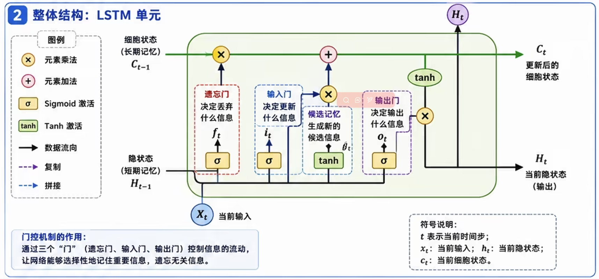
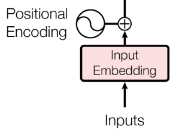
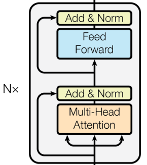

# Transformer

## 一、问题与起源：Transformer 究竟学习什么

### 1.1 从条件概率开始理解机器翻译

设源语言 Token 序列为 $x=(x_1,\ldots,x_S)$，目标语言 Token 序列为 $y=(y_1,\ldots,y_T)$。这里约定 $y_T=\texttt{<eos>}$，也就是把“何时结束”纳入预测。

模型要学习条件分布：

$$
p_\theta(y\mid x)
=\prod_{t=1}^{T}p_\theta(y_t\mid y_{<t},x),
\qquad y_{<t}=(y_1,\ldots,y_{t-1}).
$$

这个分解来自概率的链式法则，并不是 Transformer 独有的假设。Transformer 的作用是用一个可训练的神经网络，参数化右边每一步的条件概率。

以教学用的词级切分为例：

- 源序列：`我 / 爱 / 机器 / 翻译`。
- 目标序列：`I / love / machine / translation / <eos>`。
- 预测 `machine` 时，可用条件是完整中文原句和英文前缀 `I love`。

### 1.2 前 Transformer 时代的序列建模演进

**第一阶段：循环神经网络（RNN）时代**

RNN 是最早的序列建模范式，其核心思想是维护一个隐藏状态 $h_t$ ，逐步处理序列：

$$
h_t = f(W_hh_{t-1} + W_{x}x_{t} + b)
$$
其中$x_t$是当前时间的输入向量

RNN 的问题在于：

- 从时间推进的角度，每一步的计算都**依赖前一步的结果**，同一序列的状态递推限制了时间维度上的并行；
- 从 $h_{t-k}$ 到 $h_t$ 的梯度包含雅可比矩阵连乘：

  $$
  \frac{\partial h_t}{\partial h_{t-k}}
  =J_tJ_{t-1}\cdots J_{t-k+1},
  \qquad J_r=\frac{\partial h_r}{\partial h_{r-1}}.
  $$

  连乘可能导致梯度变小或变大，因此长距离依赖较难训练。另一个问题是：计算 $h_t$ 前必须先得到 $h_{t-1}$，所以**沿时间轴存在顺序依赖**。

**第二阶段：LSTM / GRU 时代**

LSTM（1997）通过引入**门控机制**（遗忘门、输入门、输出门）和**细胞状态（Cell State）**，缓解了长距离依赖问题：




- **遗忘门**：$f_t = \sigma(W_f \cdot [h_{t-1}, x_t] + b_f)$
- **输入门**：$i_t = \sigma(W_i \cdot [h_{t-1}, x_t] + b_i)$
- **候选状态**：$\tilde{C}_t = \tanh(W_C \cdot [h_{t-1}, x_t] + b_C)$
- **细胞状态更新**：$C_t = f_t \odot C_{t-1} + i_t \odot \tilde{C}_t$
- **输出门**：$o_t = \sigma(W_o \cdot [h_{t-1}, x_t] + b_o)$
- **隐藏状态输出**：$h_t = o_t \odot \tanh(C_t)$

遗忘门决定保留多少旧状态，输入门决定写入多少新信息，输出门控制显露多少细胞状态。

$c_{t-1}\to c_t$ 的直接加性通道有利于保留梯度。但不能把整个网络的总导数简单写成 $f_t$，因为门值本身也通过隐藏状态依赖历史。

------

GRU（2014）是更紧凑的门控结构，将遗忘门和输入门合并为更新门：

- **更新门**：$z_t = \sigma(W_z \cdot [h_{t-1}, x_t] + b_z)$
- **重置门**：$r_t = \sigma(W_r \cdot [h_{t-1}, x_t] + b_r)$
- **候选隐藏状态**：$\tilde{h}_t = \tanh(W_h \cdot [r_t \odot h_{t-1}, x_t] + b_h)$
- **隐藏状态更新**：$h_t = (1 - z_t) \odot h_{t-1} + z_t \odot \tilde{h}_t$

GRU 通常比相同隐藏维度的 LSTM 参数更少，但两者孰优取决于任务与配置。它们都保留时间递推。

**第三阶段：注意力机制的引入**

2014-2015 年，Bahdanau 等人在机器翻译任务中引入了**注意力机制**：解码器在生成每个输出 Token 时，不再只依赖编码器的最终隐藏状态，而是可以"回看"编码器所有时间步的隐藏状态，动态地分配注意力权重。

如果 Encoder 把整句信息压缩成一个固定向量，Decoder 每一步都依赖这同一份摘要。注意力改为保留多个源位置表示：

$$
H=(h_1^\top,\ldots,h_S^\top)^\top,
\qquad
c_t=\sum_{j=1}^{S}\alpha_{tj}h_j,
\qquad
\sum_j\alpha_{tj}=1.
$$

每一步根据当前解码状态，动态计算一组 $\alpha_{tj}$，读取不同的源句信息。

### 1.3 统一符号

| 符号              | 含义                       | 备注                                         |
| ----------------- | -------------------------- | -------------------------------------------- |
| $B$               | Batch 大小                 | 一批样本的数量                               |
| $S,T$             | 源序列、目标序列长度       | Batch 中通常指补齐后的长度                   |
| $V_s,V_t$         | 源语言、目标语言词表大小   | 用 $V_t$ 表示词表大小，避免与 Value 矩阵混淆 |
| $d$               | 模型隐藏维度               | 即 $d_{\mathrm{model}}$                      |
| $h$               | 注意力头数                 | 标准等宽多头通常要求 $h\mid d$               |
| $d_k,d_v$         | 单头 Query/Key、Value 维度 | 常取 $d_k=d_v=d/h$                           |
| $d_{\mathrm{ff}}$ | FFN 中间维度               | 通常大于 $d$                                 |
| $L_e,L_d$         | Encoder、Decoder 层数      | 每层一般有独立参数                           |
| $H,Z$             | Encoder、Decoder 隐藏表示  | 每一行对应一个位置                           |
| $Q,K,V$           | Query、Key、Value 矩阵     | 是输入经过投影得到的表示                     |
| $A,M$             | 注意力权重、加性掩码       | 不与模型参数混淆                             |

## 二、Transformer整体架构

Transformer 的核心突破可以用一句话概括：**完全抛弃循环结构，仅靠注意力机制完成序列建模**。

这带来了两个根本性改变：

- **全局并行计算**：不再逐步递推，序列中所有位置的注意力可以同时计算
- **任意距离的直接连接**：任意两个位置之间的信息传递只需一步注意力操作，路径长度为 $O(1)$ ，而 RNN 需要 $O(N)$ 步

原始 Transformer 是 Encoder–Decoder 架构，适合机器翻译等“输入序列 $\to$ 输出序列”任务：


| 组件 | 接收什么 | 产生什么 | 核心作用 |
|---|---|---|---|
| 源 Embedding 与位置编码 | 源 Token IDs | $S\times d$ | 表达 Token 内容与位置 |
| Encoder | 源序列表示 | $H\in\mathbb R^{S\times d}$ | 融合源句上下文 |
| 目标 Embedding 与位置编码 | 右移目标 IDs | $T\times d$ | 表达已知目标前缀 |
| Decoder | 目标表示与 $H$ | $Z\in\mathbb R^{T\times d}$ | 结合前缀和源句 |
| 输出投影 | $Z$ | $T\times V_t$ logits | 为每个候选 Token 打分 |
| Softmax | logits | $T\times V_t$ 概率 | 得到条件分布 |

### 1. 输入表示：Tokenizer、Embedding、位置编码



首先，需要将离散文本转换为连续向量表示，使神经网络能够处理文本信息 

#### 1.1 Tokenizer：把文本变成离散符号序列

将自然语言字符串切分为模型可识别的最小单元（Tokens），并将其映射为数字索引

$$
\text{原始文本}\longrightarrow\text{Token 序列}
\longrightarrow\text{Token ID 序列}.
$$

BPE、WordPiece 是常见子词分词算法。

一段长度为 N 的文本，经过 Tokenizer 后得到 N 个整数索引，每个索引的范围是 $[0,V−1]$ ，其中 V 是词表大小：

$$
[x_1,x_2,…,x_N], x_i∈{0,1,…,V−1}
$$

**输出结果**：

**Input IDs**：Token 在词表中的索引数字。

**Special Tokens**：

| 特殊 Token        | 常见作用            | 注意                       |
| ----------------- | ------------------- | -------------------------- |
| `<bos>` / `<sos>` | 序列起始            | 具体是否使用取决于模型     |
| `<eos>`           | 序列终止            | 通常也需要被预测           |
| `<pad>`           | 批处理补齐          | 需在注意力和损失中正确处理 |
| `<unk>`           | 未知片段            | 不是每种 tokenizer 都需要  |
| `[CLS]`、`[SEP]`  | BERT 风格的特殊用途 | 并非 Transformer 通用要求  |

Tokenizer 通常在神经网络训练前确定分词规则和词表；它不等同于后续可微、可训练的 Embedding 层。

--------------

#### 1.2 Embedding

##### 1.2.1 Token Embedding

在得到数字索引后，需要将其映射到高维连续向量空间

**核心作用**：

1. **降维与稠密化**：将高维稀疏的 One-hot 编码转换为低维稠密的实数向量。
2. **语义对齐**：在训练过程中，语义相近的词通常会在向量空间中被拉近（余弦相似度更高）。实际语义结构由训练任务塑造，但不能保证任意语义相近的 Token 都有更高余弦相似度。

**数学表达：**

**第一步：每个索引转为 One-hot 向量**

每个索引 $x_i$ 被转换为一个 $V$ 维的 One-hot 向量 $o_i \in \{0,1\}^V$，其中只有第 $x_i$ 个位置为 1，其余全为 0。

例如，词表大小 $V$，文本长度 $N=4$，则 One-hot 编码后的矩阵是：
$$
O = [o_1, o_2, o_3, o_4] \in \{0,1\}^{N \times V}
$$

**第二步：矩阵乘法得到 Embedding**

用 One-hot 矩阵右乘 Embedding 权重矩阵 $W_E \in \mathbb{R}^{V \times d_{model}}$：
$$
E = O \cdot W_E \in \mathbb{R}^{N \times d_{model}}
$$

其中每一行：
$$
e_i = o_i \cdot W_E = W_E[x_i, :]
$$

因为 $o_i$ 只有第 $x_i$ 个位置是 1，所以矩阵乘法退化为从 $W_E$ 中取出第 $x_i$ 行。

**实际工程中，不会真的构造 One-hot 矩阵**

上述矩阵乘法的描述在**数学上是完全正确的**，但在工程实现中，没有人会真的去构造一个 $(N,V)$ 的 One-hot 矩阵再做矩阵乘法，它**极度浪费内存和计算**

所以实际代码中，Embedding 操作就是一个**查表（Table Lookup）**：

设 Embedding 矩阵
$$
E\in\mathbb R^{V\times d_{\text{model}}}.
$$

Token ID $i$ 的向量是 $E$ 的第 $i$ 行：

$$
e_i=E[i,:].
$$

它等价于 one-hot 向量 $o_i$ 与矩阵相乘 $e_i=o_i^\top E$，但实现时直接查表。

```
# PyTorch 实现
embedding = nn.Embedding(num_embeddings=V, embedding_dim=d_model)
output = embedding(token_ids)  # 直接取 W_E[token_ids, :]
```

这等价于数学上的 One-hot 矩阵乘法，但**跳过了 One-hot 的构造**，直接通过索引取行，时间复杂度从 O(N⋅V⋅dmodel) 降到 O(N⋅dmodel) ，内存从 O(N⋅V) 降到 O(N⋅dmodel) 。

-----------------


Embedding 通常随机初始化，并和 Transformer 其他参数一起端到端训练。

**维度缩放 (Scaling)**：

在原始 ，Embedding 向量在输入 Encoder 之前会**乘以 $\sqrt{d_{model}}$**。

- **理由**：调整词向量与固定位置编码的数值尺度，确保位置信息不会淹没语义信息，同时有助于训练时的梯度稳定性。

---------

##### 1.2.2 Transformer 中，embedding是预训练好的还是一起参与训练的？

在 Transformer 的标准实现中，**Embedding 层通常是随机初始化，并随着模型主体（如 Self-Attention 层）一起参与端到端（End-to-End）训练的。**

不过，根据应用场景的不同，这里存在几种不同的策略：

###### 1. 随模型同步训练 (Mainstream Approach)

这是目前最普遍的做法（如 BERT、GPT、Llama 等）。

- 预训练的核心目标是"预测下一个 Token"，其本身就驱动 Embedding 将语义相近的 Token 映射到向量空间中相近的位置。经过深度训练后，Embedding 空间会自发涌现出丰富的语义结构。
- 分词方式不兼容：经典预训练词向量（Word2Vec、GloVe）基于**词级别（Word-level）**的分词，而现代大模型普遍采用**子词级别（Subword-level）**的分词（如 BPE、SentencePiece）
- 使用经典预训练词向量，只能使用固定的 $d_{\text{model}}$，无法满足大模型对于模型表现能力的需求

###### 2. 使用预训练 Embedding (Transfer Learning)

在某些特定场景下，人们会使用已经训练好的词向量（如 Word2vec, GloVe, FastText）。

- **做法**：将预训练好的向量加载到 Transformer 的 Embedding 层中。
- **分类**：
  - **Static（冻结）**：训练过程中 Embedding 不发生改变，只训练后面的 Transformer 层。这在数据集非常小时能防止过拟合。
  - **Non-static（微调）**：加载预训练向量作为初始值，但在训练中允许梯度更新（Fine-tuning）。
- **现状**：在现代大规模预训练模型中，由于模型本身参数量巨大且数据充足，通常不再依赖传统的 Word2vec，而是直接在大规模语料上从头学习。

###### 3. 工程实践中的特殊处理：Weight Sharing (权重共享策略)

这是一个非常巧妙的 Transformer 优化技巧，在原始论文《Attention is All You Need》中被提及：

输入 Embedding 矩阵 $W_{E}$ 和输出 LM Head 矩阵 $W_{out}$ **共享同一组参数**：
$$
W_E = W_{out}^T
$$
这样做的好处：

- 大幅减少参数量（省去一个 $V \times d_{\text{model}}$ 的大矩阵）
- 输入和输出空间天然对齐，有利于模型学习

--------------

##### 1.2.3 Position Embedding

若不加入位置，Self-Attention 对输入排列具有置换等变性：交换输入 Token，输出只会相应交换。模型不能仅凭内容区分“狗咬人”和“人咬狗”。

###### 1. 为什么需要位置信息

先考虑**没有位置相关操作、没有固定因果掩码**的 Self-Attention。设 $P$ 为置换矩阵，则：

$$
\operatorname{SA}(PX)=P\operatorname{SA}(X).
$$

因为 $Q'=PQ,K'=PK,V'=PV$，且逐行 Softmax 满足：

$$
\operatorname{softmax}(PAP^\top)
=P\operatorname{softmax}(A)P^\top,
$$

所以重新排列输入，只会相应重排输出。这叫**置换等变性**，不同于输出完全不变的置换不变性。

对逐位置 FFN 和 LayerNorm，同样成立。模型缺少独立的顺序线索，因此需要位置表示来区分“谁在前、谁在后”。若使用固定因果掩码，掩码本身就引入了顺序结构，不能不加条件地套用上述证明。

###### 2. 正弦—余弦位置编码

原始 Transformer 使用固定正弦—余弦位置编码，对于位置 $pos$ 和维度索引 $i$：
$$
PE_{(pos, 2i)} = \sin\left(\frac{pos}{10000^{2i/d_{model}}}\right)
$$
$$
PE_{(pos, 2i+1)} = \cos\left(\frac{pos}{10000^{2i/d_{model}}}\right)
$$

其中 $d_{model}$ 是词向量的总维度。

**核心特性**：

- **确定性**：不需要学习，直接计算生成。
- **相对位置线性表达**：由于三角函数的特性，$PE_{pos+k}$ 可以表示为 $PE_{pos}$ 的线性组合。这使得模型理论上能够更容易地学习到 Token 之间的相对偏移。
- **有界性**：取值范围在 $[-1, 1]$ 之间，有利于神经网络的数值稳定性。

**注入方式：**
$$
\text{Input\_to\_Encoder = Embedding + Position\_Embedding}
$$

###### 3. RoPE（旋转位置编码）

当前主流大模型已普遍采用 **RoPE（旋转位置编码）**，它将位置信息编码为旋转矩阵，直接作用于 Query 和 Key 向量上，在保持绝对位置信息的同时天然具备相对位置表达能力，且支持更好的长度外推。

**3.1 二维情形：直觉建立**

假设有一个二维向量 $\mathbf{x} = (x_1, x_2)$，位于位置 $m$。我们将其旋转角度 $m\theta$：

$$
\mathbf{x}' = \begin{pmatrix} \cos(m\theta) & -\sin(m\theta) \\ \sin(m\theta) & \cos(m\theta) \end{pmatrix} \begin{pmatrix} x_1 \\ x_2 \end{pmatrix} = \begin{pmatrix} x_1 \cos(m\theta) - x_2 \sin(m\theta) \\ x_1 \sin(m\theta) + x_2 \cos(m\theta) \end{pmatrix}
$$

位置 $m$ 的 Query 向量 $\mathbf{q}$ 旋转 $m\theta$，位置 $n$ 的 Key 向量 $\mathbf{k}$ 旋转 $n\theta$，计算旋转后的点积：

$$
\begin{aligned}
\hat{\mathbf{q}} \cdot \hat{\mathbf{k}} = [q_1\cos(m\theta) - q_2\sin(m\theta)][k_1\cos(n\theta) - k_2\sin(n\theta)] \\[6pt]
+ [q_1\sin(m\theta) + q_2\cos(m\theta)][k_1\sin(n\theta) + k_2\cos(n\theta)]
\end{aligned}
$$

展开并利用三角恒等式 $\cos A \cos B + \sin A \sin B = \cos(A-B)$ 化简：

$$
\begin{aligned}
\hat{\mathbf{q}} \cdot \hat{\mathbf{k}} &= (q_1 k_1 + q_2 k_2)\cos((m-n)\theta) + (q_1 k_2 - q_2 k_1)\sin((m-n)\theta)
\\[6pt]
&= (\mathbf{q} \cdot \mathbf{k})\cos((m-n)\theta) + (\mathbf{q} \times \mathbf{k})\sin((m-n)\theta)
\end{aligned}
$$

**关键发现**：在二维情形中，我们将两个二维向量$\hat{q},\hat{k}$ 分别旋转角度 $m \theta, n \theta$，旋转后的点积自然只依赖相对位置差 $m-n$，绝对位置 $m$ 和 $n$ 完全消失！

------------------

**3.2 复数视角：更优雅的理解**

将二维向量 $(x_1, x_2)$ 视为复数 $x_1 + ix_2$，旋转操作等价于乘以单位复数 $e^{im\theta}$：

$$
f(x, m) = x \cdot e^{im\theta}
$$

两个旋转后复数的内积（取实部）：

$$
\text{Re}(\hat{q} \cdot \overline{\hat{k}}) = \text{Re}(q \cdot e^{im\theta} \cdot \overline{k \cdot e^{in\theta}}) = \text{Re}(q \bar{k} \cdot e^{i(m-n)\theta})
$$

结果同样只依赖 $(m-n)$。

----------------

**3.3 高维推广：分块对角旋转**

但大模型的 $Q/K$ 向量维度 $d$ 通常是 64、128 甚至 256，远不止二维。一个自然的想法是：**把高维向量拆成多个二维子向量，每个子向量独立旋转，最后拼回去。**

这就是**分块对角旋转的核心思想**。

对于 $d$ 维向量（$d$ 为偶数），将其两两分组为 $d/2$ 个二维子向量：

$$
\begin{aligned}
\mathbf{x}^T &= (\underbrace{x_0, x_1}_{\text{第 0 组}}, \underbrace{x_2, x_3}_{\text{第 1 组}}, \ldots, \underbrace{x_{d-2}, x_{d-1}}_{\text{第 } d/2-1 \text{ 组}})\\[6pt]
&= (z_0^T,z_1^T, \ldots, z^T_{\frac{d}{2}-1})
\end{aligned}
$$

对第 $i$ 组施加旋转角度 $m\theta_i$，其中 $\theta_i = \text{base}^{-2i/d}$。将所有旋转矩阵沿对角线排列，构造出 $d \times d$ 的分块对角矩阵：

$$
R_m = \begin{pmatrix} R(m\theta_0) & & & \\ & R(m\theta_1) & & \\ & & \ddots & \\ & & & R(m\theta_{d/2-1}) \end{pmatrix}
$$

其中

$$
R(m\theta_i) = \begin{pmatrix} \cos(m\theta_i) & -\sin(m\theta_i) \\ \sin(m\theta_i) & \cos(m\theta_i) \end{pmatrix}
$$

---------------------

对位置 $m$ 的向量 $\mathbf{x}$ 施加 RoPE：
$$
\begin{aligned}
\mathbf{x}^T R_{m} = \begin{pmatrix} \mathbf{z}^T_{0}R(m\theta_0) & & & \\ & \mathbf{z}^T_{1} R(m\theta_1) & & \\ & & \ddots & \\ & & & \mathbf{z}^T_{d/2-1} R(m\theta_{d/2-1}) \end{pmatrix}
\end{aligned}
$$

设位置 $m$ 的 Query 向量为 $\mathbf{q}$，位置 $n$ 的 Key 向量为 $\mathbf{k}$，分别施加 RoPE 后为：

$$
\hat{\mathbf{q}} = R_m \mathbf{q}, \quad \hat{\mathbf{k}} = R_n \mathbf{k}
$$

旋转后的点积：

$$
\hat{\mathbf{q}}^{T} \hat{\mathbf{k}} = (R_m \mathbf{q})^T R_n \mathbf{k} = \mathbf{q}^T R_{m}^T R_n \mathbf{k}
$$

利用旋转矩阵的正交性 $R_m^\top = R_{-m}$，以及旋转矩阵的乘法性质 $R_\alpha R_\beta = R_{\alpha+\beta}$：

$$
R_m^\top R_n = R_{-m} R_n = R_{n-m}
$$

因此：

$$
\hat{\mathbf{q}}^{T} \hat{\mathbf{k}} = \mathbf{q}^{T} R_{n-m} \mathbf{k}
$$

**结果 $R_{n-m}$ 只包含相对位置差 $(n-m)$**，绝对位置 $m$ 和 $n$ 完全消失！

----------------

**3.4 总结**

分块对角旋转的精妙之处在于：

1. **结构上**：将高维空间分解为 $d/2$ 个独立的二维子空间，每个子空间执行简单的平面旋转

2. **频率上**：不同子空间使用不同频率，频率 $\theta_i = \text{base}^{-2i/d}$ 的设计使得不同维度对位置的敏感度截然不同，实现从局部到全局的多尺度位置感知

3. **性质上**：旋转矩阵的正交性保证了模长不变（信息守恒），可加性保证了点积只依赖相对位置差

4. **计算上**：分块对角结构使矩阵乘法退化为逐组的简单乘加，计算开销极低

5. **无加法干扰**：不像传统位置编码那样与词向量相加，避免语义信息被位置信号污染

RoPE 有两种常见的**添加方式**：

- 1. 先投影得到 $q,k,v$，reshape 拆多头 → (B, H, L, head_dim)，最后apply RoPE to q, k （Meta Llama 原版）

- 2. 投影得到 $q,k,v$，RoPE，再拆多头

---------------

#### 总结：数据流转过程

1. **Raw Text**: "I like AI"
2. **Tokenizer**: `["I", "like", "AI"]` $\rightarrow$ `[101, 2067, 2851]` (Input IDs)
3. **Embedding**: `[101]` $\rightarrow$ `[0.12, -0.5, ...]` (512维向量)
4. **Scaling**: $Vector \times \sqrt{512}$
5. **Next**: 加上 **Position Embedding**

------------------------

### 2. Encoder



#### 2.1 Multi-Head Attention + Add&Norm

##### 2.1.1 注意力机制

给定输入序列的表示矩阵 $X \in \mathbb{R}^{N \times d}$，首先通过三个**独立的线性投影**得到 Query、Key、Value：

$$
Q = X W_Q, \quad K = X W_K, \quad V = X W_V
$$

其中 $W_Q, W_K \in \mathbb{R}^{d \times d_k}$，$W_V \in \mathbb{R}^{d \times d_v}$，三个投影矩阵**各自独立学习**，使 Q、K、V 承担不同的角色：

| 对象  | 职责                  | 在计算中的用途  |
| ----- | --------------------- | --------------- |
| $q_i$ | 当前位置需要什么信息  | 与各个 Key 比较 |
| $k_j$ | 位置 $j$ 如何被匹配   | 决定被关注程度  |
| $v_j$ | 位置 $j$ 提供什么信息 | 被加权汇总      |

###### 1. 注意力分数的计算

**(1) 点积相似度**
$$
S = Q K^\top \in \mathbb{R}^{N \times N}
$$

$S_{ij} = \mathbf{q}_i^T\mathbf{k}_j$ 表示位置 $i$ 对位置 $j$ 的"关注度"——Query 和 Key 越相似（点积越大），说明位置 $i$ 越需要从位置 $j$ 获取信息。

**(2) 缩放（Scaling）**
$$
\hat{S} = \frac{S}{\sqrt{d_k}}
$$

为什么缩放？假设 $Q$ 和 $K$ 的每个元素独立且均值为 0、方差为 1，则：
$$
\begin{aligned}
\mathbf{q}_i^T\mathbf{k}_j &= \sum_l{q_{il}k_{jl}}\\[5pt]
\text{Var}(q_{il}k_{jl}) 
&= \text{E}(q_{il}k_{jl})^2 - E^2(q_{il}k_{jl})\\[5pt]
&= \text{E}(q_{il}^2k_{jl}^2) - E^2(q_{il})E^2(k_{jl})\\[5pt]
&= 1\\[5pt]
\text{Var}(\mathbf{q}_i^T\mathbf{k}_j) &= d_k
\end{aligned}
$$
若$d_k$比较大，最后**Softmax 归一化**时最大的那个分量会趋近于 1，其余趋近于 0——Softmax 进入**饱和区**，很多局部导数接近 0，模型很难学习

除以 $d_k$ 将方差归一化为 1，使 Softmax 保持在梯度敏感的区域

**(3) Softmax 归一化**
$$
A = \text{softmax}(\hat{S}) \in \mathbb{R}^{N \times N}
$$

$$
A_{ij} = \frac{\exp(\hat{S}_{ij})}{\sum_{l=1}^{N} \exp(\hat{S}_{il})}
$$

每行之和为 1，$A_{ij}$ 表示位置 $i$ 分配给位置 $j$ 的注意力权重。

**(4) 加权求和**
$$
O = A V \in \mathbb{R}^{N \times d_v}
$$

$$
\mathbf{o}_i = \sum_{j=1}^{N} A_{ij} \mathbf{v}_j
$$

每个位置的输出是所有 Value 向量的**加权组合**，权重由 Query-Key 的相似度决定。

**(6) 完整公式：**
$$
\text{SelfAttention}(X) = \text{softmax}\left(\frac{X W_Q (X W_K)^\top}{\sqrt{d_k}}\right) (X W_V)
$$

##### 2.1.2 Multi-Head Attention：

**Multi-Head**：用 $h$ 组可学习的投影矩阵把输入映射到 $h$ 个不同的低维子空间，各自独立做 attention，再拼接起来用一个线性层融合。这就像多个人从不同角度审视同一句话，有的关注语法，有的关注语义。

实际操作上：将 $Q, K, V$ 从单个位置的特征维度上拆分为 $h$ 个低维头，独立计算注意力后再拼接。

对第 $r$ 个头：
$$
\begin{aligned}
head_i &= \text{Attention}(XW_Q^i, XW_K^i, XW_V^i)\\[6pt]
\text{MultiHead}(X) &= \text{Concat}(head_1, ..., head_h)W_O，  \qquad W_O\in\mathbb R^{hd_v\times d}
\end{aligned}
$$

**一个完整的维度例子**

取 $B=2,n=5,d=512,h=8,d_k=d_v=64$：

| 操作                 | 张量形状          |
| -------------------- | ----------------- |
| 输入 $X$             | $(2,5,512)$       |
| 大投影后的 $Q,K,V$   | 各为 $(2,5,512)$  |
| reshape 并调整轴顺序 | 各为 $(2,8,5,64)$ |
| $QK^\top$            | $(2,8,5,5)$       |
| 沿最后一维 Softmax   | $(2,8,5,5)$       |
| 与 $V$ 相乘          | $(2,8,5,64)$      |
| 合并头               | $(2,5,512)$       |
| 输出投影 $W_O$       | $(2,5,512)$       |

在标准  $hd_k=hd_v=d$ 配置下，忽略偏置，一个多头注意力模块约有 $4d^2$ 个投影参数：Q、K、V 各 $d^2$，输出投影 $d^2$。固定 $d$ 时，增加头数主要改变子空间划分，并不让这部分参数按头数线性增加。

##### 2.1.3 残差连接、LayerNorm 与 FFN

###### 1. LayerNorm：在单个位置的特征维上归一化

对某个位置的向量 $u=(u_1,\ldots,u_d)$：

$$
\mu=\frac1d\sum_{a=1}^d u_a,
\qquad
\sigma^2=\frac1d\sum_{a=1}^d(u_a-\mu)^2,
$$

$$
\operatorname{LN}(u)_a
=\gamma_a\frac{u_a-\mu}{\sqrt{\sigma^2+\epsilon}}+\beta_a.
$$

$\gamma,\beta\in\mathbb R^d$ 可学习，$\epsilon>0$ 防止除零。

对于 $(B,T,d)$ 的隐藏张量，标准 Token-wise LayerNorm 归一化最后的 $d$ 维，**不在 Batch 维或序列维上混合统计量**。因此它本身不会让目标位置读取未来 Token。

###### 2.Post-LN 与 Pre-LN

| 形式    | 一个子层的计算                                        | 归一化位置   |
| ------- | ----------------------------------------------------- | ------------ |
| Post-LN | $Y=\operatorname{LN}(X+\operatorname{Dropout}(F(X)))$ | 残差相加之后 |
| Pre-LN  | $Y=X+\operatorname{Dropout}(F(\operatorname{LN}(X)))$ | 子层计算之前 |

原始 Transformer 使用 Post-LN。Pre-LN 改变了梯度传播路径，常有更易优化的表现；完整 Pre-LN 堆叠通常还有最终归一化。讨论训练稳定性时需要结合架构、初始化和学习率，不能把二者视为仅书写顺序不同。参见 [On Layer Normalization in the Transformer Architecture](https://arxiv.org/abs/2002.04745)。

以下 Encoder 和 Decoder 公式统一使用 **Post-LN**，避免混写。

###### 3. FFN：逐位置的非线性变换

ReLU FFN 可写成：

$$
\operatorname{FFN}(X)
=\operatorname{ReLU}(XW_1+b_1)W_2+b_2,
$$

$$
W_1\in\mathbb R^{d\times d_{\mathrm{ff}}},
\qquad W_2\in\mathbb R^{d_{\mathrm{ff}}\times d}.
$$

单个位置经历：

$$
\mathbb R^d\longrightarrow\mathbb R^{d_{\mathrm{ff}}}
\longrightarrow\mathbb R^d.
$$

同一层中的所有位置使用同一组 FFN 参数，但独立计算，不直接进行跨位置混合。由于 FFN 的输入已由注意力聚合上下文，其输出仍可依赖其他位置。

Attention 负责跨位置汇总，FFN 负责逐位置变换。若去掉非线性，连续两个仿射变换可合并成一个仿射变换，表达能力会受限制。

后续架构可以改变激活函数、门控结构或归一化方法；这些是变体，不需要混入原始架构的定义。

##### 2.1.4 Encoder：生成上下文表示


第 $\ell$ 层以 $H^{(\ell-1)}\in\mathbb R^{S\times d}$ 为输入：

$$
\widetilde H^{(\ell)}=
\operatorname{LN}_{\ell,1}\left(
H^{(\ell-1)}+
\operatorname{Dropout}(\operatorname{MHA}_{\ell,\mathrm{self}}
(H^{(\ell-1)}))\right),
$$

$$
H^{(\ell)}=
\operatorname{LN}_{\ell,2}\left(
\widetilde H^{(\ell)}+
\operatorname{Dropout}(\operatorname{FFN}_{\ell}(\widetilde H^{(\ell)}))
\right).
$$

最终：

$$
H=H^{(L_e)}\in\mathbb R^{S\times d}.
$$

---------------------

### 3. Decoder


训练时输入的是**右移后的真实目标序列**；推理时输入的是起始符和**已经生成的目标前缀**。推理时并没有完整译文可作为输入。

定义 $y_0=\texttt{<bos>}$，则训练用 Decoder 输入为：

$$
(y_0,y_1,\ldots,y_{T-1}),
$$

对应标签为：

$$
(y_1,y_2,\ldots,y_T).
$$

本文把预测 $y_t$ 的槽位编号为 $t$，该槽位的输入 Token 是 $y_{t-1}$。

------------------


Decoder 的任务是根据 Encoder 的输出和已经生成的单词，预测下一个单词。

结合 **“我爱机器翻译” $\rightarrow$ "I love machine translation"** 这个例子，拆解 Decoder 的工作流程：

-----------------------

#### 3.1 Masked Multi-Head Attention + Add&Norm

##### 3.1.1 Masked Multi-Head Attention

**(1) 因果掩码（Causal Mask）**

在 Decoder 中，模型按从左到右的顺序逐个生成 Token。训练时虽然可以并行处理整个序列（提高效率），但必须保证：**预测第 $t$ 个 Token 时，模型只能看到前 $t-1$ 个 Token，不能"偷看"未来的 Token：**

$$
P(y_1,...,y_T | x) = \prod_{t=1}^T P(y_t | y_{<t}, x)
$$

构造一个下三角矩阵 $M \in \{0, -\infty\}^{N \times N}$：

$$
M_{ij} = \begin{cases} 0 & \text{if } j \leq i \\ -\infty & \text{if } j > i \end{cases}
$$

将其加到注意力分数上：

$$
\hat{S}_{ij} = \frac{S_{ij}}{\sqrt{d_k}} + M_{ij}
$$

经过 Softmax 后，$-\infty$ 位置的权重变为 $e^{-\infty} = 0$，实现了因果约束：

$$
A = \text{softmax}(\hat{S}) = \begin{pmatrix} a_{11} & 0 & 0 & \cdots \\ a_{21} & a_{22} & 0 & \cdots \\ a_{31} & a_{32} & a_{33} & \cdots \\ \vdots & \vdots & \vdots & \ddots \end{pmatrix}
$$

--------------

所以，**Masked Attention 完整计算公式：**
$$
\text{MaskedSelfAttention}(X) = \text{softmax}\left(\frac{X W_Q (X W_K)^\top}{\sqrt{d_k}} +M^{\text{causal}}\right) (X W_V)
$$

**(2) 整体过程（加上残差连接、LayerNorm 与 FFN）**

第 $\ell$ 层以 $U^{(\ell-1)}\in\mathbb R^{T\times d}$ 为输入：
$$
\begin{aligned}
\widetilde U^{(\ell)}&=
\operatorname{LN}_{\ell,1}\left(
U^{(\ell-1)}+
\operatorname{Dropout}(\operatorname{MHA}_{\ell,\mathrm{self}}
(U^{(\ell-1)};M^{\text{causal}}))\right),\\[5pt]
U^{(\ell)}&=
\operatorname{LN}_{\ell,2}\left(
\widetilde U^{(\ell)}+
\operatorname{Dropout}(\operatorname{FFN}_{\ell}(\widetilde U^{(\ell)}))
\right).

\end{aligned}
$$

最终：

$$
U=U^{(L_e)}\in\mathbb R^{T\times d}.
$$

-------------------------------------------------

#### 3.2 Encoder-Decoder Attention

这是翻译的核心对齐环节。此时，Decoder 已经通过第一步理清了“我已经说了什么”，现在它要看“原文说了什么”。

##### 3.2.1 Cross-Attention

Cross-Attention 的任务就是实现**信息对齐**：让解码器在生成每一个词时，都能从编码器生成的上下文向量中挑出最相关的部分。

- **Query (Q):** 当前生成的英文语义（如：“我已经说了 I love，接下来该说什么？”）。

  **Key (K) & Value (V):** 中文原句的全部信息（来自 Encoder 的输出）。

  **统计学视角：** 这一步本质上是在计算**条件概率** $P(y_t|y_{<t},x)$。模型通过计算 Q 和 K 的相关性，发现当前最该关注中文里的“机器翻译”这个词，从而提取对应的特征向量。

Cross-Attention 的计算公式与 Self-Attention **基本相同**：

$$
\text{CrossAttention}(Q, K, V) = \text{softmax}\left(\frac{QK^\top}{\sqrt{d_k}}\right) V
$$

唯一的区别在于 Q、K、V 的来源不同：

$$
\begin{aligned}
Q &= U W_Q \in \mathbb{R}^{T \times d_k} \\[5pt]
K &= H W_K \in \mathbb{R}^{S \times d_k} \\[5pt]
V &= H W_V \in \mathbb{R}^{S \times d_v}
\end{aligned}
$$

记 $U^{(\ell)}$ 是 Masked Multi-Head Attention + Add&Norm 的输出，$H$ 是 Encoder 的最终输出：

$$
\begin{aligned}
C^{(\ell)}&=\operatorname{LN}_{\ell,1}\left(
U^{(\ell)}+
\operatorname{Dropout}(\operatorname{MHA}_{\ell,\mathrm{cross}}
(U^{(\ell)},H))\right),\\[5pt]
Z^{(\ell)}&=\operatorname{LN}_{\ell,2}\left(
C^{(\ell)}+
\operatorname{Dropout}(\operatorname{FFN}_{\ell}(C^{(\ell)}))
\right).
\end{aligned}
$$

所有 Decoder 层都可读取 Encoder 的最终输出 $H$，但一般具有各自独立的 Cross-Attention 投影。

------

##### 3.2.2 三种注意力放在一起比较

| 模块                          | Query 来源                     | Key/Value 来源   | 单头权重形状 | 可见范围             |
| ----------------------------- | ------------------------------ | ---------------- | ------------ | -------------------- |
| Encoder Self-Attention        | 源端当前层输入                 | 同一源端输入     | $S\times S$  | 全部有效源位置       |
| Decoder Masked Self-Attention | 目标端当前层输入               | 同一目标端输入   | $T\times T$  | 当前及之前的输入槽位 |
| Decoder Cross-Attention       | 目标端 Self-Attention 子层之后 | Encoder 最终输出 | $T\times S$  | 全部有效源位置       |

-----------

#### 3.3 Linear + Softmax


经过 Feed-Forward 网络后，Decoder 每一层会输出一个特征向量。我们要把它变回人类能读懂的单词。

标准模型对最终 Decoder 层的表示使用输出头：
$$
Z=Z^{(L_d)}\in\mathbb R^{T\times d},
\quad W_{\mathrm{out}}\in\mathbb R^{d\times V_t},
\quad b_{\mathrm{out}}\in\mathbb R^{V_t},
$$

$$
G=ZW_{\mathrm{out}}+b_{\mathrm{out}}\in\mathbb R^{T\times V_t}.
$$

$G$ 是 logits。词表概率为：

$$
p_\theta(y_t=v\mid y_{<t},x)
=\frac{\exp(G_{tv})}{\sum_{u=0}^{V_t-1}\exp(G_{tu})}.
$$

| Softmax 所在位置 | 归一化维度 | 数值的含义 |
|---|---|---|
| Attention 内部 | 可见 Key 位置 | 从哪里读取信息 |
| 输出头 | 目标词表 | 下一个 Token 是什么 |

选概率最大的 Token 是**贪心解码策略**，不是 Softmax 的定义，也不是唯一生成方式。

---------------------

## 三、Training 

第二章回答了“给定输入，网络如何算出下一个 Token 的概率”。

这一章回答：**怎样利用成对的训练语料，让这些概率逐步接近真实语言规律？**

这里仅以 **Seq2Seq（翻译、摘要等）任务**为例，沿用前文的机器翻译任务：

$$
p_\theta(y\mid x)=\prod_{t=1}^{T}p_\theta(y_t\mid y_{<t},x),
\qquad y_0=\texttt{<bos>},\quad y_T=\texttt{<eos>}.
$$

其中 $\theta$ 包含 Embedding、各层注意力投影、FFN、LayerNorm 和输出头等全部可训练参数。

**本章符号约定：** 单个序列的矩阵每一行对应一个位置；

- 带 Batch 时增加最前面的 $B$ 维。
- $V_t$ 始终表示目标词表大小，下标并非时间变量。
- $b$ 表示样本编号
- $t$ 表示预测槽位
- $k$ 表示优化器更新步数。

### 3.1 训练样本：输入、右移与标签分别是什么

#### 3.1.1 从一对句子构造监督信号

设训练集为：

$$
\mathcal D=\{(x^{(n)},y^{(n)})\}_{n=1}^{N_{\mathrm{data}}}.
$$

继续使用前文的例子：

- 源序列：`我 / 爱 / 机器 / 翻译`。
- 目标序列：`I / love / machine / translation / <eos>`。

这里 $S=4,T=5$。Decoder 输入和监督标签一一对应：

| 预测槽位 $t$           | 1       | 2      | 3         | 4                | 5                            |
| ---------------------- | ------- | ------ | --------- | ---------------- | ---------------------------- |
| Decoder 输入 $y_{t-1}$ | `<bos>` | `I`    | `love`    | `machine`        | `translation`                |
| 应预测的标签 $y_t$     | `I`     | `love` | `machine` | `translation`    | `<eos>`                      |
| 可用目标前缀           | 空前缀  | `I`    | `I love`  | `I love machine` | `I love machine translation` |

注意：槽位 $t$ 接收的是 $y_{t-1}$，其输出用于预测 $y_t$。例如，第三个槽位输入 `love`，预测 `machine`。

------

#### 3.1.2 Batch 与 Padding

设一个 Batch 中第 $b$ 个样本的实际长度为 $S_b,T_b$，补齐长度为：

$$
S=\max_b S_b,\qquad T=\max_b T_b.
$$

对第 $b$ 个样本先构造长度为 $T_b$ 的输入和标签，再分别在右侧补齐：

$$
\begin{aligned}
\text{Encoder的输入} \quad 
X_{b,:}&=(x_{b,1}&,\ldots,x_{b,S_b}&,\texttt{<pad>},\ldots),\\[5pt]
\text{Decoder的输入} \quad 
D_{b,:}&=(\texttt{<bos>}&,y_{b,1},\ldots,y_{b,T_b-1}&,\texttt{<pad>},\ldots),\\[5pt]
\text{Decoder的预测目标（标签）} 
\quad Y_{b,:}&=(y_{b,1}&,\ldots,y_{b,T_b}&,\texttt{<pad>},\ldots).
\end{aligned}
$$

于是：

$$
X\in\{0,\ldots,V_s-1\}^{B\times S},\qquad
D,Y\in\{0,\ldots,V_t-1\}^{B\times T}.
$$

**`<eos>` 是有效预测目标，计入损失；`<pad>` 仅用于补齐，不计入损失。**

---------------------

##### 1. Key Padding Mask

由于 `<pad>`是用于补齐长度的，在分配注意力的时候，我们不应该将注意力分配到无效的`<pad>`上，于是引入 **Key Padding Mask**：

Key Padding Mask 是一个**加性掩码**（additive mask），定义在 Key 索引 $j$ 上：

$$
M^{\text{src}}_{b,j} = \begin{cases} 0, & j \leq S_b \\ -\infty, & j > S_b \end{cases}
$$

$$
M^{\text{tgt}}_{b,j} = \begin{cases} 0, & j \leq T_b \\ -\infty, & j > T_b \end{cases}
$$

其中：
- $S_b$：第 $b$ 个样本源句的实际长度（不含 `<pad>`）
- $T_b$：第 $b$ 个样本目标句的实际长度（不含 `<pad>`）
- $j$：Key 的位置索引

**Key Padding Mask** 应该作用在 Attention 矩阵计算之后，Softmax 归一化之前。

对于三个模块不同的 Attention 架构，具体注意力分数为：

$$
\begin{aligned}
\text{MHA}^{\text{enc}} &= \text{softmax}\left(\frac{Q^{\text{src}} (K^{\text{src}})^\top}{\sqrt{d_k}} +M^{\text{src}}\right) V^{\text{src}} \\[5pt]
\text{MHA}^{\text{dec}} &= \text{softmax}\left(\frac{Q^{\text{tgt}} (K^{\text{tgt}})^\top}{\sqrt{d_k}} +M^{\text{causal}} + M^{\text{tgt}}\right) V^{\text{tgt}}\\[5pt]
\text{MHA}^{\text{cross}} &= \text{softmax}\left(\frac{Q^{\text{tgt}} (K^{\text{src}})^\top}{\sqrt{d_k}} +M^{\text{src}}\right) V^{\text{src}}
\end{aligned}
$$

---------------

##### 2. Loss Mask

定义标签有效位置指示量：

$$
m_{b,t}=\mathbf 1\{t\le T_b\},
\qquad N_{\mathrm{tok}}=\sum_{b=1}^{B}\sum_{t=1}^{T}m_{b,t}.
$$

$m_{b,t}$ 标记该位置是否是有效 Token；$N_{tok}$ 表示整个 Batch 中 Token 的总数

模型在位置 $(b,t)$ 输出 logits 向量 $\hat{y}_{b,t} \in \mathbb{R}^{V_t}$，与标签 $y_{b,t}$ 计算交叉熵：

$$
\ell_{b,t} = -\log \frac{\exp(\hat{y}_{b,t,\,y_{b,t}})}{\sum_{v=1}^{V_t} \exp(\hat{y}_{b,t,\,v})}
$$

带 Loss Mask 的总损失：

$$
\boxed{\mathcal{L} = \frac{1}{N_{\text{tok}}} \sum_{b=1}^{B} \sum_{t=1}^{T} m_{b,t} \cdot \ell_{b,t}}
$$

展开求和：

$$
\mathcal{L} = \frac{1}{N_{\text{tok}}} \sum_{b=1}^{B} \left( \sum_{t=1}^{T_b} \underbrace{1}_{m_{b,t}=1} \cdot \ell_{b,t} + \sum_{t=T_b+1}^{T} \underbrace{0}_{m_{b,t}=0} \cdot \ell_{b,t} \right) = \frac{1}{N_{\text{tok}}} \sum_{b=1}^{B} \sum_{t=1}^{T_b} \ell_{b,t}
$$

| 掩码 | 作用位置 | 解决的问题 |
|---|---|---|
| Causal Mask | Decoder Self-Attention 的分数 | 阻止看到未来目标输入 |
| Key Padding Mask | 各类注意力的 Key 维 | 阻止有效位置读取补齐位置 |
| Loss Mask $m_{b,t}$ | 每个预测槽位的损失 | 不要求模型学习预测补齐符 |

-----------

### 3.2 Teacher Forcing

#### 3.2.1 Teacher Forcing 的定义

训练时，用**真实目标前缀**计算每个条件分布：

$$
\begin{aligned}
p_\theta(y_1\mid x),\quad
p_\theta(y_2\mid y_1,x),\quad
p_\theta(y_3\mid y_1,y_2,x),\quad\ldots
\end{aligned}
$$

即使模型在槽位 1 把 `I` 预测错了，槽位 2 的输入仍然使用真实的 `I`，而不是槽位 1 的预测。这就叫 **Teacher Forcing（教师强制）**。

从最大似然的角度，这正是在观测到的真实历史上计算每一项条件对数概率。

#### 3.2.2 Teacher forcing 解决了什么问题

| 问题                       | Teacher Forcing 的解法     |
| -------------------------- | -------------------------- |
| 训练时不知道模型会生成什么 | 用真实标签代替模型输出     |
| 位置之间有链式依赖         | 切断依赖，所有输入预先确定 |
| 只能逐步生成               | 一次前向传播算完所有位置   |

Teacher Forcing 的本质是：**用已知的真实标签替换模型自身的输出，从而切断位置之间的链式依赖，使并行计算成为可能。**

#### 3.2.3 一次前向传播完整步骤

令 $E_s\in\mathbb R^{V_s\times d}$、$E_t\in\mathbb R^{V_t\times d}$ 为输入 Embedding，$P_S,P_T$ 为相应位置编码：

$$
H^{(0)}=\operatorname{Dropout}(\sqrt d\,E_s[X,:]+P_S),
\qquad
Z^{(0)}=\operatorname{Dropout}(\sqrt d\,E_t[D,:]+P_T).
$$

Encoder 采用第四章的递推得到 $H=H^{(L_e)}$。对 Decoder 的第 $\ell=1,\ldots,L_d$ 层：

$$
\begin{aligned}
U^{(\ell)}
&=\operatorname{LN}^{\mathrm{dec}}_{\ell,1}\!\left[
Z^{(\ell-1)}+
\operatorname{Dropout}\!\left(
\operatorname{MHA}^{\mathrm{self}}_\ell
(Z^{(\ell-1)};M^{\mathrm{causal}}+M^{\mathrm{tgt}})
\right)\right],\\[5pt]
C^{(\ell)}
&=\operatorname{LN}^{\mathrm{dec}}_{\ell,2}\!\left[
U^{(\ell)}+
\operatorname{Dropout}\!\left(
\operatorname{MHA}^{\mathrm{cross}}_\ell(U^{(\ell)},H;M^{\mathrm{src}})
\right)\right],\\[5pt]
Z^{(\ell)}
&=\operatorname{LN}^{\mathrm{dec}}_{\ell,3}\!\left[
C^{(\ell)}+\operatorname{Dropout}\!\left(
\operatorname{FFN}_\ell(C^{(\ell)})
\right)\right].
\end{aligned}
$$

每层的三个 LayerNorm 有各自参数；不同 Decoder 层通常也有各自的注意力、FFN 参数。

最后：

$$
G=Z^{(L_d)}W_{\mathrm{out}}+b_{\mathrm{out}},
\qquad
P_{t,v}=\frac{e^{G_{t,v}}}{\sum_{u=0}^{V_t-1}e^{G_{t,u}}}.
$$


训练的完整维度链为：

| 数据              | 形状                  | 说明                    |
| ----------------- | --------------------- | ----------------------- |
| 源 Token IDs      | $B\times S$           | 离散输入                |
| 源表示 $H$        | $B\times S\times d$   | Encoder 输出            |
| 右移目标 IDs      | $B\times T$           | Teacher Forcing 输入    |
| 目标表示 $Z$      | $B\times T\times d$   | 最后一层 Decoder 输出   |
| Logits $G$        | $B\times T\times V_t$ | 词表未归一化分数        |
| 标签 $Y$          | $B\times T$           | 每个槽位的正确 Token ID |
| 损失 $\mathcal L$ | 标量                  | 反向传播的起点          |

## 四、Inferring

训练完成后，$\theta$ 固定。推理时已知源句 $x$，但目标序列 $y$ 尚未知，需要模型逐步构造。

**模型给出“下一个 Token 的概率分布”；解码策略决定“从这个分布中选哪一个 Token”。**

### 4.1 自回归生成

#### 4.1.1 单步生成的数学描述

记生成结果为 $\hat y$，并令 $\hat y_0=\texttt{<bos>}$。

第 $t$ 步：

$$
\begin{aligned}
G_t&=f_\theta(x,\hat y_0,\ldots,\hat y_{t-1})
\in\mathbb R^{V_t},\\[5pt]
p_t(v)&=\frac{e^{G_{t,v}}}{\sum_u e^{G_{t,u}}},\\[5pt]
\hat y_t&=\operatorname{Decode}(p_t).
\end{aligned}
$$

已生成的序列 → 模型前向传播 → logits → softmax → 概率分布 → 解码策略 → 新 token

| 生成步 | 当前 Decoder 已知输入              | 使用的输出            | 新生成的 Token（示例） |
| ------ | ---------------------------------- | --------------------- | ---------------------- |
| 1      | `<bos>`                            | 最后一个槽位的 logits | `I`                    |
| 2      | `<bos> I`                          | 最后一个槽位的 logits | `love`                 |
| 3      | `<bos> I love`                     | 最后一个槽位的 logits | `machine`              |
| 4      | `<bos> I love machine`             | 最后一个槽位的 logits | `translation`          |
| 5      | `<bos> I love machine translation` | 最后一个槽位的 logits | `<eos>`                |

其中任一步若产生了不同 Token，后续条件分布也随之改变。

------------

#### 4.1.2 结束条件

- 生成到 `<eos>` 时停止
- 应设置最大生成长度 $T_{\text{max}}$，防止出现无限循环
- 通常生成时禁止选择 `<pad>`和`<bos>`，可以通过将相应的 logits 设为 $-\infty$ 实现（在实际框架（如 HuggingFace `transformers`）中，通常用 **LogitsProcessor** 来统一管理这类逻辑）

-----

### 4.2 解码策略

自回归生成的核心问题是：拿到每一步的概率分布 $p_t$ 后，**如何选出下一个 token**？不同的策略在**质量、多样性、速度**之间做出不同取舍。

#### 4.2.1 贪心搜索（Greedy Search）

贪心解码的规则为

$$
\boxed{ \hat y_t = \arg\max_{v\in\mathcal V} p_\theta(v\mid x,\hat y_{<t}) }
$$

选好后，把这个 token 加入上下文，再预测下一个，直到生成 $\texttt{EOS}$ 或达到长度上限。

它的特点是：每一步只选当前概率最大的 token，只维护一条生成路径，一旦选定，就不会回头。

但要注意：

$$
\boxed{ \text{每一步条件概率最大} \;\not\Rightarrow\; \text{完整序列联合概率最大} }
$$

原因是：**当前 token 的选择，会改变后续所有步骤的条件分布**。

贪心算法的优势是简单、计算开销小；局限是容易因早期选择而错过更好的完整序列。

---------

#### 4.2.2 Beam Search

如果希望寻找概率最大的完整输出，理论目标是

$$
y^\star = \arg\max_{y} p_\theta(y\mid x) = \arg\max_y \sum_{t=1}^{|y|} \log p_\theta(y_t\mid x,y_{<t}). 
$$

但固定长度 $T$ 的候选序列就有

$$
|\mathcal V|^T
$$

条，很难全部枚举。因此，Beam Search 用有限数量的候选路径进行近似搜索。

##### 1. 具体步骤

设 **beam width 为 $B$**，即每一步最多保留 $B$ 条候选路径。

对一个长度为 $t$ 的前缀，定义累计分数：

$$
\begin{aligned}
s(y_{1:t}) &= \log  \prod_{i=1}^{t} p_\theta(y_i\mid x,y_{<i}) \\[5pt]
&=\sum_{i=1}^{t} \log p_\theta(y_i\mid x,y_{<i}).
\end{aligned}
$$

使用对数有两个原因：乘积变成加法，同时避免大量小概率相乘造成数值下溢。

每一步执行：

1. 对当前保留的每条前缀，计算下一个 token 的概率分布。
2. 将每条前缀扩展为候选新路径。
3. 计算新路径的累计分数。
4. **在所有扩展路径中，统一选出分数最高的 $B$ 条。**

设当前候选集合为 $\mathcal B_{t-1}$（上一步**筛选后**保留的候选序列），则这一步**扩展后**的全部候选序列：

$$
\mathcal C_t = \left\{ b\mathbin{\Vert}v: b\in\mathcal B_{t-1},\ v\in\mathcal V \right\},
$$

其中 $\Vert$ 表示拼接。扩展一个新 Token $v$，扩展路径的分数为

$$
s(b\mathbin{\Vert}v) = s(b)+\log p_\theta(v\mid x,b), 
$$

随后保留

$$
\boxed{ \mathcal B_t = \operatorname{TopB}_{c\in\mathcal C_t}s(c) }
$$

这里尤其要注意：**不是每条路径分别保留 $B$ 个，而是所有路径扩展后，总共保留 $B$ 个。**

--------

##### 2. 示例

设 $B=3$，词表 $\mathcal{V} = \{A, B, C\}$

```
𝓑₀ = {<bos>}
       │
       │ 扩展（拼接词表每个 token）
       ▼
𝓒₁ = {A, B, C}          ← 所有候选
       │
       │ 打分，保留 Top-B
       ▼
𝓑₁ = {C, B, A}          ← 存活者
       │
       │ 扩展（每个存活者 × 词表每个 token）
       ▼
𝓒₂ = {CA,CB,CC,BA,BB,BC,AA,AB,AC}  ← 所有候选（9个）
       │
       │ 打分，保留 Top-B
       ▼
𝓑₂ = {CB, CC, BC}       ← 存活者
       │
       │ ...继续...
       ▼
```

##### 3. 三个需要理解的细节

- **它仍然是近似搜索**。某条前缀一旦被剪掉，即使它后面有非常好的延续，也无法重新找回。因此，有限的 $B$ 不保证找到全局最优解。在相同评分与停止规则下，$B=1$ 就退化为贪心解码。

- 因为每个条件概率都不超过 1，

  $$
  s(y_{1:t+1}) = s(y_{1:t})+\log p_\theta(y_{t+1}\mid x,y_{1:t}) \le s(y_{1:t}), 
  $$

  所以原始累计对数概率可能会使模型为了追求高分而倾向于生成极短、甚至不完整的句子。

  常见做法是引入长度归一化，例如
  $$
  s_{\mathrm{norm}}(y) = \frac{1}{|y|^\alpha} \sum_{t=1}^{|y|} \log p_\theta(y_t\mid x,y_{<t}), \qquad \alpha\ge0.
  $$
  
  其中 $\alpha=0$ 表示不做归一化。**使用这个评分后，优化目标就不再是原始序列概率本身。**

-----

#### 4.2.3 Sampling

Sampling（采样）的核心是：**模型给出下一个 token 的概率分布，我们按照这个分布随机抽取一个 token，再基于抽取结果继续生成。**

##### 1. 一步采样

假设输入为 $x$，已经生成了前缀 $y_{<t}$。模型在第 $t$ 步输出 logits：

$$
z_t=f_\theta(x,y_{<t})\in\mathbb R^{|\mathcal V|}. 
$$

经过 Softmax，得到下一个 token 的概率：

$$
p_t(v) = p_\theta(y_t=v\mid x,y_{<t}) = \frac{\exp(z_{t,v})} {\sum_{u\in\mathcal V}\exp(z_{t,u})}.
$$

即分布：

$$
Y_t\sim P(y_t = v)=p_t(v)
$$

接下来就是使用计算机模拟的方法从这个分布中采样得到相应的 token。

----------

##### 2. 从一步到整段：每抽到一个 token，都重新计算分布

生成过程为

$$
\begin{aligned} 
Y_1&\sim p_\theta(\cdot\mid x),\\[5pt] 
Y_2&\sim p_\theta(\cdot\mid x,Y_1),\\[5pt]
Y_3&\sim p_\theta(\cdot\mid x,Y_1,Y_2),\\[5pt] 
&\ \vdots \end{aligned}
$$

直到抽到 $\texttt{EOS}$ 或达到长度限制。

所以，逐步条件采样满足

$$
\boxed{ \mathbb P(Y_{1:T}=y_{1:T}\mid x) = \prod_{t=1}^{T} p_\theta(y_t\mid x,y_{<t}) = p_\theta(y_{1:T}\mid x) }
$$

这就是**自回归采样**：不需要枚举所有句子，也能从模型定义的序列联合分布中抽样。

------

##### 3. 调整分布

直接从原始 Softmax 分布抽样称为原始分布采样，也常被称为 ancestral sampling。

问题在于，词表可能很大。许多单个概率很低的 token，合起来仍然可能占据相当大的概率质量。

例如：

$$
\underbrace{0.8}_{\text{少量高概率候选}} + \underbrace{0.2}_{\text{大量低概率候选}} =1. 
$$

虽然尾部每个 token 都很难抽中，但**抽中低概率 token 的总概率仍是 $20\%$**。低概率 token 不一定错误，但其中可能包含不适合当前语境的延续。

因此，实际采样经常先构造调整后的分布 $q_t$，再抽样：

$$
\boxed{ p_t \xrightarrow{\text{调整}} q_t, \qquad Y_t\sim\operatorname{Categorical}(q_t). }
$$

Temperature 调节概率的集中程度；Top-k 和 Top-p 限制允许抽取的候选集合。

-----------------------------

##### 4. Temperature

温度参数 $\tau>0$ 的定义是

$$
q_t(v;\tau) = \frac{\exp(z_{t,v}/\tau)} {\sum_u\exp(z_{t,u}/\tau)}.
$$

它也等价于

$$
\boxed{ q_t(v;\tau) = \frac{p_t(v)^{1/\tau}} {\sum_u p_t(u)^{1/\tau}} } , \quad p_t(v) =  \frac{\exp(z_{t,v})} {\sum_{u\in\mathcal V}\exp(z_{t,u})}
$$

推导如下：

原始 Softmax 的分母为 $Z$，则
$$
p_t(v)=\frac{e^{z_{t,v}}}{Z} \quad\Longrightarrow\quad e^{z_{t,v}/\tau} = Z^{1/\tau}p_t(v)^{1/\tau}.
$$

将其代回温度公式，公共因子 $Z^{1/\tau}$ 消去，就得到上述表达式。

**温度调整后的分布会如何变化？**

观察任意两个 token 的概率比：

$$
\frac{q_t(a;\tau)}{q_t(b;\tau)} = \exp\left(\frac{z_{t,a}-z_{t,b}}{\tau}\right) = \left(\frac{p_t(a)}{p_t(b)}\right)^{1/\tau}.
$$

当 $p_t(a)>p_t(b)$ 时，降低 $\tau$ 会增大这个比值，让高概率 token 的优势更大。

因此：

- **低温**：更集中，抽样结果更稳定。
- **高温**：更平坦，抽样结果随机性更强。
- **温度不会改变 token 的概率排名**

---------

##### 5. Top-k

设 $\mathcal K_t$ 是当前概率最高的 $k$ 个 token 的集合。Top-k 定义

$$
q_t(v) = \begin{cases} \dfrac{p_t(v)}{\sum_{u\in\mathcal K_t}p_t(u)}, &v\in\mathcal K_t,\\[6pt] 0,&v\notin\mathcal K_t. \end{cases}
$$

从统计角度看，它相当于对当前一步的类别分布做条件化：

$$
q_t(v) = p_t\bigl(v\mid v\in\mathcal K_t\bigr). 
$$

Top-k 相当于在原有的输出上，选概率最高的 k 个 token，然后 Softmax 归一化。

-----

##### 6. Top-p

Top-p 又称 nucleus sampling。用 $\rho\in(0,1]$ 表示阈值。

先将概率降序排列：

$$
p_t(v_{(1)})\ge p_t(v_{(2)})\ge\dots. 
$$

找到累计概率第一次达到或超过 $\rho$ 的位置：

$$
m_t = \min\left\{ m: \sum_{i=1}^{m}p_t(v_{(i)})\ge\rho \right\}. 
$$

保留集合

$$
\mathcal N_t = \{v_{(1)},\dots,v_{(m_t)}\},
$$

再归一化：

$$
q_t(v) = \frac{p_t(v)\mathbf 1\{v\in\mathcal N_t\}} {\sum_{u\in\mathcal N_t}p_t(u)}. 
$$

Top-p 跟 Top-k类似，不同的是它是通过设置概率的阈值来做条件化。

---------

理解 Sampling 最关键的一条数学关系是：

$$
\underbrace{z_t=f_\theta(x,y_{<t})}_{\text{模型计算偏好}} \quad\longrightarrow\quad \underbrace{q_t}_{\text{构造抽样分布}} \quad\longrightarrow\quad \underbrace{Y_t\sim q_t}_{\text{随机选择一个 token}}. 
$$

**模型负责给概率，Temperature 与 Top-k/Top-p 负责调整概率，Sampling 负责把概率变成一次实际选择。**

---------------

### 4.3 KV Cache

首先，我们来梳理一下推理的过程。

#### 4.3.1 源句的处理

设源句 token 序列为

$$
x=(x_1,\dots,x_S). 
$$

Encoder 将它编码为

$$
H^{\mathrm{enc}} = \operatorname{Encoder}(x) \in\mathbb R^{S\times d_{\mathrm{model}}}.
$$

其中每一行对应一个源 token 的上下文表示。

**在整个翻译过程中，源句不变**，因此
$$
H^{\mathrm{enc}}
$$

也保持不变。Decoder 每次生成新 token，都可以通过 Cross-Attention 读取这份表示。

所以，Decoder 的下一词预测同时依赖：

$$
\underbrace{x}_{\text{源句}} \qquad\text{和}\qquad \underbrace{y_{0:t}}_{\text{已生成的译文前缀}}.
$$

#### 4.3.2 目标句的处理

首先，需要注意的是，推理与训练不同，训练时使用了 Teacher Forcing，Decoder 在输出是是不需要一个词一个词按序生成的，但推理时只能从  `<bos>`开始一个一个按序生成。

设目标句 token 序列为
$$
Y = (y_1, \cdots, y_T)\in\mathbb R^{T\times d_{\mathrm{model}}}.
$$
先看 Decoder 中的Masked Self Attention：

##### 1. Decoder Masked Self-Attention

以第 $l$ 层为例，这里就不标注出来。首先，投影得到：

$$
\begin{aligned}
Q&=YW_Q\in\mathbb R^{d_k}, \\[4pt]
K&=YW_K\in\mathbb R^{d_k}, \\[4pt]
V&=YW_V\in\mathbb R^{d_v}. 
\end{aligned}
$$

计算注意力输出，先忽略除以 $\sqrt{d_k}$

$$
\begin{aligned}

QK^T + M^{\text{causal}} &= 
\begin{pmatrix}
q_{0} \\[4pt] q_{1} \\[4pt] q_{2} \\[4pt] \vdots \\[4pt] q_n
\end{pmatrix}
\begin{pmatrix}
k_{0}^T & k_{1}^T & k_{2}^T & \cdots & k_{n}^T
\end{pmatrix} + 
\begin{pmatrix}
0 & -\infty & -\infty & \cdots &-\infty \\[4pt]
0 & 0 & -\infty & \cdots & -\infty \\[4pt]
0 & 0 & 0 & \cdots & -\infty\\[4pt]
\vdots & \vdots & \vdots & \vdots & \vdots \\[4pt]
0 & 0 & 0 & \cdots & 0
\end{pmatrix}
\\[8pt]
&=
\begin{pmatrix}
q_0k_0^T & -\infty & -\infty & \cdots & -\infty \\[4pt]
q_1k_0^T & q_1k_1^T  & -\infty & \cdots & -\infty \\[4pt]
q_2k_0^T & q_2k_1^T & q_2k_2^T & \cdots & -\infty\\[4pt]
\cdots & \cdots & \cdots & \cdots & \cdots & \\[4pt]
q_nk_0^T & q_nk_1^T & q_nk_2^T & \cdots & q_nk_n^T
\end{pmatrix}
\end{aligned}
$$


故：

$$
(QK^T + M^{\text{causal}})V = \begin{pmatrix}
q_0k_0^T & -\infty & -\infty & \cdots & -\infty \\[4pt]
q_1k_0^T & q_1k_1^T  & -\infty & \cdots & -\infty \\[4pt]
q_2k_0^T & q_2k_1^T & q_2k_2^T & \cdots & -\infty\\[4pt]
\cdots & \cdots & \cdots & \cdots & \cdots & \\[4pt]
q_nk_0^T & q_nk_1^T & q_nk_2^T & \cdots & q_nk_n^T
\end{pmatrix}
\begin{pmatrix}
v_{0} \\[4pt] v_{1} \\[4pt] v_{2} \\[4pt] \vdots \\[4pt] v_n
\end{pmatrix}
$$


观察上式可看出，当我们推理到第 $t$ 个词的时候，计算对应的自注意力输出时，只需要：

$$
q_t,\quad K_{0:t}, \quad V_{0:t},
$$

其中

$$
\begin{aligned}
K_{0:t} &= \begin{bmatrix} k_0\\ k_1\\ \vdots\\ k_t \end{bmatrix} \in\mathbb R^{(t+1)\times d_k}, \\[5pt]
V_{0:t} &= \begin{bmatrix} v_0\\ v_1\\ \vdots\\ v_t \end{bmatrix} \in\mathbb R^{(t+1)\times d_v}
\end{aligned}
$$

计算推理第 $t$ 个词时 Query 的注意力输出：

$$
a_t = \text{softmax}(\frac{q_tK_{0:t}^T}{\sqrt{d_k}})V_{0:t} \quad \in\mathbb R^{1\times d_v}
$$

注意这个公式的结构：

$$
\boxed{\text{当前一个 Query，与历史加当前的所有 Key、Value 交互。}}
$$

可以看到：

- 旧的 $k_0,\dots,k_t$ 会继续被读取。
- 旧的 $v_0,\dots,v_t$ 会继续被读取。
- 旧的 $q_t$ 不再参与新位置的计算。

所以，在推理第 $t$ 个词时，如果已经提前缓存了

$$
K_{0:t-1},\quad V_{0:t-1}
$$

这一步只需要计算新位置的

$$
q_t,\qquad k_t,\qquad v_t, 
$$

然后追加：

$$
\begin{aligned}
K_{0:t} &= \operatorname{Concat}(K_{0:t-1},k_t),\\[4pt]
V_{0:t} &= \operatorname{Concat}(V_{0:t-1},v_t). 
\end{aligned}
$$

接着计算

$$
\underbrace{q_t}_{1\times d_k} 
\underbrace{K_{0:t}^{\mathsf T}}_{d_k\times(t+1)} 
\underbrace{V_{0:t}^{\mathsf T}}_{d_k\times(t+1)} 
\quad\Rightarrow\quad \underbrace{\text{注意力输出}}_{1\times d_{v}},
$$

每一步推理时，把 $k_t$ 和 $v_t$ 缓存起来，这就是 **KV Cache**

##### 2. Cross Attention

在第 $\ell$ 层 Cross-Attention 中，Key、Value 来自 Encoder：

$$
K_{\mathrm{cross}} = H^{\mathrm{enc}}W_{K,\mathrm{cross}}, \\[5pt]
V_{\mathrm{cross}} = H^{\mathrm{enc}}W_{V,\mathrm{cross}}.
$$

由于源句不变，Encoder 输出不变，所以它们同样**可以只计算一次，并在全部生成步骤中复用**。

当前位置的 Cross-Attention Query 来自 Decoder：

$$
q_{\mathrm{cross},t} = r_tW_{Q,\mathrm{cross}},
$$

其中 $r_t$ 表示进入该层 Cross-Attention 的当前位置表示。

于是

$$
c_t^{(\ell)} = \operatorname{softmax} \left( \frac{ q_{\mathrm{cross},t}^{(\ell)} (K_{\mathrm{cross}}^{(\ell)})^{\mathsf T} }{ \sqrt{d_k} } \right) V_{\mathrm{cross}}^{(\ell)}.
$$

虽然 Cross-Attention 的 K、V 固定，但每步 Query 不同，所以**每步仍需重新计算当前目标位置对源句的注意力权重**。

------

#### 4.3.3 独立的 KV Cache

设 Decoder 有 $L$ 层，则 Self-Attention 缓存为

$$
\left\{ K_{\mathrm{self}}^{(\ell)}, V_{\mathrm{self}}^{(\ell)} \right\}_{\ell=1}^{L}. 
$$

原因是，各层输入表示不同，投影矩阵也不同：

$$
k_i^{(\ell)} = u_i^{(\ell)}W_K^{(\ell)}, \qquad v_i^{(\ell)} = u_i^{(\ell)}W_V^{(\ell)}. 
$$

所以第一层的 Key、Value 不能直接作为第二层的缓存使用。

当新 token 到达时：

1. 新 token 的嵌入进入第 1 层，利用第 1 层历史缓存计算当前位置输出。
2. 当前位置输出进入第 2 层，利用第 2 层历史缓存计算。
3. 逐层继续，直到第 $L$ 层。
4. 最后一层当前位置的表示，用来预测下一个 token。

**每一层都只计算新位置，但每一层都能够读取该层所有历史位置的 K、V。**对于Cross-Attention 中的KV Cache是同样的操作。

对于标准多头注意力，单层缓存的一种常见形状为

$$
K_{\mathrm{self}}^{(\ell)}, V_{\mathrm{self}}^{(\ell)} \in \mathbb R^{B\times H\times n\times d_h}, 
$$

其中：

- $B$：批大小；
- $H$：注意力头数；
- $n$：已经处理的目标位置数；
- $d_h$：每个头的维度。

新增一个 token 时，序列长度维度从 $n$ 增加到 $n+1$。

--------

#### 4.3.4 KV Cache 节省了多少计算？

**KV Cahce 节省的是每一步对于历史位置的重复计算。它使每步只计算一个新位置，但新位置仍然需要读取历史 K、V**

本节从 FLOPs 角度量化这一收益，区分两个维度：
- **第 n 步的单步计算量** vs **生成长度为 T 的序列的累计计算量**；
-  **注意力交互计算** vs **线性投影、FFN 等逐位置独立的计算**。

##### 1. 总结速查

下表给出**逐 token 生成整个序列的累计计算量**（单层）：

| 计算类别                 | 无缓存                          | 有缓存                       | 渐近加速比   |
| ------------------------ | ------------------------------- | ---------------------------- | ------------ |
| QKV 投影 + 输出投影      | $O(T^2d^2)$                   | $O(Td^2)$                  | $\sim T/2$ |
| FFN                      | $O(T^2dd_{\mathrm{ff}})$      | $O(Tdd_{\mathrm{ff}})$     | $\sim T/2$ |
| Self-Attention 交互      | $O(T^3d)$                     | $O(T^2d)$                  | $\sim T/3$ |
| Cross-Attention 交互     | $O(T^2Sd)$                    | $O(TSd)$                   | $\sim T/2$ |
| Cross-Attention K/V 投影 | $O(TSd^2)$                    | $O(Sd^2)$                  | $T$ 倍     |

> **为什么加速比不统一？** 逐位置独立的操作（投影、FFN）每步成本固定，累计为 $\sum n \sim T^2/2$ vs $T$，加速比 $\approx (T+1)/2$。注意力交互的成本随前缀长度增长（无缓存时 $n$ 个位置互相注意，成本 $\propto n^2$），累计为 $\sum n^2 \sim T^3/3$ vs $\sum n \sim T^2/2$，加速比 $\approx T/3$。

##### 2. 符号约定与 FLOPs 计数

| 符号                | 含义                                |
| ------------------- | ----------------------------------- |
| $T$               | 生成过程处理的目标位置总数          |
| $n$               | 当前前缀长度，$1\le n\le T$       |
| $S$               | 源句长度（仅 Cross-Attention 涉及） |
| $d$               | 模型维度 $d_{\mathrm{model}}$     |
| $H$               | 注意力头数                          |
| $d_h$             | 单头维度，$d = H \cdot d_h$       |
| $d_{\mathrm{ff}}$ | FFN 隐藏维度                        |

**FLOPs 计数约定**：一次乘法 + 一次加法各算 1 次运算，因此 $\underbrace{A}_{a\times b}\;\underbrace{B}_{b\times c}$ 约需 $2abc$ 次浮点运算。

##### 2. 总量关系：生成整个长度为 $T$ 的序列的累计计算量

假设总共处理 $T$ 个目标位置。

无缓存时，第 $n$ 步处理 $n$ 个位置；有缓存时每步只处理 $1$ 个位置。对所有**逐位置独立、成本固定**的操作（如 QKV 投影、FFN），累计处理量之比：

$$
\sum_{n=1}^{T} n = \frac{T(T+1)}{2} \quad\text{vs}\quad T
\qquad\Longrightarrow\qquad
\boxed{\text{加速比} \approx \frac{T+1}{2}.}
$$

##### 3. Self-Attention

###### （1） QKV 投影

把所有头的投影合并为一次矩阵乘法：

$$
Q=XW_Q,\quad K=XW_K,\quad V=XW_V, \qquad W_Q,W_K,W_V\in\mathbb R^{d\times d}.
$$

|              | 无缓存                                    | 有缓存                                                   |
| ------------ | ----------------------------------------- | -------------------------------------------------------- |
| **输入**     | $X\in\mathbb R^{n\times d}$（整个前缀） | $x_{\mathrm{new}}\in\mathbb R^{1\times d}$（仅新位置） |
| **三次投影** | $C_{\mathrm{QKV,no}}(n)\approx 6nd^2$   | $C_{\mathrm{QKV,cache}}(n)\approx 6d^2$                |

累计到 $T$ 步：

$$
\begin{aligned}
C_{\mathrm{QKV,no,total}} &\approx 6d^2\sum_{n=1}^{T}n = 3d^2 T(T+1) \;\sim\; O(T^2d^2), \\[5pt]
C_{\mathrm{QKV,cache,total}} &\approx 6d^2 T \;\sim\; O(Td^2).
\end{aligned}
$$

输出投影 $W_O\in\mathbb R^{d\times d}$ 同理：每步从 $2nd^2$ 降为 $2d^2$，阶数相同。

###### （2）注意力交互：$QK^{\mathsf T}$ 与 $AV$

**$QK^{\mathsf T}$（计算注意力分数）**：

- **无缓存**：$Q,K\in\mathbb R^{n\times d_h}$，所有头合计 $2n^2d$ FLOPs。
- **有缓存**：只算新位置 $q_{\mathrm{new}}\in\mathbb R^{1\times d_h}$ 与缓存 $K_{\mathrm{cache}}\in\mathbb R^{n\times d_h}$ 的内积，所有头合计 $2nd$。

**$AV$（对 Value 加权）**：

- **无缓存**：$\underbrace{A}_{n\times n}\;\underbrace{V}_{n\times d_h}$，所有头合计 $2n^2d$。
- **有缓存**：$\underbrace{a_{\mathrm{new}}}_{1\times n}\;\underbrace{V_{\mathrm{cache}}}_{n\times d_h}$，所有头合计 $2nd$。

两项合并：

|          | 无缓存                                                       | 有缓存                                         |
| -------- | ------------------------------------------------------------ | ---------------------------------------------- |
| **单步** | $C_{\mathrm{attn,no}}(n)\approx 4n^2d$                     | $C_{\mathrm{attn,cache}}(n)\approx 4nd$      |
| **累计** | $\displaystyle 4d\sum_{n=1}^{T}n^2 = \frac{2dT(T+1)(2T+1)}{3}$ | $\displaystyle 4d\sum_{n=1}^{T}n = 2dT(T+1)$ |

$$
\boxed{O(T^3d)\longrightarrow O(T^2d)}
$$

> 注意其加速比约为 $T/3$（而非投影部分的 $(T+1)/2$），因为注意力成本随前缀长度二次增长。

-------------------

##### 4. Cross-Attention

Cross-Attention 与 Self-Attention 的注意力交互结构相同，区别在于：Key/Value 来自固定的 Encoder 输出 $H^{\mathrm{enc}}\in\mathbb R^{S\times d}$，目标位置只需注意 $S$ 个源位置。

###### （1）K、V 投影（可缓存为常量）

$$
K_{\mathrm{cross}}=H^{\mathrm{enc}}W_K, \quad V_{\mathrm{cross}}=H^{\mathrm{enc}}W_V.
$$

由于 Encoder 输出在生成过程中不变，这两次投影只需计算**一次**（$4Sd^2$ FLOPs），之后所有步直接复用：

$$
\boxed{4TSd^2\longrightarrow 4Sd^2}
$$

> 这与 Self-Attention 的 QKV 投影不同——Self-Attention 的 K/V 每步都要为新位置追加计算，无法完全省去。

###### （2）注意力交互

与 Self-Attention 推导完全同理，只需将前缀长度 $n$ 替换为源句长度 $S$：

|          | 无缓存                                           | 有缓存                                      |
| -------- | ------------------------------------------------ | ------------------------------------------- |
| **单步** | $n$ 个 Query × $S$ 个源位置：$4nSd$        | 1 个 Query × $S$ 个源位置：$4Sd$        |
| **累计** | $\displaystyle 4Sd\sum_{n=1}^{T}n = 2SdT(T+1)$ | $\displaystyle 4Sd\sum_{n=1}^{T}1 = 4SdT$ |

$$
\boxed{O(T^2Sd)\longrightarrow O(TSd)}
$$

---

##### 5. FFN

标准 FFN 为

$$
\operatorname{FFN}(X) = \sigma(XW_1 + b_1)W_2 + b_2, \quad W_1\in\mathbb{R}^{d\times d_{\mathrm{ff}}},\; W_2\in\mathbb{R}^{d_{\mathrm{ff}}\times d}
$$

| | 无缓存 | 有缓存 |
| --- | --- | --- |
| 单步 | $4n d d_{\mathrm{ff}}$ | $4d d_{\mathrm{ff}}$ |
| 累计 | $O(T^2 d d_{\mathrm{ff}})$ | $O(T d d_{\mathrm{ff}})$ |

##### 6. 实际速度未必按相同比例提高

上面的倍数是**理论计算量之比**，不能直接当成实测加速比，主要有三个原因。

- 缓存需要从显存读取，每步新 Query 仍然要读取历史 K、V。

- 计算矩阵变小后，GPU 利用率可能降低：

  无缓存时是多个位置一起做矩阵运算；有缓存时可能只有一个位置。FLOPs 虽然大幅减少，但小矩阵运算未必能充分利用 GPU

##### 7. 总结

**KV Cache 最准确的计算收益表达是：**

$$
\boxed{ \begin{aligned} \text{历史位置的投影与 FFN：}\quad &O(T^2d^2)\to O(Td^2),\\ \text{Self-Attention 交互：}\quad &O(T^3d)\to O(T^2d),\\ \text{Cross-Attention 交互：}\quad &O(T^2Sd)\to O(TSd). \end{aligned} }
$$

这些都是**逐 token 生成整个序列的累计计算量**。缓存让每个历史位置的表示只计算一次，但每个新 token 对历史信息的读取仍然需要重新进行。

## 五、架构变体、复杂度与实现检查

前面用 Encoder–Decoder 翻译模型建立了完整流程。接下来理解其他 Transformer 时，可以依次问：**输入是什么、每个位置能看到哪里、监督目标是什么、计算代价是什么？**

### 5.1 三类主干架构

| 架构 | 主要结构 | 注意力可见范围 | 常见目标 | 代表性模型 |
|---|---|---|---|---|
| Encoder-only | 双向 Self-Attention + FFN | 全部有效输入位置 | 掩码预测、分类、表示学习 | BERT |
| Decoder-only | 因果 Self-Attention + FFN | 当前及历史输入位置 | 下一个 Token 预测 | GPT 类模型 |
| Encoder–Decoder | 双向 Encoder + 因果 Decoder + Cross-Attention | 源端双向、目标端因果且可读取源端 | 条件生成、翻译、去噪重建 | 原始 Transformer、T5 |

这是典型配置，并不意味着某种结构只能支持表中的任务。

#### 5.1.1 Encoder-only：以 BERT 的 MLM 为例

Encoder-only 只有一列编码器层。每层由**双向 Self-Attention**和 FFN 构成，没有因果掩码；因此，只要不是 Padding，每个位置都可以同时读取整段输入的左、右上下文。

给定文本 $x=(x_1,\ldots,x_N)$，随机选取预测位置集合 $\mathcal M$，将输入中位置在 $\mathcal{M}$ 中的词按某种规则扰动为 $\tilde x$，然后作为输入进入编码器。先构造输入表示：

$$
Z^{(0)}=E_{\mathrm{tok}}(\tilde x)+E_{\mathrm{pos}}+E_{\mathrm{seg}},
$$

其中 $E_{\mathrm{seg}}$ 是 BERT 用于区分句子 A/B 的 token-type embedding；单句任务中它可以省略。经过 $L$ 个 Encoder block 后得到

$$
H=Z^{(L)}=\operatorname{Encoder}_\theta(\tilde x)\in\mathbb R^{N\times d}.
$$

对每个 $i\in\mathcal M$，把位置 $i$ 的上下文表示 $h_i$，变成“该位置原词是什么”的**词表概率分布**：

$$
p_\theta(x_i=v\mid\tilde x)
=\operatorname{softmax}(W_{\mathrm{vocab}}h_i+b)_v,
\qquad v\in\mathcal V.
$$

例如：

$$
\tilde x=\texttt{我 喜欢 [MASK] 学习},
$$

$p_\theta(\cdot \mid\tilde x)$ 就是 MASK 掉的这个位置的条件概率分布

若原始句子是“我喜欢机器学习”，目标就是希望模型得到 $p_\theta(x_i=\texttt{机器}\mid\tilde x)$ 尽可能大。

**MLM 的训练损失**：

$$
\mathcal L_{\mathrm{MLM}}
=-\mathbb E_{\mathcal M,\tilde x\mid x}
\left[\sum_{i\in\mathcal M}\log p_\theta(x_i\mid\tilde x)\right].
$$

- $p_\theta (x_i | \tilde{x})$：对每个被选中的位置 $i \in \mathcal{M}$，损失取其真实 Token 的负对数概率
- 期望 $\mathbb{E}$：扰动 $\mathcal{M}$ 是随机的。理论上，我们希望模型在所有可能的遮盖方式下都表现好；实践中，每个 batch 随机采样一次遮盖方式，用样本平均近似该期望。

在原始 BERT 中，大约 15% 的位置被选入 $\mathcal M$；其中大多数替换为 `[MASK]`，一部分替换为随机词，少量保持不变。这样模型不能只依赖 `[MASK]` 这个符号，而必须真正利用上下文。以

$$
\texttt{我 喜欢 [MASK] 学习}
$$

为例，预测位置既可以注意到左侧的“我喜欢”，也可以注意到右侧的“学习”。这正是它擅长**理解整段文本**的原因。

但也正因为训练时每个位置可以偷看右侧，Encoder-only 不天然对应从左到右的生成过程。MLM 学到的是受扰动上下文下的条件分布，而不能直接把这些项写成同一完整序列的自回归似然分解。因此，它最自然的用法是先把输入编码为上下文化表示，再在其上接轻量任务头：

$$
\hat y=\operatorname{softmax}(W_{\mathrm{cls}}h_{\texttt{[CLS]}}+b)
\quad\text{或}\quad
\hat y_i=\operatorname{softmax}(W_{\mathrm{tag}}h_i+b).
$$

前者对应句子/文本分类，后者对应序列标注（如 NER）。若要做语义检索，也常对 $H$ 做池化，得到整段文本的向量表示。

原始 BERT 还包含 Next Sentence Prediction 目标，不能把它的完整预训练简单写成“只有 MLM”。参见 [BERT 原论文](https://arxiv.org/abs/1810.04805)。

#### 5.1.2 Decoder-only：自回归语言建模

Decoder-only 的每层通常只保留**因果 Self-Attention**和 FFN。它没有独立的源端 Encoder，也没有 Cross-Attention；所有条件信息、指令和已生成内容都被组织为同一条序列的前缀。

给定单一文本序列 $x=(x_1,\ldots,x_N)$，包含约定的终止标记。第 $t$ 个位置的注意力掩码为

$$
M_{t,s}=
\begin{cases}
0, & s\le t,\\
-\infty, & s>t,
\end{cases}
$$

因此 Self-Attention 中位置 $t$ 只能读取 $x_{\le t}$，不能读取未来 Token。若采用“输入右移、标签左移”实现，则输入与监督标签分别为

$$
u=(\texttt{<bos>},x_1,\ldots,x_{N-1}),
\qquad
y=(x_1,\ldots,x_N).
$$

模型在所有位置并行计算 logits，但每个位置只能基于可见前缀预测下一个词：

$$
p_\theta(x)=\prod_{t=1}^{N}p_\theta(x_t\mid x_{<t}),\qquad
\mathcal L_{\mathrm{CLM}}=-\sum_{t=1}^{N}\log p_\theta(x_t\mid x_{<t}).
$$

Decoder-only，通常不是把第五章的标准翻译 Decoder 原封不动单独拿出来，而是保留因果 Self-Attention 和 FFN，并去掉读取独立源序列的 Cross-Attention。

若希望根据提示词 $c$ 生成回答 $a$，可将两者拼接到一条序列：

$$
u=(c_1,\ldots,c_P,a_1,\ldots,a_R).
$$

回答仍满足：

$$
p_\theta(a\mid c)=\prod_{t=1}^{R}p_\theta(a_t\mid c,a_{<t}).
$$

实际训练时，常只对回答部分计算损失，以免模型把“复述提示词”也当作主要目标：

$$
\mathcal L_{\mathrm{SFT}}
=-\sum_{t=1}^{R}\log p_\theta(a_t\mid c,a_{<t}).
$$

这里“条件”通过同一条因果序列中的前缀提供。它的优点是所有形式的任务都可统一成“继续写下去”，适合开放式续写、对话、代码生成和指令跟随；代价是当条件 $c$ 很长时，生成每个回答 Token 都会反复对整个前缀做因果注意力。

#### 5.1.3 Encoder–Decoder：以去噪预训练为例

从完整文本 $x$ 构造受扰动输入 $\tilde x$ 与重建目标 $r(x)$：
$$
\mathcal L_{\mathrm{denoise}}
=-\sum_t\log p_\theta(r_t\mid r_{<t},\tilde x).
$$

原始翻译任务中两侧是源语言与目标语言；去噪任务中两侧可以来自同一段文本，因此不必人工标注翻译句对。

T5 的跨度破坏任务用 sentinel Token 标记被删片段，Decoder 生成带相应 sentinel 的缺失跨度序列。参见 [T5 原论文](https://arxiv.org/abs/1910.10683)。

例如，以下是便于理解的示意，而非固定 tokenizer 输出：

| 项目 | 序列 |
|---|---|
| 原句 | `我 爱 机器 学习 和 自然 语言 处理` |
| Encoder 输入 | `我 爱 <extra_id_0> 和 <extra_id_1> 处理` |
| Decoder 目标 | `<extra_id_0> 机器 学习 <extra_id_1> 自然 语言 <extra_id_2> <eos>` |
